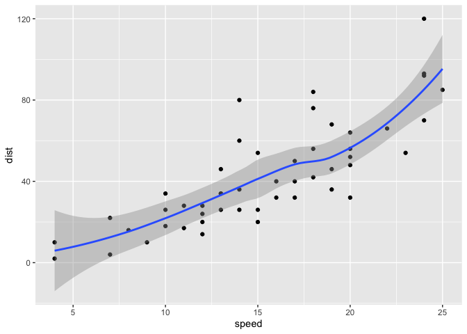
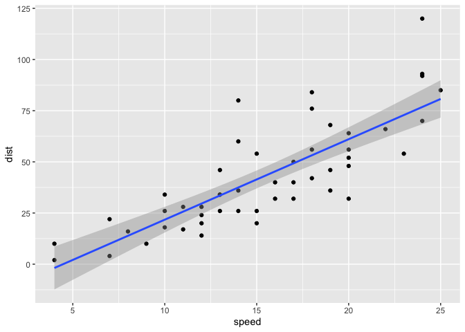
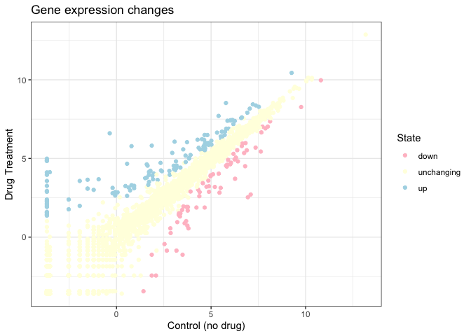

# Class 5: Data Visualization Lab
Yane Lee PID A17670350

# Week 3 Data Visualization Lab

Install the package ggplot

``` r
#install.packages("ggplot2")
library(ggplot2)
#View(cars)
```

\#A quick base R plot - this is not ggplot

``` r
plot(cars)
```


# Our first ggplot, we need data + aes + geoms

``` r
ggplot(data=cars) +
  aes(x=speed, y=dist) +
  geom_point()
```


``` r
p <- ggplot(data=cars) + 
  aes(x=speed, y=dist) +
  geom_point()
```

# Add a line with geom with geom_line()

``` r
p + geom_line()
```


# Add a trend line close to the data

``` r
p + geom_smooth()
```

    `geom_smooth()` using method = 'loess' and formula = 'y ~ x'



``` r
p + geom_smooth(method="lm") 
```

    `geom_smooth()` using formula = 'y ~ x'



\#—————————————————

# Read in our drug expression data

``` r
url <- "https://bioboot.github.io/bimm143_S20/class-material/up_down_expression.txt"
genes <- read.delim(url)
head(genes)
```

            Gene Condition1 Condition2      State
    1      A4GNT -3.6808610 -3.4401355 unchanging
    2       AAAS  4.5479580  4.3864126 unchanging
    3      AASDH  3.7190695  3.4787276 unchanging
    4       AATF  5.0784720  5.0151916 unchanging
    5       AATK  0.4711421  0.5598642 unchanging
    6 AB015752.4 -3.6808610 -3.5921390 unchanging

# Q. How many genes are in this dataset?

``` r
nrow(genes)
```

    [1] 5196

# Q. How many ‘up’ regulated genes?

``` r
table( genes$State )
```


          down unchanging         up 
            72       4997        127 

# Q. What fraction of total genes is up-regulated?

``` r
round((table(genes$State) / nrow(genes)) * 100, 2)
```


          down unchanging         up 
          1.39      96.17       2.44 

# Let’s make a first plot attempt

``` r
g <- ggplot(data=genes) + aes(x=Condition1, y=Condition2, col=State) + geom_point()

g
```


# Add some color

``` r
g + scale_color_manual(values=c("pink", "lightyellow", "lightblue")) +
  labs(title="Gene expression changes", x= "Control (no drug)", y= "Drug Treatment") +
  theme_bw()
```


