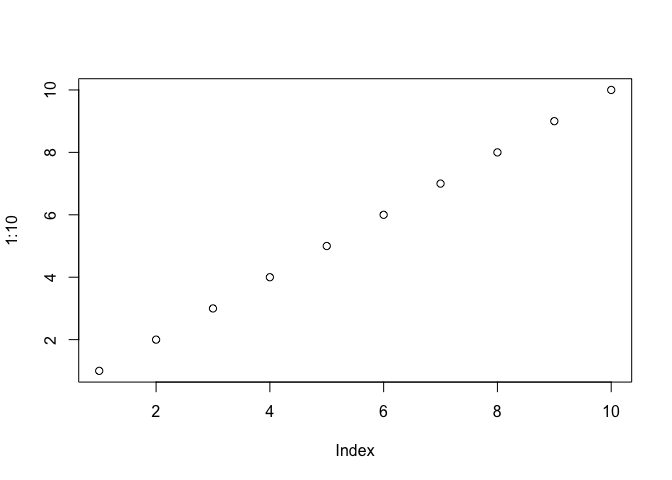
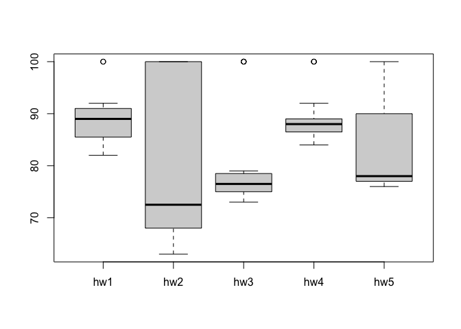

# Week 3 R Functions
Yane Lee
2026-01-24

This week we are introducing **R functions** and how to write our own
functions.

Questions to answer:

> Q1. Write a function grade() to determine an overall grade from a
> vector of student homework assignment scores dropping the lowest
> single score. If a student misses a homework (i.e. has an NA value)
> this can be used as a score to be potentially dropped. Your final
> function should be adquately explained with code comments and be able
> to work on an example class gradebook such as this one in CSV format:
> “https://tinyurl.com/gradeinput” \[3pts\]

``` r
plot(1:10)
```



``` r
# Example input vectors to start with
student1 <- c(100, 100, 100, 100, 100, 100, 100, 90)
student2 <- c(100, NA, 90, 90, 90, 90, 97, 80)
student3 <- c(90, NA, NA, NA, NA, NA, NA, NA)
```

Follow the guidelines from class

- Write a working snippet of code that solves a simple problem

``` r
# Straight forward mean()
student1 <- c(100, 100, 100, 100, 100, 100, 100, 90)

mean(student1)
```

    [1] 98.75

But… We need to drop the lowest score. First we need to identify the
lowest score.

``` r
#Which element of the vector is the lowest?
which.min(student1)
```

    [1] 8

What I want is to now drop (i.e exclude) this lowest score from my
mean() calculation.

``` r
# This will return everything but the eighth element of the vector
student1[-8]
```

    [1] 100 100 100 100 100 100 100

Now we can use the answer from which.min() to return all other elements
of the vector.

``` r
# This is our first working snippet
mean(student1[-which.min(student1)])
```

    [1] 100

What about the other example students? Will this work for them?

We could try using na.rm=TRUE argument for mean but this is pants! Not a
good approach i.e unfair.

``` r
student2 <- c(100, NA, 90, 90, 90, 90, 97, 80)
mean(student2, na.rm=TRUE)
```

    [1] 91

``` r
student3 <- c(90, NA, NA, NA, NA, NA, NA, NA)
mean(student3, na.rm=TRUE)
```

    [1] 90

Another approach is to mask (i.e replace) all NA values with zero.

First we need to find the NA elements of the vector. How do we find the
NA elements?

``` r
x <- student2

is.na(x)
```

    [1] FALSE  TRUE FALSE FALSE FALSE FALSE FALSE FALSE

``` r
which(is.na(x))
```

    [1] 2

Now we have identified the NA elements we want to “mask” then. Replace
them with zero?

``` r
# This does not quite get us there
mean(x[-which(is.na(x))])
```

    [1] 91

Instead we will make the NA elements zero.

``` r
# Cool, this is useful!
x[is.na(x)] <- 0
mean(x)
```

    [1] 79.625

Recall we should drop the lowest score now…

``` r
x[is.na(x)] <- 0
mean(x[-which.min(x)])
```

    [1] 91

Now we are essentially there.

``` r
student3 <- c(90, NA, NA, NA, NA, NA, NA, NA)
x <- student3
x[is.na(x)] <- 0
mean(x[-which.min(x)])
```

    [1] 12.85714

\##Now we make our function

Take the snippet and turn into function Every function has 3 parts

- A name, in our case ‘grade()’
- Input arguments, a vector of student scores
- The body i.e. our working snippet of code

Using RStudio I will select ‘Code \> Extract Function’

``` r
grade <- function(x) {
  x[is.na(x)] <- 0
  mean(x[-which.min(x)])
}
```

``` r
grade(student1)
```

    [1] 100

``` r
grade(student2)
```

    [1] 91

``` r
grade(student3)
```

    [1] 12.85714

This looks great! We now need to add comments to explain this to our
future selves and others who want to use this function.

``` r
#' Calculate the average score for a vector of student scores 
#' dropping the lowest score. Missing velues will be treated as
#' zero.
#' 
#' @param x A numeric vector of homework scores
#' 
#' @return Average score
#' @export
#' 
#' @examples
#' student = c(100, NA, 90, 97)
#' grade(student)
#' 
grade <- function(x) {
  # mask NA with zero
  # Treat missing values as zero
  x[is.na(x)] <- 0
  # Exclude the lowerst score from mean
  mean(x[-which.min(x)])
}
```

Now finally we can use our function on our “real” whole class data from
this CSV format: file: “https://tinyurl.com/gradeinput”

``` r
url <- "https://tinyurl.com/gradeinput"
gradebook <- read.csv(url, row.names = 1)
```

``` r
apply(gradebook, 1, grade)
```

     student-1  student-2  student-3  student-4  student-5  student-6  student-7 
         91.75      82.50      84.25      84.25      88.25      89.00      94.00 
     student-8  student-9 student-10 student-11 student-12 student-13 student-14 
         93.75      87.75      79.00      86.00      91.75      92.25      87.75 
    student-15 student-16 student-17 student-18 student-19 student-20 
         78.75      89.50      88.00      94.50      82.75      82.75 

> Q2. Using your grade() function and the supplied gradebook, Who is the
> top scoring student overall in the gradebook? \[3pts\]

To answer this we run the apply() function and save the results.

``` r
results <- apply(gradebook, 1, grade)
sort(results, decreasing=TRUE)
```

    student-18  student-7  student-8 student-13  student-1 student-12 student-16 
         94.50      94.00      93.75      92.25      91.75      91.75      89.50 
     student-6  student-5 student-17  student-9 student-14 student-11  student-3 
         89.00      88.25      88.00      87.75      87.75      86.00      84.25 
     student-4 student-19 student-20  student-2 student-10 student-15 
         84.25      82.75      82.75      82.50      79.00      78.75 

``` r
which.max(results)
```

    student-18 
            18 

> Q3. From your analysis of the gradebook, which homework was toughest
> on students (i.e. obtained the lowest scores overall? \[2pts\]

``` r
gradebook
```

               hw1 hw2 hw3 hw4 hw5
    student-1  100  73 100  88  79
    student-2   85  64  78  89  78
    student-3   83  69  77 100  77
    student-4   88  NA  73 100  76
    student-5   88 100  75  86  79
    student-6   89  78 100  89  77
    student-7   89 100  74  87 100
    student-8   89 100  76  86 100
    student-9   86 100  77  88  77
    student-10  89  72  79  NA  76
    student-11  82  66  78  84 100
    student-12 100  70  75  92 100
    student-13  89 100  76 100  80
    student-14  85 100  77  89  76
    student-15  85  65  76  89  NA
    student-16  92 100  74  89  77
    student-17  88  63 100  86  78
    student-18  91  NA 100  87 100
    student-19  91  68  75  86  79
    student-20  91  68  76  88  76

``` r
ave.scores <- apply(gradebook, 2, mean, na.rm=TRUE)
ave.scores
```

         hw1      hw2      hw3      hw4      hw5 
    89.00000 80.88889 80.80000 89.63158 83.42105 

``` r
which.min(ave.scores)
```

    hw3 
      3 

``` r
med.scores <- apply(gradebook, 2, median, na.rm=TRUE)
med.scores
```

     hw1  hw2  hw3  hw4  hw5 
    89.0 72.5 76.5 88.0 78.0 

``` r
which.min(med.scores)
```

    hw2 
      2 

``` r
boxplot(gradebook)
```



> Q4. Optional Extension: From your analysis of the gradebook, which
> homework was most predictive of overall score (i.e. highest
> correlation with average grade score)? \[1pt\]

Are the final results (i.e. average svore for each student) correlated
with the results (i.e. scores) for the individual homeworks - the
gradebook columns?

``` r
masked.gradebook <- gradebook
masked.gradebook[is.na(masked.gradebook)] <- 0
masked.gradebook
```

               hw1 hw2 hw3 hw4 hw5
    student-1  100  73 100  88  79
    student-2   85  64  78  89  78
    student-3   83  69  77 100  77
    student-4   88   0  73 100  76
    student-5   88 100  75  86  79
    student-6   89  78 100  89  77
    student-7   89 100  74  87 100
    student-8   89 100  76  86 100
    student-9   86 100  77  88  77
    student-10  89  72  79   0  76
    student-11  82  66  78  84 100
    student-12 100  70  75  92 100
    student-13  89 100  76 100  80
    student-14  85 100  77  89  76
    student-15  85  65  76  89   0
    student-16  92 100  74  89  77
    student-17  88  63 100  86  78
    student-18  91   0 100  87 100
    student-19  91  68  75  86  79
    student-20  91  68  76  88  76

And look at correlation

``` r
cor(results, masked.gradebook$hw5)
```

    [1] 0.6325982

``` r
apply(masked.gradebook, 2, cor, x=results)
```

          hw1       hw2       hw3       hw4       hw5 
    0.4250204 0.1767780 0.3042561 0.3810884 0.6325982 

Now we want the code to return the most predictive homework assignment
with the highest correlation.

``` r
most_predictive <- which.max(apply(masked.gradebook, 2, cor, x=results))
most_predictive
```

    hw5 
      5 

> Q5. Make sure you save your Quarto document and can click the “Render”
> (or Rmarkdown”Knit”) button to generate a PDF format report without
> errors. Finally, submit your PDF to gradescope. \[1pt\]

Knit the document to make a PDF
