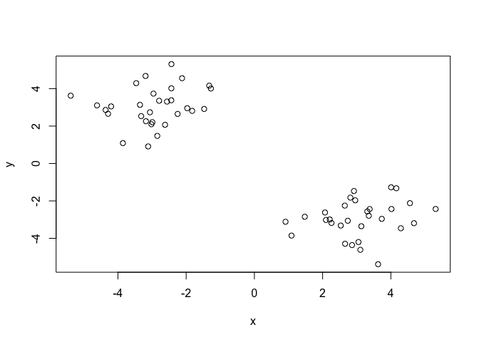
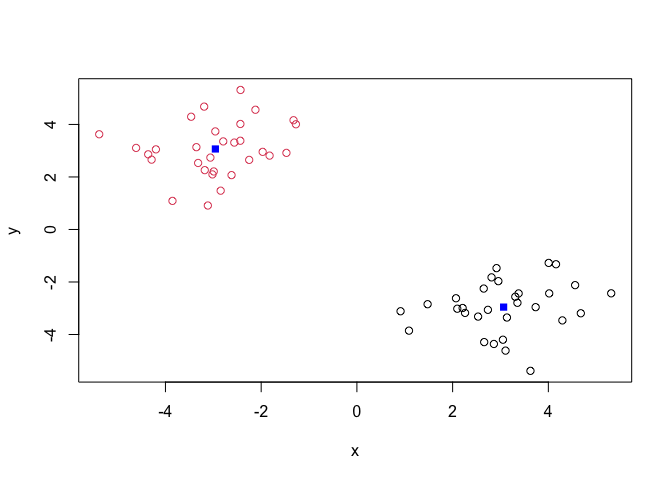
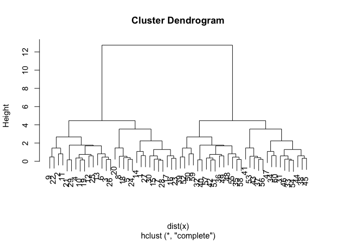
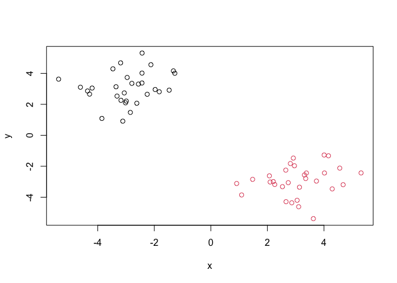
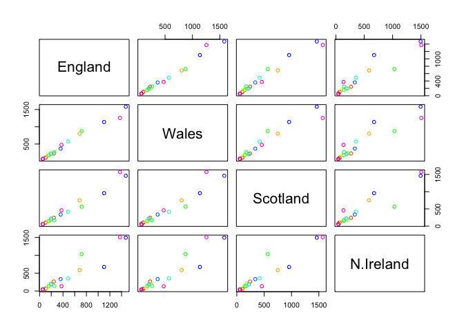
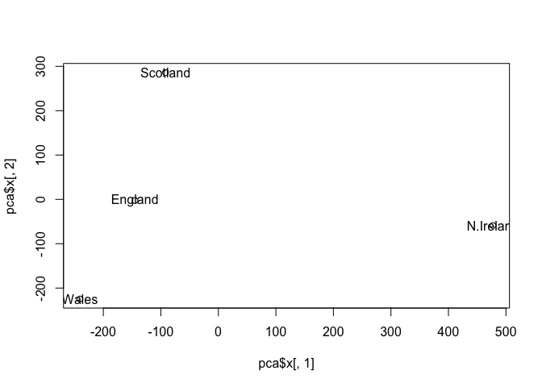
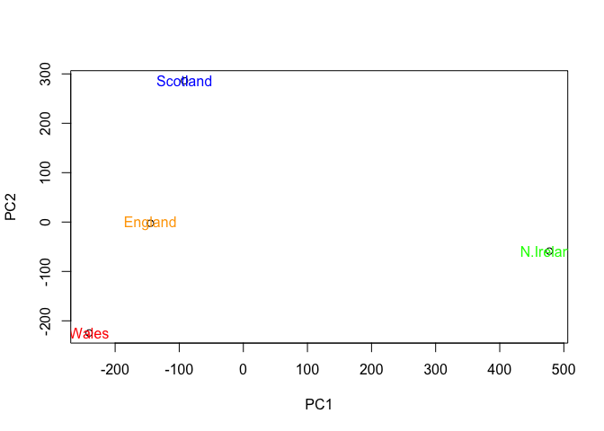
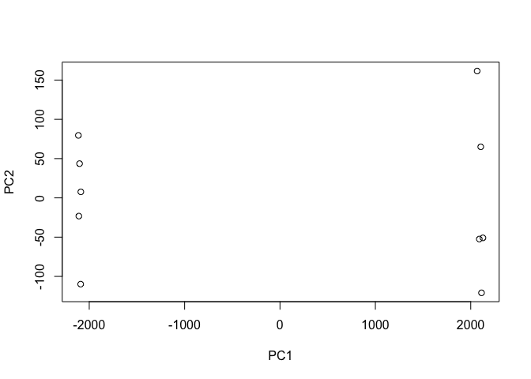
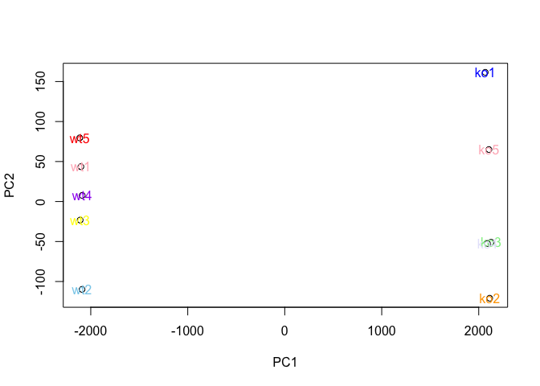

# Machine Learning 1
Yane Lee PID A17670350
2026-02-01

# First up kmeans()

Demo of using kmeans() function in based R. First make up some data with
a known structure.

``` r
tmp <- c( rnorm(30, -3), rnorm(30, 3) )
tmp
```

     [1] -2.8463884 -2.1201254 -1.9686932 -2.7928550 -4.2893518 -2.2507052
     [7] -2.9909137 -4.6134438 -3.1911063 -2.4357771 -2.4313721 -2.4345800
    [13] -1.4725831 -3.8534462 -3.1785240 -3.3176986 -3.3534130 -4.1989442
    [19] -2.5614582 -5.3841517 -1.3237576 -3.4631485 -3.0610957 -4.3606344
    [25] -2.9582756 -1.8242774 -3.1142824 -3.0177896 -1.2738478 -2.6191340
    [31]  2.0702620  4.0070106  2.0972954  0.9123313  2.8129773  3.7346361
    [37]  2.8624197  2.7373664  4.2930922  4.1601974  3.6261461  3.3092810
    [43]  3.0510578  3.1346559  2.5323960  2.2596464  1.0882746  2.9173452
    [49]  4.0178226  5.3132433  3.3789687  4.6786663  3.1053826  2.2091362
    [55]  2.6497098  2.6592823  3.3539242  2.9555344  4.5592253  1.4771855

``` r
x <- cbind(x=tmp, y=rev(tmp))
plot(x)
```



Now we have some made up data in `x` let’s see how kmeans works with
this data

``` r
k <- kmeans(x, centers = 2, nstart = 20)
k
```

    K-means clustering with 2 clusters of sizes 30, 30

    Cluster means:
              x         y
    1  3.065482 -2.956726
    2 -2.956726  3.065482

    Clustering vector:
     [1] 2 2 2 2 2 2 2 2 2 2 2 2 2 2 2 2 2 2 2 2 2 2 2 2 2 2 2 2 2 2 1 1 1 1 1 1 1 1
    [39] 1 1 1 1 1 1 1 1 1 1 1 1 1 1 1 1 1 1 1 1 1 1

    Within cluster sum of squares by cluster:
    [1] 58.34956 58.34956
     (between_SS / total_SS =  90.3 %)

    Available components:

    [1] "cluster"      "centers"      "totss"        "withinss"     "tot.withinss"
    [6] "betweenss"    "size"         "iter"         "ifault"      

> Q. How many points are in each cluster?

``` r
k$size
```

    [1] 30 30

> Q. How do we get to the cluster membership/assignment.

``` r
k$cluster
```

     [1] 2 2 2 2 2 2 2 2 2 2 2 2 2 2 2 2 2 2 2 2 2 2 2 2 2 2 2 2 2 2 1 1 1 1 1 1 1 1
    [39] 1 1 1 1 1 1 1 1 1 1 1 1 1 1 1 1 1 1 1 1 1 1

> Q. What about cluster centers?

``` r
k$centers
```

              x         y
    1  3.065482 -2.956726
    2 -2.956726  3.065482

Now we got to the main results. Let’s use them to plot our data with the
kmeans result

``` r
plot (x, col=k$cluster)
points(k$centers, col="blue", pch=15)
```



## Now for hclust()

We will cluster the same data `x` with the `hclust()`. In this case
`hclust()` requires a distance matrix as input.

``` r
hc <- hclust( dist(x) ) 
hc
```


    Call:
    hclust(d = dist(x))

    Cluster method   : complete 
    Distance         : euclidean 
    Number of objects: 60 

Let’s plot our hclust result

``` r
plot(hc)
```



To get our cluster membership vector we need to “cut” the tree with the
`cutree()`

``` r
grps <- cutree(hc, h=8)
grps
```

     [1] 1 1 1 1 1 1 1 1 1 1 1 1 1 1 1 1 1 1 1 1 1 1 1 1 1 1 1 1 1 1 2 2 2 2 2 2 2 2
    [39] 2 2 2 2 2 2 2 2 2 2 2 2 2 2 2 2 2 2 2 2 2 2

Now plot our data with the hclust() results.

``` r
plot(x, col=grps)
```



# Principal Component Analysis (PCA)

## PCA of UK food data

Read data from website and try a few visualizations.

``` r
url <- "https://tinyurl.com/UK-foods"
x <- read.csv(url, row.names=1)
x
```

                        England Wales Scotland N.Ireland
    Cheese                  105   103      103        66
    Carcass_meat            245   227      242       267
    Other_meat              685   803      750       586
    Fish                    147   160      122        93
    Fats_and_oils           193   235      184       209
    Sugars                  156   175      147       139
    Fresh_potatoes          720   874      566      1033
    Fresh_Veg               253   265      171       143
    Other_Veg               488   570      418       355
    Processed_potatoes      198   203      220       187
    Processed_Veg           360   365      337       334
    Fresh_fruit            1102  1137      957       674
    Cereals                1472  1582     1462      1494
    Beverages                57    73       53        47
    Soft_drinks            1374  1256     1572      1506
    Alcoholic_drinks        375   475      458       135
    Confectionery            54    64       62        41

``` r
cols <- rainbow(nrow(x))
barplot( as.matrix(x), col=cols )
```


``` r
barplot( as.matrix(x), col=cols, beside = TRUE )
```


``` r
pairs(x, col=cols)
```



PCA to the rescue!! The main base R PCA function is called `prcomp()`
and we will ened to give it the transpose of our input data!

``` r
t(x)
```

              Cheese Carcass_meat  Other_meat  Fish Fats_and_oils  Sugars
    England      105           245         685  147            193    156
    Wales        103           227         803  160            235    175
    Scotland     103           242         750  122            184    147
    N.Ireland     66           267         586   93            209    139
              Fresh_potatoes  Fresh_Veg  Other_Veg  Processed_potatoes 
    England               720        253        488                 198
    Wales                 874        265        570                 203
    Scotland              566        171        418                 220
    N.Ireland            1033        143        355                 187
              Processed_Veg  Fresh_fruit  Cereals  Beverages Soft_drinks 
    England              360         1102     1472        57         1374
    Wales                365         1137     1582        73         1256
    Scotland             337          957     1462        53         1572
    N.Ireland            334          674     1494        47         1506
              Alcoholic_drinks  Confectionery 
    England                 375             54
    Wales                   475             64
    Scotland                458             62
    N.Ireland               135             41

``` r
pca <- prcomp( t(x) )
```

``` r
summary(pca)
```

    Importance of components:
                                PC1      PC2      PC3     PC4
    Standard deviation     324.1502 212.7478 73.87622 2.7e-14
    Proportion of Variance   0.6744   0.2905  0.03503 0.0e+00
    Cumulative Proportion    0.6744   0.9650  1.00000 1.0e+00

``` r
attributes(pca)
```

    $names
    [1] "sdev"     "rotation" "center"   "scale"    "x"       

    $class
    [1] "prcomp"

To make our new PCA plot (a.k.a. PCA score plot) we access `pca$x`

``` r
plot(pca$x[,1], pca$x[,2])
text(pca$x[,1], pca$x[,2], colnames(x))
```



Color up the plot

``` r
country_cols <- c("orange", "red", "blue", "green")
plot(pca$x[,1], pca$x[,2], xlab="PC1", ylab="PC2")
text(pca$x[,1], pca$x[,2], colnames(x), col=country_cols)
```



## PCA of RNA-Seq data

Read in data from website

``` r
url2 <- "https://tinyurl.com/expression-CSV"
rna.data <- read.csv(url2, row.names=1)
head(rna.data)
```

           wt1 wt2  wt3  wt4 wt5 ko1 ko2 ko3 ko4 ko5
    gene1  439 458  408  429 420  90  88  86  90  93
    gene2  219 200  204  210 187 427 423 434 433 426
    gene3 1006 989 1030 1017 973 252 237 238 226 210
    gene4  783 792  829  856 760 849 856 835 885 894
    gene5  181 249  204  244 225 277 305 272 270 279
    gene6  460 502  491  491 493 612 594 577 618 638

``` r
pca <- prcomp( t(rna.data) )
summary(pca)
```

    Importance of components:
                                 PC1     PC2      PC3      PC4      PC5      PC6
    Standard deviation     2214.2633 88.9209 84.33908 77.74094 69.66341 67.78516
    Proportion of Variance    0.9917  0.0016  0.00144  0.00122  0.00098  0.00093
    Cumulative Proportion     0.9917  0.9933  0.99471  0.99593  0.99691  0.99784
                                PC7      PC8      PC9      PC10
    Standard deviation     65.29428 59.90981 53.20803 2.852e-13
    Proportion of Variance  0.00086  0.00073  0.00057 0.000e+00
    Cumulative Proportion   0.99870  0.99943  1.00000 1.000e+00

Do our PCA plot of this RNA-Seq data

``` r
plot(pca$x[,1], pca$x[,2], xlab="PC1", ylab="PC2")
```



``` r
gene_cols <- c("lightpink", "skyblue", "yellow", "purple", "red", "blue", "orange", "lightgreen", "lavender")
plot(pca$x[,1], pca$x[,2], xlab="PC1", ylab="PC2")
text(pca$x[,1], pca$x[,2], colnames(rna.data), col=gene_cols)
```


