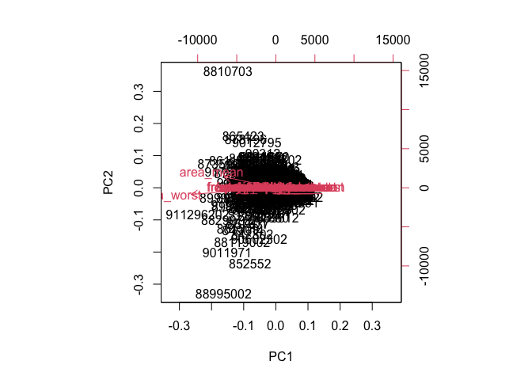
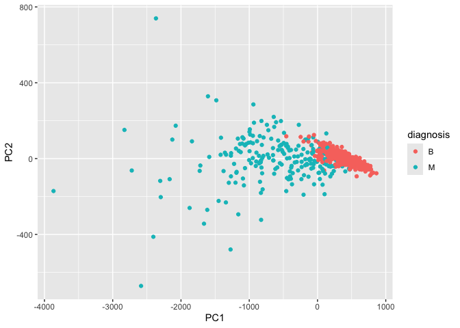
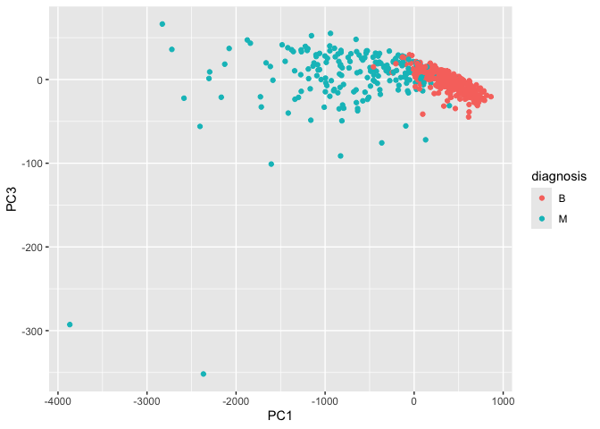
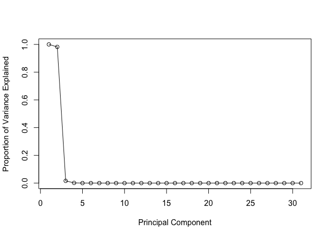
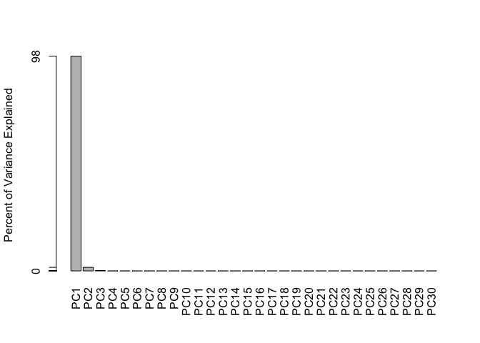
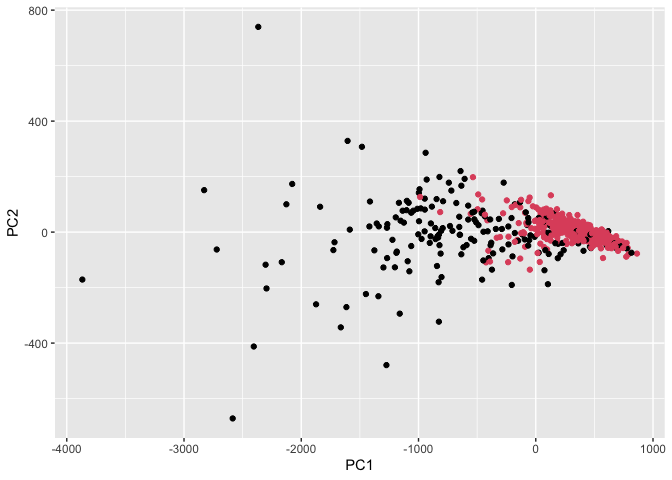
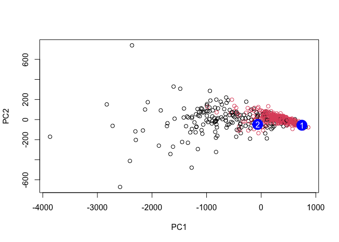

# ML Mini Project
Yane Lee PID A17670350
2026-02-01

## Predicting Malignancy of New Samples

``` r
url <- "https://bioboot.github.io/bimm143_W26/class-material/WisconsinCancer.csv"
wisc.df <- read.csv(url)
```

``` r
wisc.df <- read.csv(url, row.names=1)
head(wisc.df)
```

             diagnosis radius_mean texture_mean perimeter_mean area_mean
    842302           M       17.99        10.38         122.80    1001.0
    842517           M       20.57        17.77         132.90    1326.0
    84300903         M       19.69        21.25         130.00    1203.0
    84348301         M       11.42        20.38          77.58     386.1
    84358402         M       20.29        14.34         135.10    1297.0
    843786           M       12.45        15.70          82.57     477.1
             smoothness_mean compactness_mean concavity_mean concave.points_mean
    842302           0.11840          0.27760         0.3001             0.14710
    842517           0.08474          0.07864         0.0869             0.07017
    84300903         0.10960          0.15990         0.1974             0.12790
    84348301         0.14250          0.28390         0.2414             0.10520
    84358402         0.10030          0.13280         0.1980             0.10430
    843786           0.12780          0.17000         0.1578             0.08089
             symmetry_mean fractal_dimension_mean radius_se texture_se perimeter_se
    842302          0.2419                0.07871    1.0950     0.9053        8.589
    842517          0.1812                0.05667    0.5435     0.7339        3.398
    84300903        0.2069                0.05999    0.7456     0.7869        4.585
    84348301        0.2597                0.09744    0.4956     1.1560        3.445
    84358402        0.1809                0.05883    0.7572     0.7813        5.438
    843786          0.2087                0.07613    0.3345     0.8902        2.217
             area_se smoothness_se compactness_se concavity_se concave.points_se
    842302    153.40      0.006399        0.04904      0.05373           0.01587
    842517     74.08      0.005225        0.01308      0.01860           0.01340
    84300903   94.03      0.006150        0.04006      0.03832           0.02058
    84348301   27.23      0.009110        0.07458      0.05661           0.01867
    84358402   94.44      0.011490        0.02461      0.05688           0.01885
    843786     27.19      0.007510        0.03345      0.03672           0.01137
             symmetry_se fractal_dimension_se radius_worst texture_worst
    842302       0.03003             0.006193        25.38         17.33
    842517       0.01389             0.003532        24.99         23.41
    84300903     0.02250             0.004571        23.57         25.53
    84348301     0.05963             0.009208        14.91         26.50
    84358402     0.01756             0.005115        22.54         16.67
    843786       0.02165             0.005082        15.47         23.75
             perimeter_worst area_worst smoothness_worst compactness_worst
    842302            184.60     2019.0           0.1622            0.6656
    842517            158.80     1956.0           0.1238            0.1866
    84300903          152.50     1709.0           0.1444            0.4245
    84348301           98.87      567.7           0.2098            0.8663
    84358402          152.20     1575.0           0.1374            0.2050
    843786            103.40      741.6           0.1791            0.5249
             concavity_worst concave.points_worst symmetry_worst
    842302            0.7119               0.2654         0.4601
    842517            0.2416               0.1860         0.2750
    84300903          0.4504               0.2430         0.3613
    84348301          0.6869               0.2575         0.6638
    84358402          0.4000               0.1625         0.2364
    843786            0.5355               0.1741         0.3985
             fractal_dimension_worst
    842302                   0.11890
    842517                   0.08902
    84300903                 0.08758
    84348301                 0.17300
    84358402                 0.07678
    843786                   0.12440

``` r
# You can use head() to analyze specific rows of data too
head(wisc.df, 4)
```

             diagnosis radius_mean texture_mean perimeter_mean area_mean
    842302           M       17.99        10.38         122.80    1001.0
    842517           M       20.57        17.77         132.90    1326.0
    84300903         M       19.69        21.25         130.00    1203.0
    84348301         M       11.42        20.38          77.58     386.1
             smoothness_mean compactness_mean concavity_mean concave.points_mean
    842302           0.11840          0.27760         0.3001             0.14710
    842517           0.08474          0.07864         0.0869             0.07017
    84300903         0.10960          0.15990         0.1974             0.12790
    84348301         0.14250          0.28390         0.2414             0.10520
             symmetry_mean fractal_dimension_mean radius_se texture_se perimeter_se
    842302          0.2419                0.07871    1.0950     0.9053        8.589
    842517          0.1812                0.05667    0.5435     0.7339        3.398
    84300903        0.2069                0.05999    0.7456     0.7869        4.585
    84348301        0.2597                0.09744    0.4956     1.1560        3.445
             area_se smoothness_se compactness_se concavity_se concave.points_se
    842302    153.40      0.006399        0.04904      0.05373           0.01587
    842517     74.08      0.005225        0.01308      0.01860           0.01340
    84300903   94.03      0.006150        0.04006      0.03832           0.02058
    84348301   27.23      0.009110        0.07458      0.05661           0.01867
             symmetry_se fractal_dimension_se radius_worst texture_worst
    842302       0.03003             0.006193        25.38         17.33
    842517       0.01389             0.003532        24.99         23.41
    84300903     0.02250             0.004571        23.57         25.53
    84348301     0.05963             0.009208        14.91         26.50
             perimeter_worst area_worst smoothness_worst compactness_worst
    842302            184.60     2019.0           0.1622            0.6656
    842517            158.80     1956.0           0.1238            0.1866
    84300903          152.50     1709.0           0.1444            0.4245
    84348301           98.87      567.7           0.2098            0.8663
             concavity_worst concave.points_worst symmetry_worst
    842302            0.7119               0.2654         0.4601
    842517            0.2416               0.1860         0.2750
    84300903          0.4504               0.2430         0.3613
    84348301          0.6869               0.2575         0.6638
             fractal_dimension_worst
    842302                   0.11890
    842517                   0.08902
    84300903                 0.08758
    84348301                 0.17300

We don’t want to include the first column in our analysis

``` r
new.wisc.df <- wisc.df[,-1]
```

We will create a diagnosis vector to store the data from the diagnosis
column of the original dataset. We will use this later for plotting.

``` r
diagnosis <- wisc.df$diagnosis
```

> Q1. How many observations are in this dataset?

``` r
nrow(wisc.df)
```

    [1] 569

> Q2. How many of the observations have a malignant diagnosis?

``` r
table(wisc.df$diagnosis)
```


      B   M 
    357 212 

> Q3. How many variables/features in the data are suffixed with `_mean`?

``` r
grep("_mean$", colnames(wisc.df), value = TRUE)
```

     [1] "radius_mean"            "texture_mean"           "perimeter_mean"        
     [4] "area_mean"              "smoothness_mean"        "compactness_mean"      
     [7] "concavity_mean"         "concave.points_mean"    "symmetry_mean"         
    [10] "fractal_dimension_mean"

We will check column means and standard deviations

``` r
colMeans(new.wisc.df)
```

                radius_mean            texture_mean          perimeter_mean 
               1.412729e+01            1.928965e+01            9.196903e+01 
                  area_mean         smoothness_mean        compactness_mean 
               6.548891e+02            9.636028e-02            1.043410e-01 
             concavity_mean     concave.points_mean           symmetry_mean 
               8.879932e-02            4.891915e-02            1.811619e-01 
     fractal_dimension_mean               radius_se              texture_se 
               6.279761e-02            4.051721e-01            1.216853e+00 
               perimeter_se                 area_se           smoothness_se 
               2.866059e+00            4.033708e+01            7.040979e-03 
             compactness_se            concavity_se       concave.points_se 
               2.547814e-02            3.189372e-02            1.179614e-02 
                symmetry_se    fractal_dimension_se            radius_worst 
               2.054230e-02            3.794904e-03            1.626919e+01 
              texture_worst         perimeter_worst              area_worst 
               2.567722e+01            1.072612e+02            8.805831e+02 
           smoothness_worst       compactness_worst         concavity_worst 
               1.323686e-01            2.542650e-01            2.721885e-01 
       concave.points_worst          symmetry_worst fractal_dimension_worst 
               1.146062e-01            2.900756e-01            8.394582e-02 

``` r
apply(new.wisc.df, 2, sd)
```

                radius_mean            texture_mean          perimeter_mean 
               3.524049e+00            4.301036e+00            2.429898e+01 
                  area_mean         smoothness_mean        compactness_mean 
               3.519141e+02            1.406413e-02            5.281276e-02 
             concavity_mean     concave.points_mean           symmetry_mean 
               7.971981e-02            3.880284e-02            2.741428e-02 
     fractal_dimension_mean               radius_se              texture_se 
               7.060363e-03            2.773127e-01            5.516484e-01 
               perimeter_se                 area_se           smoothness_se 
               2.021855e+00            4.549101e+01            3.002518e-03 
             compactness_se            concavity_se       concave.points_se 
               1.790818e-02            3.018606e-02            6.170285e-03 
                symmetry_se    fractal_dimension_se            radius_worst 
               8.266372e-03            2.646071e-03            4.833242e+00 
              texture_worst         perimeter_worst              area_worst 
               6.146258e+00            3.360254e+01            5.693570e+02 
           smoothness_worst       compactness_worst         concavity_worst 
               2.283243e-02            1.573365e-01            2.086243e-01 
       concave.points_worst          symmetry_worst fractal_dimension_worst 
               6.573234e-02            6.186747e-02            1.806127e-02 

Time for PCA!

``` r
wisc.pr <- prcomp(new.wisc.df)
summary(wisc.pr)
```

    Importance of components:
                               PC1      PC2      PC3     PC4     PC5     PC6   PC7
    Standard deviation     666.170 85.49912 26.52987 7.39248 6.31585 1.73337 1.347
    Proportion of Variance   0.982  0.01618  0.00156 0.00012 0.00009 0.00001 0.000
    Cumulative Proportion    0.982  0.99822  0.99978 0.99990 0.99999 0.99999 1.000
                              PC8    PC9   PC10   PC11    PC12    PC13    PC14
    Standard deviation     0.6095 0.3944 0.2899 0.1778 0.08659 0.05623 0.04649
    Proportion of Variance 0.0000 0.0000 0.0000 0.0000 0.00000 0.00000 0.00000
    Cumulative Proportion  1.0000 1.0000 1.0000 1.0000 1.00000 1.00000 1.00000
                              PC15   PC16    PC17    PC18    PC19    PC20     PC21
    Standard deviation     0.03642 0.0253 0.01936 0.01534 0.01359 0.01281 0.008838
    Proportion of Variance 0.00000 0.0000 0.00000 0.00000 0.00000 0.00000 0.000000
    Cumulative Proportion  1.00000 1.0000 1.00000 1.00000 1.00000 1.00000 1.000000
                              PC22     PC23     PC24     PC25     PC26     PC27
    Standard deviation     0.00759 0.005909 0.005329 0.004018 0.003534 0.001918
    Proportion of Variance 0.00000 0.000000 0.000000 0.000000 0.000000 0.000000
    Cumulative Proportion  1.00000 1.000000 1.000000 1.000000 1.000000 1.000000
                               PC28     PC29      PC30
    Standard deviation     0.001688 0.001416 0.0008379
    Proportion of Variance 0.000000 0.000000 0.0000000
    Cumulative Proportion  1.000000 1.000000 1.0000000

> Q4. From your results, what proportion of the original variance is
> captured by the first principal component (PC1)?

*0.982*

> Q5. How many principal components (PCs) are required to describe at
> least 70% of the original variance in the data?

*1*

> Q6. How many principal components (PCs) are required to describe at
> least 90% of the original variance in the data?

*1*

Let’s plot this data

``` r
biplot(wisc.pr)
```

    Warning in arrows(0, 0, y[, 1L] * 0.8, y[, 2L] * 0.8, col = col[2L], length =
    arrow.len): zero-length arrow is of indeterminate angle and so skipped
    Warning in arrows(0, 0, y[, 1L] * 0.8, y[, 2L] * 0.8, col = col[2L], length =
    arrow.len): zero-length arrow is of indeterminate angle and so skipped
    Warning in arrows(0, 0, y[, 1L] * 0.8, y[, 2L] * 0.8, col = col[2L], length =
    arrow.len): zero-length arrow is of indeterminate angle and so skipped
    Warning in arrows(0, 0, y[, 1L] * 0.8, y[, 2L] * 0.8, col = col[2L], length =
    arrow.len): zero-length arrow is of indeterminate angle and so skipped
    Warning in arrows(0, 0, y[, 1L] * 0.8, y[, 2L] * 0.8, col = col[2L], length =
    arrow.len): zero-length arrow is of indeterminate angle and so skipped
    Warning in arrows(0, 0, y[, 1L] * 0.8, y[, 2L] * 0.8, col = col[2L], length =
    arrow.len): zero-length arrow is of indeterminate angle and so skipped
    Warning in arrows(0, 0, y[, 1L] * 0.8, y[, 2L] * 0.8, col = col[2L], length =
    arrow.len): zero-length arrow is of indeterminate angle and so skipped
    Warning in arrows(0, 0, y[, 1L] * 0.8, y[, 2L] * 0.8, col = col[2L], length =
    arrow.len): zero-length arrow is of indeterminate angle and so skipped
    Warning in arrows(0, 0, y[, 1L] * 0.8, y[, 2L] * 0.8, col = col[2L], length =
    arrow.len): zero-length arrow is of indeterminate angle and so skipped
    Warning in arrows(0, 0, y[, 1L] * 0.8, y[, 2L] * 0.8, col = col[2L], length =
    arrow.len): zero-length arrow is of indeterminate angle and so skipped
    Warning in arrows(0, 0, y[, 1L] * 0.8, y[, 2L] * 0.8, col = col[2L], length =
    arrow.len): zero-length arrow is of indeterminate angle and so skipped
    Warning in arrows(0, 0, y[, 1L] * 0.8, y[, 2L] * 0.8, col = col[2L], length =
    arrow.len): zero-length arrow is of indeterminate angle and so skipped
    Warning in arrows(0, 0, y[, 1L] * 0.8, y[, 2L] * 0.8, col = col[2L], length =
    arrow.len): zero-length arrow is of indeterminate angle and so skipped
    Warning in arrows(0, 0, y[, 1L] * 0.8, y[, 2L] * 0.8, col = col[2L], length =
    arrow.len): zero-length arrow is of indeterminate angle and so skipped
    Warning in arrows(0, 0, y[, 1L] * 0.8, y[, 2L] * 0.8, col = col[2L], length =
    arrow.len): zero-length arrow is of indeterminate angle and so skipped
    Warning in arrows(0, 0, y[, 1L] * 0.8, y[, 2L] * 0.8, col = col[2L], length =
    arrow.len): zero-length arrow is of indeterminate angle and so skipped
    Warning in arrows(0, 0, y[, 1L] * 0.8, y[, 2L] * 0.8, col = col[2L], length =
    arrow.len): zero-length arrow is of indeterminate angle and so skipped
    Warning in arrows(0, 0, y[, 1L] * 0.8, y[, 2L] * 0.8, col = col[2L], length =
    arrow.len): zero-length arrow is of indeterminate angle and so skipped
    Warning in arrows(0, 0, y[, 1L] * 0.8, y[, 2L] * 0.8, col = col[2L], length =
    arrow.len): zero-length arrow is of indeterminate angle and so skipped
    Warning in arrows(0, 0, y[, 1L] * 0.8, y[, 2L] * 0.8, col = col[2L], length =
    arrow.len): zero-length arrow is of indeterminate angle and so skipped



> Q7. What stands out to you about this plot? Is it easy or difficult to
> understand? Why?

*It is difficult to understand because there is so much data on one
plot. The datapoints are overlapping. What stands out to me the most is
the different colors: red, and black*

The trends are harder to see with this plot, so we’ll use a more
standard scatter plot to obseve and analyze

``` r
# install.packages("ggplot2")
library(ggplot2)

ggplot(wisc.pr$x) + aes(PC1, PC2, col = diagnosis) + geom_point() + labs(x="PC1", y="PC2")
```



> Q8. Generate a similar plot for principal components 1 and 3. What do
> you notice about these plots?

``` r
ggplot(wisc.pr$x) + aes(PC1, PC3, col = diagnosis) + geom_point() + labs(x="PC1", y="PC3")
```



*The plots indicate that there is separation between the malignant and
benign samples. The plot comparing components 1 and 3, however, is
higher up on the graph than the plot comparing components 1 and 2.*

Calculating variance…

``` r
pr.var <- wisc.pr$sdev^2
head(pr.var)
```

    [1] 4.437826e+05 7.310100e+03 7.038337e+02 5.464874e+01 3.989002e+01
    [6] 3.004588e+00

``` r
pve <- wisc.pr$sdev^2 / sum(wisc.pr$sdev^2)

plot(c(1,pve), xlab = "Principal Component", 
     ylab = "Proportion of Variance Explained", 
     ylim = c(0, 1), type = "o")
```



Alternatively, you can use a barplot

``` r
barplot(pve, ylab = "Percent of Variance Explained",
     names.arg=paste0("PC",1:length(pve)), las=2, axes = FALSE)
axis(2, at=pve, labels=round(pve,2)*100 )
```



> Q9. For the first principal component, what is the component of the
> loading vector (i.e. wisc.pr\$rotation\[,1\]) for the feature
> concave.points_mean? This tells us how much this original feature
> contributes to the first PC. Are there any features with larger
> contributions than this one?

``` r
wisc.pr$rotation["concave.points_mean",1]
```

    [1] -4.778078e-05

``` r
sort(abs(wisc.pr$rotation[,1]), decreasing = TRUE)
```

                 area_worst               area_mean                 area_se 
               8.520634e-01            5.168265e-01            5.572717e-02 
            perimeter_worst          perimeter_mean            radius_worst 
               4.945764e-02            3.507633e-02            7.154733e-03 
                radius_mean           texture_worst            perimeter_se 
               5.086232e-03            3.067366e-03            2.236342e-03 
               texture_mean               radius_se         concavity_worst 
               2.196570e-03            3.137425e-04            1.689286e-04 
          compactness_worst          concavity_mean    concave.points_worst 
               1.012759e-04            8.193995e-05            7.366582e-05 
                 texture_se     concave.points_mean        compactness_mean 
               6.509840e-05            4.778078e-05            4.052600e-05 
             symmetry_worst            concavity_se           symmetry_mean 
               1.789863e-05            8.870945e-06            7.078043e-06 
           smoothness_worst          compactness_se         smoothness_mean 
               6.420055e-06            5.519182e-06            4.236945e-06 
          concave.points_se  fractal_dimension_mean fractal_dimension_worst 
               3.279150e-06            2.621553e-06            1.613562e-06 
                symmetry_se           smoothness_se    fractal_dimension_se 
               1.241018e-06            8.056460e-07            8.545308e-08 

# Next we’re going into hierarchical clustering

``` r
# Scale the wisc.data data using the scale() function
data.scaled <- scale(new.wisc.df)

# Calculate the Euclidean distances between all pairs of observations in new scaled dataset
data.dist <- dist(data.scaled)

# Create hierarchical clustering model
wisc.hclust <- hclust(data.dist, method = "complete")
```

> Q10. Using the plot() and abline() functions, what is the height at
> which the clustering model has 4 clusters?

``` r
plot(wisc.hclust)
abline(wisc.hclust, col="red", lty=2)
```


*There are 4 clusters when the height is approximately 19*

We’re going to cut the tree so that it has 4 clusters

``` r
wisc.hclust.clusters <- cutree(wisc.hclust, h=19)
table(wisc.hclust.clusters, diagnosis)
```

                        diagnosis
    wisc.hclust.clusters   B   M
                       1  12 165
                       2   2   5
                       3 343  40
                       4   0   2

> Q12. Which method gives your favorite results for the same data.dist
> dataset? Explain your reasoning.

``` r
wisc.pr.hclust <- hclust(data.dist, method = "ward.D2")
plot(wisc.pr.hclust)
```


``` r
wisc.hclust.clust <- cutree(wisc.pr.hclust, h=32)
table(wisc.hclust.clust, diagnosis)
```

                     diagnosis
    wisc.hclust.clust   B   M
                    1   0 115
                    2   6  48
                    3 337  48
                    4  14   1

Let’s find out if our two main clusters are malignant and benign

``` r
grps <- cutree(wisc.pr.hclust, k=2)
table(grps)
```

    grps
      1   2 
    184 385 

``` r
table(grps, diagnosis)
```

        diagnosis
    grps   B   M
       1  20 164
       2 337  48

``` r
ggplot(wisc.pr$x) +
  aes(PC1, PC2) +
  geom_point(col=grps)
```



``` r
# We're going to cut the tree so theres 2 clusters
wisc.pr.hclust.clusters <- cutree(wisc.pr.hclust, k=2)
```

> Q13. How well does the newly created hclust model with two clusters
> separate out the two “M” and “B” diagnoses?

``` r
table(wisc.pr.hclust.clusters, diagnosis)
```

                           diagnosis
    wisc.pr.hclust.clusters   B   M
                          1  20 164
                          2 337  48

> Q14. How well do the hierarchical clustering models you created in the
> previous sections (i.e. without first doing PCA) do in terms of
> separating the diagnoses? Again, use the table() function to compare
> the output of each model (wisc.hclust.clusters and
> wisc.pr.hclust.clusters) with the vector containing the actual
> diagnoses.

``` r
table(wisc.hclust.clusters, diagnosis)
```

                        diagnosis
    wisc.hclust.clusters   B   M
                       1  12 165
                       2   2   5
                       3 343  40
                       4   0   2

# We’re now going to try to predict with new data

``` r
url <- "https://tinyurl.com/new-samples-CSV"
new <- read.csv(url)
npc <- predict(wisc.pr, newdata=new)
npc
```

               PC1       PC2       PC3       PC4       PC5       PC6       PC7
    [1,] 745.60081 -56.16454 -21.15609 -3.330663  9.355518  2.317462 -1.147268
    [2,] -64.40839 -48.46996 -15.93413 12.089591 -4.636008 -1.045210 -0.295228
                PC8         PC9        PC10      PC11        PC12         PC13
    [1,] -0.7644759  0.11704582  0.06401851 0.1191717 -0.05611973 -0.040020096
    [2,] -0.7454142 -0.09167106 -0.76173550 0.3206674  0.02602751  0.005023528
                PC14         PC15        PC16        PC17        PC18         PC19
    [1,]  0.01354667 -0.018755904 -0.01050870 -0.01183961 0.020946097  0.030567858
    [2,] -0.11943490  0.008958015  0.03391077 -0.02468455 0.008002482 -0.006896744
                 PC20         PC21        PC22         PC23         PC24
    [1,] -0.007960122 -0.003773165 0.018561168 0.0001875602 -0.005463212
    [2,]  0.007001178 -0.022182056 0.008725155 0.0075849336  0.004619616
                 PC25        PC26         PC27         PC28         PC29
    [1,] -0.005992320 0.005357732 4.550233e-05  0.003252776 0.0012510265
    [2,]  0.002804663 0.003229335 1.977351e-03 -0.002261832 0.0009130702
                  PC30
    [1,] -0.0009794321
    [2,] -0.0009078383

``` r
plot(wisc.pr$x[,1:2], col=grps)
points(npc[,1], npc[,2], col="blue", pch=16, cex=3)
text(npc[,1], npc[,2], c(1,2), col="white")
```



> Q16. Which of these new patients should we prioritize for follow up
> based on your results?

*Patient 2 should be prioritized because their PCA position is closer to
the malignant clusters, indicating greater similarity to known malignant
cases*
