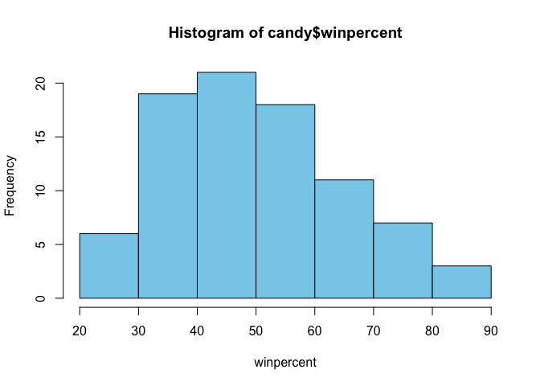
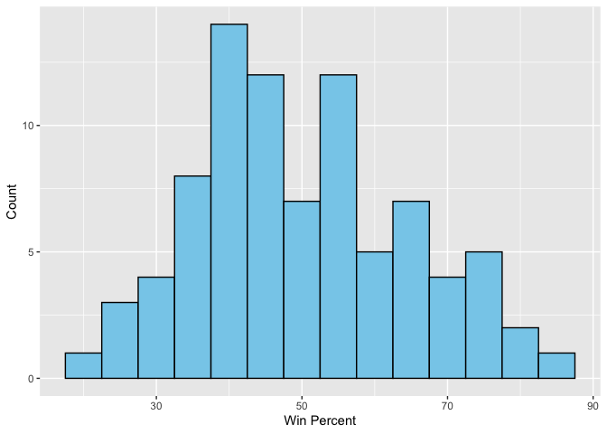
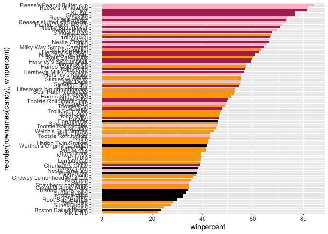
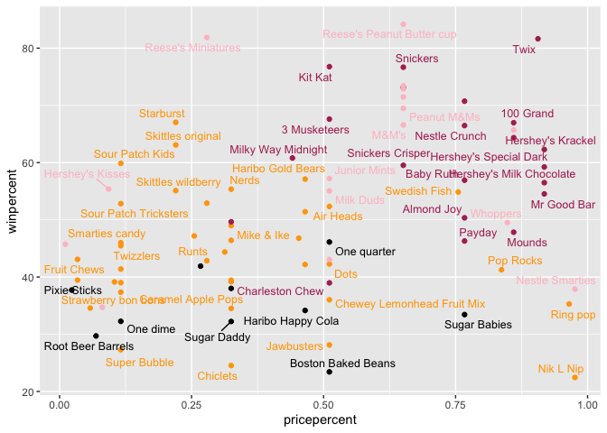
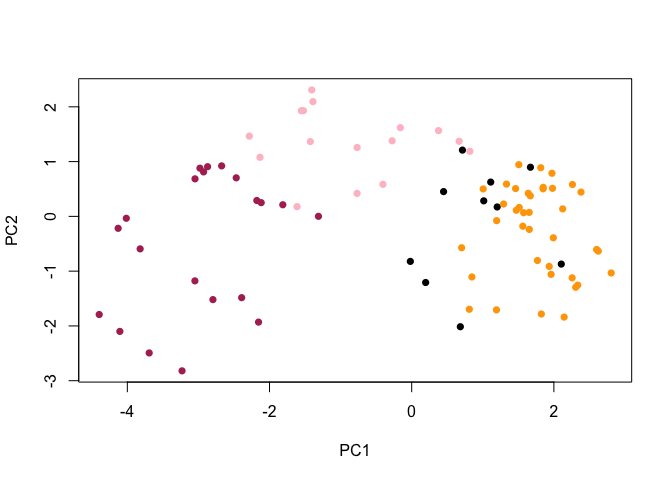
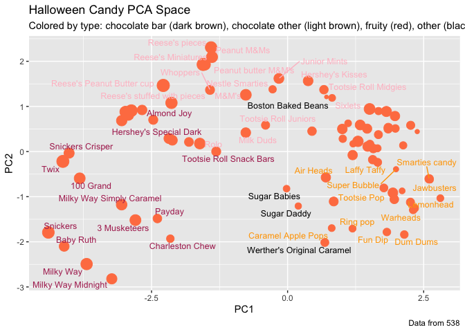
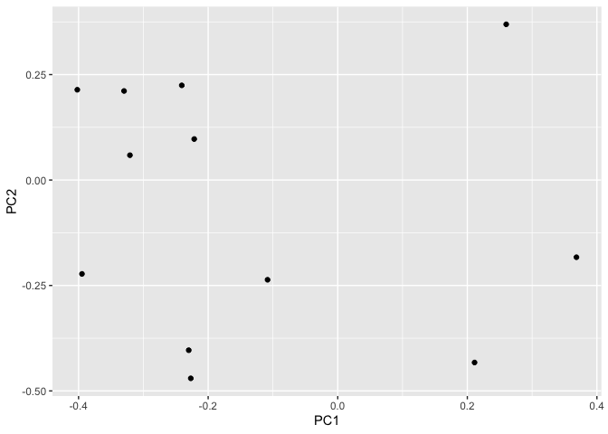

# Class 9 Candy Mini Project
Yane Lee PID A17670350
2026-02-08

<link href="class09_candyminiproject_files/libs/htmltools-fill-0.5.9/fill.css" rel="stylesheet" />
<script src="class09_candyminiproject_files/libs/htmlwidgets-1.6.4/htmlwidgets.js"></script>
<script src="class09_candyminiproject_files/libs/plotly-binding-4.12.0/plotly.js"></script>
<script src="class09_candyminiproject_files/libs/setprototypeof-0.1/setprototypeof.js"></script>
<script src="class09_candyminiproject_files/libs/typedarray-0.1/typedarray.min.js"></script>
<script src="class09_candyminiproject_files/libs/jquery-3.5.1/jquery.min.js"></script>
<link href="class09_candyminiproject_files/libs/crosstalk-1.2.2/css/crosstalk.min.css" rel="stylesheet" />
<script src="class09_candyminiproject_files/libs/crosstalk-1.2.2/js/crosstalk.min.js"></script>
<link href="class09_candyminiproject_files/libs/plotly-htmlwidgets-css-2.25.2/plotly-htmlwidgets.css" rel="stylesheet" />
<script src="class09_candyminiproject_files/libs/plotly-main-2.25.2/plotly-latest.min.js"></script>

This mini-project will allow us to apply our data analysis skills and
build on our PCA skills.

``` r
candy_file <- "candy-data.csv"

candy = read.csv(candy_file, row.names=1)
# head(candy)
```

> Q1. How many different candy types are in this dataset?

``` r
nrow(candy)
```

    [1] 85

> Q2. How many fruity candy types are in the dataset?

``` r
sum(candy$fruity)
```

    [1] 38

`winpercent` is the percentage of people who prefer a given candy over
another randomly chosen candy from the dataset. Higher values indicate a
more popular candy.

We can find the winpercent value for Twix by using its name to access
the corresponding row of the dataset.

``` r
candy["Twix", ]$winpercent
```

    [1] 81.64291

Alternatively, you can do this…

``` r
# install.packages("vctrs")
# install.packages("dplyr")

library(dplyr)
```


    Attaching package: 'dplyr'

    The following objects are masked from 'package:stats':

        filter, lag

    The following objects are masked from 'package:base':

        intersect, setdiff, setequal, union

``` r
candy |> 
  filter(row.names(candy)=="Twix") |> 
  select(winpercent)
```

         winpercent
    Twix   81.64291

> Q3. What is your favorite candy (other than Twix) in the dataset and
> what is it’s winpercent value? *My favorite candy is Snickers*

``` r
# This is the winpercent value of the Snickers
candy["Snickers", ]$winpercent
```

    [1] 76.67378

> Q4. What is the winpercent value for “Kit Kat”?

``` r
candy["Kit Kat", ]$winpercent
```

    [1] 76.7686

> Q5. What is the winpercent value for “Tootsie Roll Snack Bars”?

``` r
candy["Tootsie Roll Snack Bars", ]$winpercent
```

    [1] 49.6535

There is a useful skim() function in the skimr package that can help
give you a quick overview of a given dataset.

``` r
# install.packages("skimr")
library("skimr")
skim(candy)
```

|                                                  |       |
|:-------------------------------------------------|:------|
| Name                                             | candy |
| Number of rows                                   | 85    |
| Number of columns                                | 12    |
| \_\_\_\_\_\_\_\_\_\_\_\_\_\_\_\_\_\_\_\_\_\_\_   |       |
| Column type frequency:                           |       |
| numeric                                          | 12    |
| \_\_\_\_\_\_\_\_\_\_\_\_\_\_\_\_\_\_\_\_\_\_\_\_ |       |
| Group variables                                  | None  |

Data summary

**Variable type: numeric**

| skim_variable | n_missing | complete_rate | mean | sd | p0 | p25 | p50 | p75 | p100 | hist |
|:---|---:|---:|---:|---:|---:|---:|---:|---:|---:|:---|
| chocolate | 0 | 1 | 0.44 | 0.50 | 0.00 | 0.00 | 0.00 | 1.00 | 1.00 | ▇▁▁▁▆ |
| fruity | 0 | 1 | 0.45 | 0.50 | 0.00 | 0.00 | 0.00 | 1.00 | 1.00 | ▇▁▁▁▆ |
| caramel | 0 | 1 | 0.16 | 0.37 | 0.00 | 0.00 | 0.00 | 0.00 | 1.00 | ▇▁▁▁▂ |
| peanutyalmondy | 0 | 1 | 0.16 | 0.37 | 0.00 | 0.00 | 0.00 | 0.00 | 1.00 | ▇▁▁▁▂ |
| nougat | 0 | 1 | 0.08 | 0.28 | 0.00 | 0.00 | 0.00 | 0.00 | 1.00 | ▇▁▁▁▁ |
| crispedricewafer | 0 | 1 | 0.08 | 0.28 | 0.00 | 0.00 | 0.00 | 0.00 | 1.00 | ▇▁▁▁▁ |
| hard | 0 | 1 | 0.18 | 0.38 | 0.00 | 0.00 | 0.00 | 0.00 | 1.00 | ▇▁▁▁▂ |
| bar | 0 | 1 | 0.25 | 0.43 | 0.00 | 0.00 | 0.00 | 0.00 | 1.00 | ▇▁▁▁▂ |
| pluribus | 0 | 1 | 0.52 | 0.50 | 0.00 | 0.00 | 1.00 | 1.00 | 1.00 | ▇▁▁▁▇ |
| sugarpercent | 0 | 1 | 0.48 | 0.28 | 0.01 | 0.22 | 0.47 | 0.73 | 0.99 | ▇▇▇▇▆ |
| pricepercent | 0 | 1 | 0.47 | 0.29 | 0.01 | 0.26 | 0.47 | 0.65 | 0.98 | ▇▇▇▇▆ |
| winpercent | 0 | 1 | 50.32 | 14.71 | 22.45 | 39.14 | 47.83 | 59.86 | 84.18 | ▃▇▆▅▂ |

> Q6. Is there any variable/column that looks to be on a different scale
> to the majority of the other columns in the dataset? *The column with
> the types of candy are different because it’s not a numerical scale*

> Q7. What do you think a zero and one represent for the
> candy\$chocolate column? *The zero means that there isn’t chocolate in
> that specific candy, and a one means that there is choclate in that
> specific candy*

> Q8. Plot a histogram of winpercent values using both base R an
> ggplot2.

``` r
hist(candy$winpercent, xlab = "winpercent", col = "skyblue")
```



``` r
# install.packages("ggplot2")
library(ggplot2)
ggplot(candy, aes(x = winpercent)) +
  geom_histogram( binwidth = 5, fill = "skyblue", color = "black") +
  labs( x = "Win Percent",
       y = "Count")
```



> Q9. Is the distribution of winpercent values symmetrical? *They are
> not symmetrical*

> Q10. Is the center of the distribution above or below 50%?

``` r
mean(candy$winpercent)
```

    [1] 50.31676

``` r
median(candy$winpercent)
```

    [1] 47.82975

> Q11. On average is chocolate candy higher or lower ranked than fruit
> candy?

``` r
avg_chocolate <- mean(candy$winpercent[as.logical(candy$chocolate)])
avg_fruity <- mean(candy$winpercent[as.logical(candy$fruity)])
avg_chocolate > avg_fruity
```

    [1] TRUE

> Q12. Is this difference statistically significant?

``` r
t.test(
  candy$winpercent[as.logical(candy$chocolate)],
  candy$winpercent[as.logical(candy$fruity)]
)
```


        Welch Two Sample t-test

    data:  candy$winpercent[as.logical(candy$chocolate)] and candy$winpercent[as.logical(candy$fruity)]
    t = 6.2582, df = 68.882, p-value = 2.871e-08
    alternative hypothesis: true difference in means is not equal to 0
    95 percent confidence interval:
     11.44563 22.15795
    sample estimates:
    mean of x mean of y 
     60.92153  44.11974 

> Q13. What are the five least liked candy types in this set?

``` r
# head(candy[order(candy$winpercent),], n=5)
```

> Q14. What are the top 5 all time favorite candy types out of this set?

``` r
# head(candy[order(candy$winpercent, decreasing=TRUE),], n=5)
```

> Q15. Make a first barplot of candy ranking based on winpercent values.

``` r
library(ggplot2)

ggplot(candy) +
  aes(winpercent, reorder(rownames(candy), winpercent)) +
  geom_col()
```


Let’s setup a color vector that signifies candy type.

``` r
my_cols=rep("black", nrow(candy))
my_cols[as.logical(candy$chocolate)] = "pink"
my_cols[as.logical(candy$bar)] = "maroon"
my_cols[as.logical(candy$fruity)] = "orange"

ggplot(candy) + 
  aes(winpercent, reorder(rownames(candy),winpercent)) +
  geom_col(fill=my_cols) 
```



Now, for the first time, using this plot we can answer questions like:

> Q17. What is the worst ranked chocolate candy?

``` r
# head(candy[order(candy$winpercent),], n=1)
```

> Q18. What is the best ranked fruity candy?

``` r
fruity_candy <- candy[as.logical(candy$fruity),]
fruity_candy[which.max(fruity_candy$winpercent), ]
```

              chocolate fruity caramel peanutyalmondy nougat crispedricewafer hard
    Starburst         0      1       0              0      0                0    0
              bar pluribus sugarpercent pricepercent winpercent
    Starburst   0        1        0.151         0.22   67.03763

The pricepercent variable records the percentile rank of the candy’s
price against all the other candies in the dataset. Lower values are
less expensive and higher values are more expensive.

``` r
# install.packages("ggrepel")
library(ggrepel)

ggplot(candy) +
  aes(x = pricepercent, 
      y = winpercent, label=rownames(candy)) +
  geom_point(col=my_cols) + 
  geom_text_repel(col=my_cols, size=3.3, max.overlaps = 5)
```



> Q19. Which candy type is the highest ranked in terms of winpercent for
> the least money - i.e. offers the most bang for your buck?

``` r
ord <- candy[order(candy$pricepercent, -candy$winpercent), ]
head( ord, 1 )
```

                         chocolate fruity caramel peanutyalmondy nougat
    Tootsie Roll Midgies         1      0       0              0      0
                         crispedricewafer hard bar pluribus sugarpercent
    Tootsie Roll Midgies                0    0   0        1        0.174
                         pricepercent winpercent
    Tootsie Roll Midgies        0.011   45.73675

> Q20. What are the top 5 most expensive candy types in the dataset and
> of these which is the least popular?

``` r
most_expensive <- candy[order(-candy$pricepercent), ]

head(most_expensive, 5)
```

                             chocolate fruity caramel peanutyalmondy nougat
    Nik L Nip                        0      1       0              0      0
    Nestle Smarties                  1      0       0              0      0
    Ring pop                         0      1       0              0      0
    Hershey's Krackel                1      0       0              0      0
    Hershey's Milk Chocolate         1      0       0              0      0
                             crispedricewafer hard bar pluribus sugarpercent
    Nik L Nip                               0    0   0        1        0.197
    Nestle Smarties                         0    0   0        1        0.267
    Ring pop                                0    1   0        0        0.732
    Hershey's Krackel                       1    0   1        0        0.430
    Hershey's Milk Chocolate                0    0   1        0        0.430
                             pricepercent winpercent
    Nik L Nip                       0.976   22.44534
    Nestle Smarties                 0.976   37.88719
    Ring pop                        0.965   35.29076
    Hershey's Krackel               0.918   62.28448
    Hershey's Milk Chocolate        0.918   56.49050

``` r
top5_expensive <- head(most_expensive, 5)
```

``` r
least_pop_expensive <- top5_expensive[order(top5_expensive$winpercent), ]

least_pop_expensive[1, ]
```

              chocolate fruity caramel peanutyalmondy nougat crispedricewafer hard
    Nik L Nip         0      1       0              0      0                0    0
              bar pluribus sugarpercent pricepercent winpercent
    Nik L Nip   0        1        0.197        0.976   22.44534

> Q21. Optional…

Now that we’ve explored the dataset a little, we’ll see how the
variables interact with one another. We’ll use correlation and view the
results with the corrplot package to plot a correlation matrix.

``` r
# install.packages("corrplot")
library(corrplot)
```

    corrplot 0.95 loaded

``` r
cij <- cor(candy)
corrplot(cij)
```


> Q22. Examining this plot what two variables are anti-correlated
> (i.e. have minus values)? *Fruity and chocolate candies*

> Q23. Similarly, what two variables are most positively correlated?
> *Chocolate and peanutyalmondy*

``` r
pca <- prcomp(candy, scale = TRUE)
summary(pca)
```

    Importance of components:
                              PC1    PC2    PC3     PC4    PC5     PC6     PC7
    Standard deviation     2.0788 1.1378 1.1092 1.07533 0.9518 0.81923 0.81530
    Proportion of Variance 0.3601 0.1079 0.1025 0.09636 0.0755 0.05593 0.05539
    Cumulative Proportion  0.3601 0.4680 0.5705 0.66688 0.7424 0.79830 0.85369
                               PC8     PC9    PC10    PC11    PC12
    Standard deviation     0.74530 0.67824 0.62349 0.43974 0.39760
    Proportion of Variance 0.04629 0.03833 0.03239 0.01611 0.01317
    Cumulative Proportion  0.89998 0.93832 0.97071 0.98683 1.00000

> Q24. Complete the code to generate the loadings plot above. What
> original variables are picked up strongly by PC1 in the positive
> direction? Do these make sense to you? Where did you see this
> relationship highlighted previously?

``` r
plot(pca$x[, 1:2], col=my_cols, pch=16)
```



``` r
my_data <- cbind(candy, pca$x[,1:3])

p <- ggplot(my_data) + 
        aes(x=PC1, y=PC2, 
            size=winpercent/100,  
            text=rownames(my_data),
            label=rownames(my_data)) +
        geom_point(col="coral")
```

``` r
library(ggrepel)

p + geom_text_repel(size=3.3, col=my_cols, max.overlaps = 7)  + 
  theme(legend.position = "none") +
  labs(title="Halloween Candy PCA Space",
       subtitle="Colored by type: chocolate bar (dark brown), chocolate other (light brown), fruity (red), other (black)",
       caption="Data from 538")
```



``` r
# install.packages("plotly")

library(plotly)
```


    Attaching package: 'plotly'

    The following object is masked from 'package:ggplot2':

        last_plot

    The following object is masked from 'package:stats':

        filter

    The following object is masked from 'package:graphics':

        layout

``` r
ggplotly(p)
```

<div class="plotly html-widget html-fill-item" id="htmlwidget-692b30bd30636f1eb026" style="width:672px;height:480px;"></div>
<script type="application/json" data-for="htmlwidget-692b30bd30636f1eb026">{"x":{"data":[{"x":[-3.8198617450338839,-2.7960236395023101,1.2025836315339848,0.44865377872929796,0.70289922101263735,-2.4683383374455459,-4.1053122278249043,0.71385812911879831,1.0135720412682272,0.81049644709198365,-2.1543658740121479,1.6526848199515005,2.3818081662045829,1.5124993621205078,2.1443093258381687,2.2613376304884407,1.8238334838391494,1.9604781160418945,1.3336074637748303,1.1116736451286773,1.4615295226573093,1.6684901647770944,0.3772267485187647,-3.0478835644961508,-2.1169641707883966,-2.1785037562027108,2.6249158673699671,-0.16010609998878469,-2.8708654644150076,1.6545004188042898,2.335646952070721,1.1952876648295458,-1.5222381444208106,-0.76747560629036027,1.5748729015402911,-0.76836937030615837,-3.6927221838214148,-3.2303651268152205,-3.0493622631808139,-1.8129279465958617,-2.6732784917460668,1.9342689493482899,-2.9785508125316515,-2.9274048760239717,1.6398527213514766,1.9807098230419491,-2.3918055607741091,-1.3889706898085175,1.670422274508238,1.7687934829190719,2.1240684877673295,-1.5521025097162946,-2.284279848334871,-1.4059076089204254,-2.1338239828456746,1.1927441238739047,-1.6125932233170048,2.1044025437438401,2.256991848753044,0.81799664349647339,1.2925912853784434,1.4714851736125267,-0.27556562513355459,2.6011521390625951,-4.3957679187957561,-4.0145733479370387,1.8155176864056171,1.9732666039236577,1.5065849329187211,2.8064783733762075,-0.019005588740838686,0.19642038204205847,1.9924282012383752,1.0054740661616894,0.84734171246031076,-0.40463666537327792,0.66730732389627334,-1.3114984201784634,1.8504845635693901,-4.1290904398299491,1.5631258385733802,2.3070703300449917,1.84808800952644,0.68420363241620119,-1.4254955249731796],"y":[-0.59357876699128409,-1.5196062111490658,0.17181206565384977,0.45197356214956053,-0.57313432631884598,0.7035501120046439,-2.1000967736149843,1.2098216536797484,0.28343196211929911,-1.6960889498264977,-1.9304213037340263,0.072643494363967942,0.443092607073654,0.16239585915286911,-1.8388386159706938,0.58183225199365352,-1.7828662094011702,-1.0584680266894844,0.58926999209086983,0.62576978075165823,0.5073691482300936,0.37486462646383129,1.5654519145146064,0.68507927870811447,0.25045688907749486,0.28985700521309427,-0.63436716178127661,1.6194428346907159,0.90696553350406672,-0.23796051440694557,-1.2553404646305224,-0.078361024580045111,1.9291395889858927,1.2573539135514662,0.066425974582048242,0.41927939455434088,-2.4933313172941629,-2.8201031326663211,-1.1774777304496868,0.2120726312239043,0.92172073441268354,-0.91333072245628188,0.87988353679582765,0.8119013153680994,0.42102173223310263,0.51171509192833309,-1.4839637512176718,2.0947188031081163,0.89697923645046329,-0.80603256401223111,0.13668229597088921,1.9287569792771333,1.4648923293464819,2.3077984818203521,1.0787289653625369,-1.7069749283502293,0.17737349316926768,-0.87113405557911172,-1.1223199933908554,1.1888290122000216,0.22637051370533393,0.11183545590606023,1.3792344137274384,-0.60479475204908861,-1.7919312516198138,-0.03476735224276746,0.88794452152158798,0.7869473238864183,0.94372908300374436,-1.0331193111443184,-0.82195422930655127,-1.2073694698280582,-0.39158986476599134,0.50033270400460805,-1.1060686710295218,0.58485803620256727,1.3709464979822541,0.00097212857499770434,0.53040551680395698,-0.21802995732967123,-0.17945883538682533,-1.2940268824869601,0.50220061837795993,-2.0146385440068371,1.36541477023411],"text":["PC1: -3.81986175<br />PC2: -0.5935787670<br />winpercent/100: 0.6697173<br />100 Grand<br />rownames(my_data): 100 Grand","PC1: -2.79602364<br />PC2: -1.5196062111<br />winpercent/100: 0.6760294<br />3 Musketeers<br />rownames(my_data): 3 Musketeers","PC1:  1.20258363<br />PC2:  0.1718120657<br />winpercent/100: 0.3226109<br />One dime<br />rownames(my_data): One dime","PC1:  0.44865378<br />PC2:  0.4519735621<br />winpercent/100: 0.4611650<br />One quarter<br />rownames(my_data): One quarter","PC1:  0.70289922<br />PC2: -0.5731343263<br />winpercent/100: 0.5234146<br />Air Heads<br />rownames(my_data): Air Heads","PC1: -2.46833834<br />PC2:  0.7035501120<br />winpercent/100: 0.5034755<br />Almond Joy<br />rownames(my_data): Almond Joy","PC1: -4.10531223<br />PC2: -2.1000967736<br />winpercent/100: 0.5691455<br />Baby Ruth<br />rownames(my_data): Baby Ruth","PC1:  0.71385813<br />PC2:  1.2098216537<br />winpercent/100: 0.2341782<br />Boston Baked Beans<br />rownames(my_data): Boston Baked Beans","PC1:  1.01357204<br />PC2:  0.2834319621<br />winpercent/100: 0.3801096<br />Candy Corn<br />rownames(my_data): Candy Corn","PC1:  0.81049645<br />PC2: -1.6960889498<br />winpercent/100: 0.3451768<br />Caramel Apple Pops<br />rownames(my_data): Caramel Apple Pops","PC1: -2.15436587<br />PC2: -1.9304213037<br />winpercent/100: 0.3897504<br />Charleston Chew<br />rownames(my_data): Charleston Chew","PC1:  1.65268482<br />PC2:  0.0726434944<br />winpercent/100: 0.3601763<br />Chewey Lemonhead Fruit Mix<br />rownames(my_data): Chewey Lemonhead Fruit Mix","PC1:  2.38180817<br />PC2:  0.4430926071<br />winpercent/100: 0.2452499<br />Chiclets<br />rownames(my_data): Chiclets","PC1:  1.51249936<br />PC2:  0.1623958592<br />winpercent/100: 0.4227208<br />Dots<br />rownames(my_data): Dots","PC1:  2.14430933<br />PC2: -1.8388386160<br />winpercent/100: 0.3946056<br />Dum Dums<br />rownames(my_data): Dum Dums","PC1:  2.26133763<br />PC2:  0.5818322520<br />winpercent/100: 0.4308892<br />Fruit Chews<br />rownames(my_data): Fruit Chews","PC1:  1.82383348<br />PC2: -1.7828662094<br />winpercent/100: 0.3918550<br />Fun Dip<br />rownames(my_data): Fun Dip","PC1:  1.96047812<br />PC2: -1.0584680267<br />winpercent/100: 0.4678335<br />Gobstopper<br />rownames(my_data): Gobstopper","PC1:  1.33360746<br />PC2:  0.5892699921<br />winpercent/100: 0.5711974<br />Haribo Gold Bears<br />rownames(my_data): Haribo Gold Bears","PC1:  1.11167365<br />PC2:  0.6257697808<br />winpercent/100: 0.3415896<br />Haribo Happy Cola<br />rownames(my_data): Haribo Happy Cola","PC1:  1.46152952<br />PC2:  0.5073691482<br />winpercent/100: 0.5141243<br />Haribo Sour Bears<br />rownames(my_data): Haribo Sour Bears","PC1:  1.66849016<br />PC2:  0.3748646265<br />winpercent/100: 0.4217877<br />Haribo Twin Snakes<br />rownames(my_data): Haribo Twin Snakes","PC1:  0.37722675<br />PC2:  1.5654519145<br />winpercent/100: 0.5537545<br />Hershey's Kisses<br />rownames(my_data): Hershey's Kisses","PC1: -3.04788356<br />PC2:  0.6850792787<br />winpercent/100: 0.6228448<br />Hershey's Krackel<br />rownames(my_data): Hershey's Krackel","PC1: -2.11696417<br />PC2:  0.2504568891<br />winpercent/100: 0.5649050<br />Hershey's Milk Chocolate<br />rownames(my_data): Hershey's Milk Chocolate","PC1: -2.17850376<br />PC2:  0.2898570052<br />winpercent/100: 0.5923612<br />Hershey's Special Dark<br />rownames(my_data): Hershey's Special Dark","PC1:  2.62491587<br />PC2: -0.6343671618<br />winpercent/100: 0.2812744<br />Jawbusters<br />rownames(my_data): Jawbusters","PC1: -0.16010610<br />PC2:  1.6194428347<br />winpercent/100: 0.5721925<br />Junior Mints<br />rownames(my_data): Junior Mints","PC1: -2.87086546<br />PC2:  0.9069655335<br />winpercent/100: 0.7676860<br />Kit Kat<br />rownames(my_data): Kit Kat","PC1:  1.65450042<br />PC2: -0.2379605144<br />winpercent/100: 0.4138956<br />Laffy Taffy<br />rownames(my_data): Laffy Taffy","PC1:  2.33564695<br />PC2: -1.2553404646<br />winpercent/100: 0.3914106<br />Lemonhead<br />rownames(my_data): Lemonhead","PC1:  1.19528766<br />PC2: -0.0783610246<br />winpercent/100: 0.5291139<br />Lifesavers big ring gummies<br />rownames(my_data): Lifesavers big ring gummies","PC1: -1.52223814<br />PC2:  1.9291395890<br />winpercent/100: 0.7146505<br />Peanut butter M&M's<br />rownames(my_data): Peanut butter M&M's","PC1: -0.76747561<br />PC2:  1.2573539136<br />winpercent/100: 0.6657458<br />M&M's<br />rownames(my_data): M&M's","PC1:  1.57487290<br />PC2:  0.0664259746<br />winpercent/100: 0.4641172<br />Mike & Ike<br />rownames(my_data): Mike & Ike","PC1: -0.76836937<br />PC2:  0.4192793946<br />winpercent/100: 0.5506407<br />Milk Duds<br />rownames(my_data): Milk Duds","PC1: -3.69272218<br />PC2: -2.4933313173<br />winpercent/100: 0.7309956<br />Milky Way<br />rownames(my_data): Milky Way","PC1: -3.23036513<br />PC2: -2.8201031327<br />winpercent/100: 0.6080070<br />Milky Way Midnight<br />rownames(my_data): Milky Way Midnight","PC1: -3.04936226<br />PC2: -1.1774777304<br />winpercent/100: 0.6435334<br />Milky Way Simply Caramel<br />rownames(my_data): Milky Way Simply Caramel","PC1: -1.81292795<br />PC2:  0.2120726312<br />winpercent/100: 0.4782975<br />Mounds<br />rownames(my_data): Mounds","PC1: -2.67327849<br />PC2:  0.9217207344<br />winpercent/100: 0.5452645<br />Mr Good Bar<br />rownames(my_data): Mr Good Bar","PC1:  1.93426895<br />PC2: -0.9133307225<br />winpercent/100: 0.5535405<br />Nerds<br />rownames(my_data): Nerds","PC1: -2.97855081<br />PC2:  0.8798835368<br />winpercent/100: 0.7073564<br />Nestle Butterfinger<br />rownames(my_data): Nestle Butterfinger","PC1: -2.92740488<br />PC2:  0.8119013154<br />winpercent/100: 0.6647068<br />Nestle Crunch<br />rownames(my_data): Nestle Crunch","PC1:  1.63985272<br />PC2:  0.4210217322<br />winpercent/100: 0.2244534<br />Nik L Nip<br />rownames(my_data): Nik L Nip","PC1:  1.98070982<br />PC2:  0.5117150919<br />winpercent/100: 0.3944680<br />Now & Later<br />rownames(my_data): Now & Later","PC1: -2.39180556<br />PC2: -1.4839637512<br />winpercent/100: 0.4629660<br />Payday<br />rownames(my_data): Payday","PC1: -1.38897069<br />PC2:  2.0947188031<br />winpercent/100: 0.6948379<br />Peanut M&Ms<br />rownames(my_data): Peanut M&Ms","PC1:  1.67042227<br />PC2:  0.8969792365<br />winpercent/100: 0.3772234<br />Pixie Sticks<br />rownames(my_data): Pixie Sticks","PC1:  1.76879348<br />PC2: -0.8060325640<br />winpercent/100: 0.4126551<br />Pop Rocks<br />rownames(my_data): Pop Rocks","PC1:  2.12406849<br />PC2:  0.1366822960<br />winpercent/100: 0.3734852<br />Red vines<br />rownames(my_data): Red vines","PC1: -1.55210251<br />PC2:  1.9287569793<br />winpercent/100: 0.8186626<br />Reese's Miniatures<br />rownames(my_data): Reese's Miniatures","PC1: -2.28427985<br />PC2:  1.4648923293<br />winpercent/100: 0.8418029<br />Reese's Peanut Butter cup<br />rownames(my_data): Reese's Peanut Butter cup","PC1: -1.40590761<br />PC2:  2.3077984818<br />winpercent/100: 0.7343499<br />Reese's pieces<br />rownames(my_data): Reese's pieces","PC1: -2.13382398<br />PC2:  1.0787289654<br />winpercent/100: 0.7288790<br />Reese's stuffed with pieces<br />rownames(my_data): Reese's stuffed with pieces","PC1:  1.19274412<br />PC2: -1.7069749284<br />winpercent/100: 0.3529076<br />Ring pop<br />rownames(my_data): Ring pop","PC1: -1.61259322<br />PC2:  0.1773734932<br />winpercent/100: 0.6571629<br />Rolo<br />rownames(my_data): Rolo","PC1:  2.10440254<br />PC2: -0.8711340556<br />winpercent/100: 0.2970369<br />Root Beer Barrels<br />rownames(my_data): Root Beer Barrels","PC1:  2.25699185<br />PC2: -1.1223199934<br />winpercent/100: 0.4284914<br />Runts<br />rownames(my_data): Runts","PC1:  0.81799664<br />PC2:  1.1888290122<br />winpercent/100: 0.3472200<br />Sixlets<br />rownames(my_data): Sixlets","PC1:  1.29259129<br />PC2:  0.2263705137<br />winpercent/100: 0.6308514<br />Skittles original<br />rownames(my_data): Skittles original","PC1:  1.47148517<br />PC2:  0.1118354559<br />winpercent/100: 0.5510369<br />Skittles wildberry<br />rownames(my_data): Skittles wildberry","PC1: -0.27556563<br />PC2:  1.3792344137<br />winpercent/100: 0.3788719<br />Nestle Smarties<br />rownames(my_data): Nestle Smarties","PC1:  2.60115214<br />PC2: -0.6047947520<br />winpercent/100: 0.4599583<br />Smarties candy<br />rownames(my_data): Smarties candy","PC1: -4.39576792<br />PC2: -1.7919312516<br />winpercent/100: 0.7667378<br />Snickers<br />rownames(my_data): Snickers","PC1: -4.01457335<br />PC2: -0.0347673522<br />winpercent/100: 0.5952925<br />Snickers Crisper<br />rownames(my_data): Snickers Crisper","PC1:  1.81551769<br />PC2:  0.8879445215<br />winpercent/100: 0.5986400<br />Sour Patch Kids<br />rownames(my_data): Sour Patch Kids","PC1:  1.97326660<br />PC2:  0.7869473239<br />winpercent/100: 0.5282595<br />Sour Patch Tricksters<br />rownames(my_data): Sour Patch Tricksters","PC1:  1.50658493<br />PC2:  0.9437290830<br />winpercent/100: 0.6703763<br />Starburst<br />rownames(my_data): Starburst","PC1:  2.80647837<br />PC2: -1.0331193111<br />winpercent/100: 0.3457899<br />Strawberry bon bons<br />rownames(my_data): Strawberry bon bons","PC1: -0.01900559<br />PC2: -0.8219542293<br />winpercent/100: 0.3343755<br />Sugar Babies<br />rownames(my_data): Sugar Babies","PC1:  0.19642038<br />PC2: -1.2073694698<br />winpercent/100: 0.3223100<br />Sugar Daddy<br />rownames(my_data): Sugar Daddy","PC1:  1.99242820<br />PC2: -0.3915898648<br />winpercent/100: 0.2730386<br />Super Bubble<br />rownames(my_data): Super Bubble","PC1:  1.00547407<br />PC2:  0.5003327040<br />winpercent/100: 0.5486111<br />Swedish Fish<br />rownames(my_data): Swedish Fish","PC1:  0.84734171<br />PC2: -1.1060686710<br />winpercent/100: 0.4898265<br />Tootsie Pop<br />rownames(my_data): Tootsie Pop","PC1: -0.40463667<br />PC2:  0.5848580362<br />winpercent/100: 0.4306890<br />Tootsie Roll Juniors<br />rownames(my_data): Tootsie Roll Juniors","PC1:  0.66730732<br />PC2:  1.3709464980<br />winpercent/100: 0.4573675<br />Tootsie Roll Midgies<br />rownames(my_data): Tootsie Roll Midgies","PC1: -1.31149842<br />PC2:  0.0009721286<br />winpercent/100: 0.4965350<br />Tootsie Roll Snack Bars<br />rownames(my_data): Tootsie Roll Snack Bars","PC1:  1.85048456<br />PC2:  0.5304055168<br />winpercent/100: 0.4717323<br />Trolli Sour Bites<br />rownames(my_data): Trolli Sour Bites","PC1: -4.12909044<br />PC2: -0.2180299573<br />winpercent/100: 0.8164291<br />Twix<br />rownames(my_data): Twix","PC1:  1.56312584<br />PC2: -0.1794588354<br />winpercent/100: 0.4546628<br />Twizzlers<br />rownames(my_data): Twizzlers","PC1:  2.30707033<br />PC2: -1.2940268825<br />winpercent/100: 0.3901190<br />Warheads<br />rownames(my_data): Warheads","PC1:  1.84808801<br />PC2:  0.5022006184<br />winpercent/100: 0.4437552<br />Welch's Fruit Snacks<br />rownames(my_data): Welch's Fruit Snacks","PC1:  0.68420363<br />PC2: -2.0146385440<br />winpercent/100: 0.4190431<br />Werther's Original Caramel<br />rownames(my_data): Werther's Original Caramel","PC1: -1.42549552<br />PC2:  1.3654147702<br />winpercent/100: 0.4952411<br />Whoppers<br />rownames(my_data): Whoppers"],"type":"scatter","mode":"markers","marker":{"autocolorscale":false,"color":"rgba(255,127,80,1)","opacity":1,"size":[19.828627725370275,19.941984319750745,11.314880656547571,15.481303576751872,16.930244105548791,16.484134594815721,17.900272666104886,6.1513544191163154,13.268631717585256,12.136283196529833,13.558076351961677,12.6402369136879,7.2479883217543106,14.488987603289399,13.700647372194114,14.707372216994584,13.620133203251825,15.644984830742168,17.942240251785197,12.011188691622834,16.724299417829293,14.463758693258258,17.581418277695441,18.960407698580422,17.813145978190153,18.368055701191199,9.5127175473046268,17.96254805653075,21.50651276191503,14.247927162561822,13.607059979498962,17.055002164064962,20.61895567351322,19.756894800114495,15.554045861588005,17.516009025138441,20.897399322815147,18.675024806269022,19.349592943727746,15.897376557849205,17.402336543296304,17.576931215749674,20.493201505700164,19.738073871370162,3.7795275590551185,13.696636182247577,15.525733227842068,20.275140640737121,13.180243764768324,14.213597533381357,13.064518020284071,22.319609322232719,22.677165354330711,20.953983377552241,20.861598987402733,12.39970178751039,19.600754635727014,10.259317495109034,14.643722125579757,12.206703679146875,19.112196180707198,17.524349561389624,13.230828600011638,15.451437040701942,21.491035308933039,18.426057141542458,18.492013876273006,17.036372913844975,19.840500380144245,12.157476429670227,11.753678691933704,11.303321658506617,9.0809712154395346,17.473206618105284,16.169502350938579,14.702070204995396,15.387058129122941,16.325131596709078,15.73964616303534,22.284733591160411,15.319466470168813,13.568973296550341,15.042760141550163,14.389197283895959,16.295265371189366],"symbol":"circle","line":{"width":1.8897637795275593,"color":"rgba(255,127,80,1)"}},"hoveron":"points","showlegend":false,"xaxis":"x","yaxis":"y","hoverinfo":"text","frame":null}],"layout":{"margin":{"t":23.305936073059364,"r":7.3059360730593621,"b":37.260273972602747,"l":37.260273972602747},"plot_bgcolor":"rgba(235,235,235,1)","paper_bgcolor":"rgba(255,255,255,1)","font":{"color":"rgba(0,0,0,1)","family":"","size":14.611872146118724},"xaxis":{"domain":[0,1],"automargin":true,"type":"linear","autorange":false,"range":[-4.755880233404354,3.1665906879848058],"tickmode":"array","ticktext":["-2.5","0.0","2.5"],"tickvals":[-2.5,0,2.5],"categoryorder":"array","categoryarray":["-2.5","0.0","2.5"],"nticks":null,"ticks":"outside","tickcolor":"rgba(51,51,51,1)","ticklen":3.6529680365296811,"tickwidth":0.66417600664176002,"showticklabels":true,"tickfont":{"color":"rgba(77,77,77,1)","family":"","size":11.68949771689498},"tickangle":-0,"showline":false,"linecolor":null,"linewidth":0,"showgrid":true,"gridcolor":"rgba(255,255,255,1)","gridwidth":0.66417600664176002,"zeroline":false,"anchor":"y","title":{"text":"PC1","font":{"color":"rgba(0,0,0,1)","family":"","size":14.611872146118724}},"hoverformat":".2f"},"yaxis":{"domain":[0,1],"automargin":true,"type":"linear","autorange":false,"range":[-3.0764982133906549,2.5641935625446859],"tickmode":"array","ticktext":["-3","-2","-1","0","1","2"],"tickvals":[-3,-2,-1,0,1.0000000000000004,2.0000000000000004],"categoryorder":"array","categoryarray":["-3","-2","-1","0","1","2"],"nticks":null,"ticks":"outside","tickcolor":"rgba(51,51,51,1)","ticklen":3.6529680365296811,"tickwidth":0.66417600664176002,"showticklabels":true,"tickfont":{"color":"rgba(77,77,77,1)","family":"","size":11.68949771689498},"tickangle":-0,"showline":false,"linecolor":null,"linewidth":0,"showgrid":true,"gridcolor":"rgba(255,255,255,1)","gridwidth":0.66417600664176002,"zeroline":false,"anchor":"x","title":{"text":"PC2","font":{"color":"rgba(0,0,0,1)","family":"","size":14.611872146118724}},"hoverformat":".2f"},"shapes":[],"showlegend":false,"legend":{"bgcolor":"rgba(255,255,255,1)","bordercolor":"transparent","borderwidth":1.8897637795275593,"font":{"color":"rgba(0,0,0,1)","family":"","size":11.68949771689498},"title":{"text":"winpercent/100","font":{"color":"rgba(0,0,0,1)","family":"","size":14.611872146118724}}},"hovermode":"closest","barmode":"relative"},"config":{"doubleClick":"reset","modeBarButtonsToAdd":["hoverclosest","hovercompare"],"showSendToCloud":false},"source":"A","attrs":{"6533189564d":{"x":{},"y":{},"size":{},"text":{},"label":{},"type":"scatter"}},"cur_data":"6533189564d","visdat":{"6533189564d":["function (y) ","x"]},"highlight":{"on":"plotly_click","persistent":false,"dynamic":false,"selectize":false,"opacityDim":0.20000000000000001,"selected":{"opacity":1},"debounce":0},"shinyEvents":["plotly_hover","plotly_click","plotly_selected","plotly_relayout","plotly_brushed","plotly_brushing","plotly_clickannotation","plotly_doubleclick","plotly_deselect","plotly_afterplot","plotly_sunburstclick"],"base_url":"https://plot.ly"},"evals":[],"jsHooks":[]}</script>

``` r
ggplot(pca$rotation) +
  aes(x = PC1, y = PC2) +
  geom_point()
```



> Q25. Based on your exploratory analysis, correlation findings, and PCA
> results, what combination of characteristics appears to make a
> “winning” candy? How do these different analyses (visualization,
> correlation, PCA) support or complement each other in reaching this
> conclusion? *Overall, a “winning” candy tends to be chocolate-based,
> often with peanut/almond or nougat, and not hard or strongly fruity.
> Visualizations showed that these candies consistently rank higher in
> winpercent. Correlation analysis confirmed positive relationships
> between chocolate-related features and popularity, while fruity and
> hard candies were less favored. PCA tied these results together by
> showing that chocolate, nutty ingredients, and winpercent drive the
> main variation in the data, reinforcing the same conclusion from
> multiple perspectives.*
