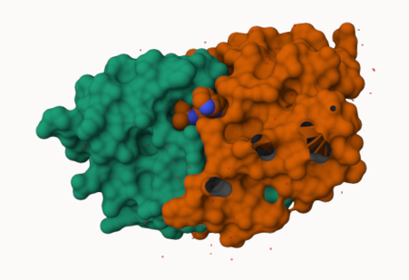
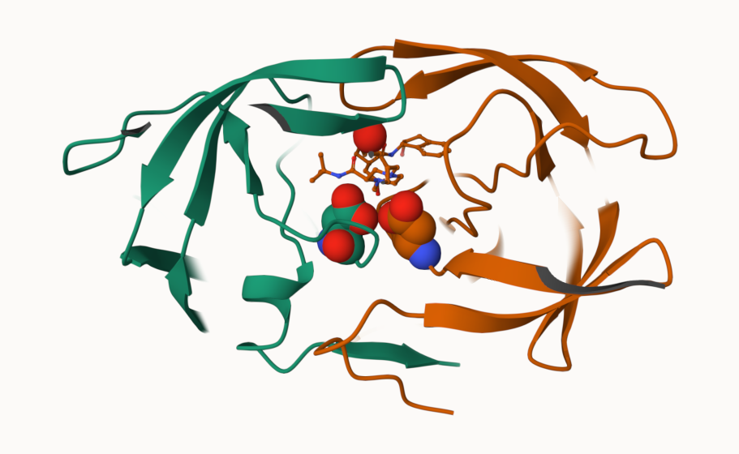
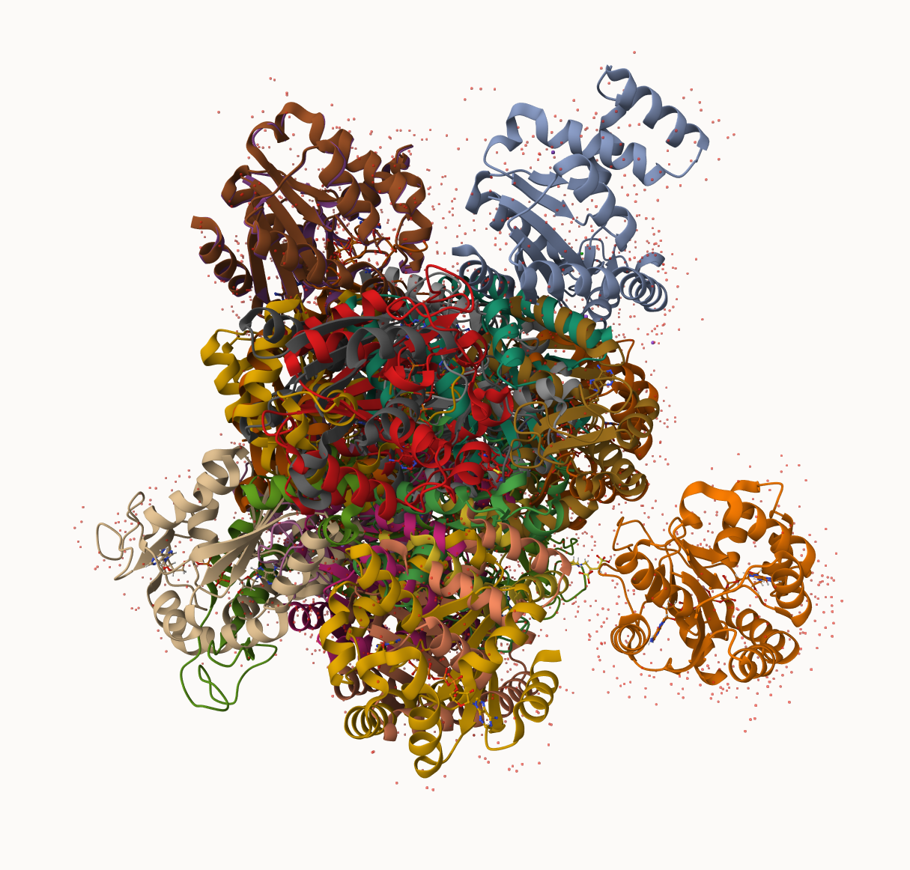

## PDB Statistics

The Protein Data Bank (PDB) is the main repository of biomolecular strucutres. Let's see what it contains:

```{r}
stats <- read.csv("Data Export Summary.csv")
stats
```
```{r}
stats$X.ray
```


```{r}
sum(stats$Neutron)
```

The comma in these numbers leads to the numbers here bring read as character.

```{r}
c("100", "10", "barry")
```

```{r}
#install.packages("readr")
library(readr)
stats <- read_csv("Data Export Summary.csv")
stats
```

```{r}
n.xray <- sum(stats$`X-ray`)
#n.em <- 
n.total <- sum(stats$Total)

n.xray/n.total
```


> Q1: What percentage of structures in the PDB are solved by X-Ray and Electron Microscopy.

```{r}
n.xray <- sum(stats$`X-ray`)
n.em <- sum(stats$`EM`)
n.total <- sum(stats$Total)

(n.xray + n.em)/n.total
```

> Q2: What proportion of structures in the PDB are protein?

```{r}
n.protein <- sum(stats[1,9])
n.protein/n.total
```

> Q3: SKIP... Looking up HIV structures including 1HSG


## Visualizing the HIV-1 protease structure

We can use the Molstar viewer online: https://molstar.org/viewer/



A new clean image showing the catalytic ASP25 amino acids in both chaings of the HIV-Pr dimer along with the inhibitor and all important active site water.



## Bio3D package for structural bioinformatics

```{r}
library(bio3d)

pdb <- read.pdb("1hsg")
pdb
```

```{r}
#head(pdb$atom)
```

```{r}
#install.packages("pak")
pak::pak("bioboot/bio3dview")
```

```{r}
library(bio3dview)

#view.pdb(pdb)
```


```{r}
# Select the important ASP 25 residue
sele <- atom.select(pdb, resno=25)

# and highlight them in spacefill representation
#view.pdb(pdb, cols=c("navy","skyblue"), 
        # highlight = sele,
        # highlight.style = "spacefill")
```


## Predicting functional motions of a single structure

Read an ADK structure from the PDB database:

```{r}
adk <- read.pdb("6s36")
adk
```

```{r}
m <- nma(adk)
plot(m)
```

Write out our results as a wee ttrajectory/movie of predicted motions:

```{r}
mktrj(m, file="adk_m7.pdb")
```


## Comparative analysis with PCA

First step find an ADK sequence:

```{r}
library(bio3d)
id <- "1ake_A" ## Change this to run a different analysis
aa <- get.seq( id )
```

```{r}
aa
```

Next step, is search the PDB database for all related entries:

```{r}
blast <- blast.pdb(aa)
hits <- plot(blast)
```

All the BLAST results are here for us to see:
```{r}
head( blast$hit.tbl )
```

The "top hits" are in the `hits` object. Now we can download these to our computer. Put these in a wee sub-folder (directory) called "pdbs" and use gzip to speed things up.

```{r}
# Download releated PDB files
files <- get.pdb(hits$pdb.id, path="pdbs", split=TRUE, gzip=TRUE)
```

These looks like a hot mess



Next we will use the pdbaln() function to align and also optionally fit (i.e. superpose) the identified PDB structures.

This requires a BioConductor package called "msa" that we need to install.
First we install BiocManager. Then we use `BiocManager::install("msa")`

```{r}
# Align releated PDBs
pdbs <- pdbaln(files, fit = TRUE, exefile="msa")
```

We have a wee peak at this new "alignment object" `pdbs`

```{r}
pdbs
```

We could view these in R with **bio3dview** `view.pdbs()` function.

```{r}
library(bio3dview)
view.pdbs(pdbs, colorScheme = "residue")
```

## PCA

We can run PCA on our `pdbs` object using the `pca()` function from **bio3d**:

```{r}
pc.xray <- pca(pdbs)
plot(pc.xray)
```

```{r}
plot(pc.xray, 1:2)
```

We can make a visualization of the major conformational difference (i.e. large scale structure change) captured by our pCA analysis with the `mktrj()` function.

```{r}
pc1 <- mktrj(pc.xray, file="pca.pdb")
```

Let's see in Mol-star


