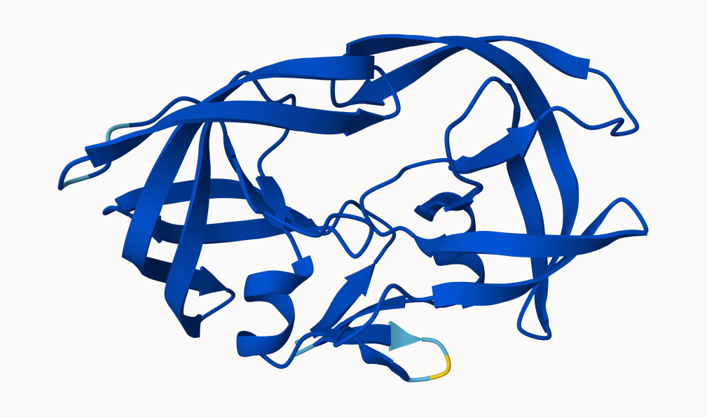

## Background

We saw last day that the main repository for biomolecular structure (the PDB database) only had \~250,000 entries.

UniProtKB (the main protein sequence database) has over 200 million entries!

In this hands-on session we will utilize AlphaFold to predict protein structure from sequence (Jumper et al. 2021).

Without the aid of such approaches, it can take years of expensive laboratory work to determine the structure of just one protein. With AlphaFold we can now accurately compute a typical protein structure in as little as ten minutes.

## The EBI AlphaFold database

The EBI alphafold database contains lots of computed structure models. It is increasingly likely that the structure you are interested in is already in this database at \< <https://alphafold.ebi.ac.uk> \>

There are 3 major outputs from AlphaFold

1.  A model of structure in **PDB format**.
2.  A **pLDDT score**: that tells us how confident the model is for a given residue in your protein (High values are good, above 70).
3.  A **PAE score** that tells us about protein packing quality.

If you can't find a matching entry for the sequence you are interested in AFDB you can run AlphaFold yourself...

## Running AlphaFold

We will use ColabFold to run AlphaFold on our sequence \< <https://colab.research.google.com/github/sokrypton/ColabFold> \>

Figure from AlphaFold here!

## Interpreting Results

Custom analysis of resulting models

We can read all the AlphaFold results into R and do more quantitative analysis than just viewing the structures in Mol-star:

Read all the PDB models:

```{r}
library(bio3d)
p <- read.pdb("hivpr_a4e10/hivpr_a4e10_unrelaxed_rank_001_alphafold2_ptm_model_5_seed_000.pdb")

```

```{r}
pdb_files <- list.files("hivpr_a4e10/", pattern = ".pdb", full.names = T)

pdbs <- pdbaln(pdb_files, fit=TRUE, exefile="msa")
```

```{r}
library(bio3dview)
view.pdbs(pdbs)
```

How similar or different are my models?

```{r}
rd <- rmsd(pdbs)

library(pheatmap)
colnames(rd) <- paste0("m",1:5)
rownames(rd) <- paste0("m",1:5)
pheatmap(rd)
```

```{r}
pdb <- read.pdb("1hsg")
```

```{r}
# Change this for YOUR results dir name
results_dir <- "hivpr_a4e10/" 
```

Below we read these files and see that AlphaFold produces a useful inter-domain prediction for model 1 (and 2) but not for model 5 (or indeed models 3, 4, and 5)

```{r}
library(jsonlite)

# Listing of all PAE JSON files
pae_files <- list.files(path=results_dir,
                        pattern=".*model.*\\.json",
                        full.names = TRUE)
```

```{r}
pae1 <- read_json(pae_files[1],simplifyVector = TRUE)
pae5 <- read_json(pae_files[5],simplifyVector = TRUE)

attributes(pae1)
```

```{r}
# Per-residue pLDDT scores 
#  same as B-factor of PDB..
head(pae1$plddt) 
```

The maximum PAE values are useful for ranking models. Here we can see that model 5 is much worse than model 1. The lower the PAE score the better. How about the other models, what are their max PAE scores?

```{r}
pae1$max_pae
```

```{r}
pae5$max_pae
```

We can plot the N by N (where N is the number of residues) PAE scores with ggplot or with functions from the Bio3D package:

```{r}
# plot of model 1
plot.dmat(pae1$pae, 
          xlab="Residue Position (i)",
          ylab="Residue Position (j)")
```

```{r}
# plot for model 5
plot.dmat(pae5$pae, 
          xlab="Residue Position (i)",
          ylab="Residue Position (j)",
          grid.col = "black",
          zlim=c(0,30))
```

```{r}
# replotting model 1 with same z range
plot.dmat(pae1$pae, 
          xlab="Residue Position (i)",
          ylab="Residue Position (j)",
          grid.col = "black",
          zlim=c(0,30))
```

Residue conservation from alignment file

```{r}
aln_file <- list.files(path=results_dir,
                       pattern=".a3m$",
                        full.names = TRUE)
aln_file
```

```{r}
aln <- read.fasta(aln_file[1], to.upper = TRUE)
```

How many sequences are in this alignment

```{r}
dim(aln$ali)
```

We can score residue conservation in the alignment with the conserv() function.

```{r}
sim <- conserv(aln)
```

```{r}
plotb3(sim[1:99], sse=trim.pdb(pdb, chain="A"),
       ylab="Conservation Score")
```

Conserved Active Sites will stand out if we generate a consensus sequence with a higher cutoff value:

```{r}
con <- consensus(aln, cutoff = 0.60)
con$seq
```

We can model this on Molstar

```{r}
m1.pdb <- read.pdb(pdb_files[1])
occ <- vec2resno(c(sim[1:99], sim[1:99]), m1.pdb$atom$resno)
write.pdb(m1.pdb, o=occ, file="m1_conserv.pdb")
```


