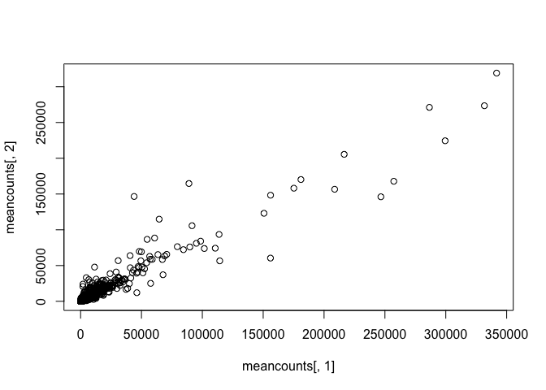
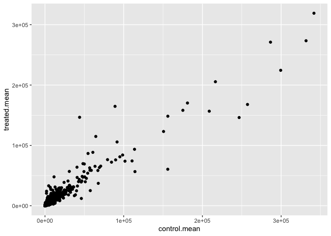
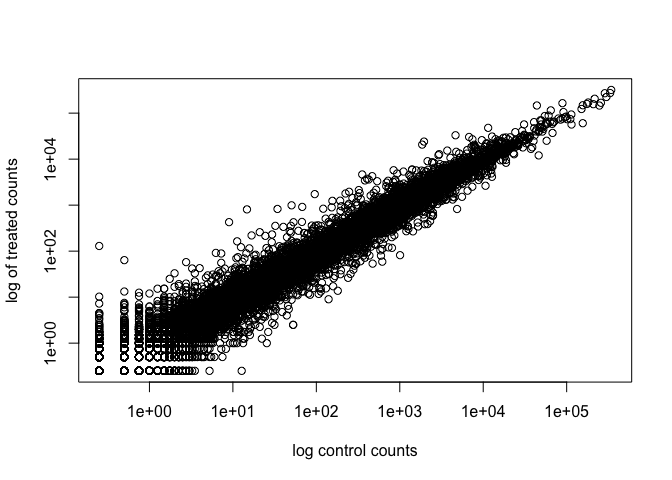
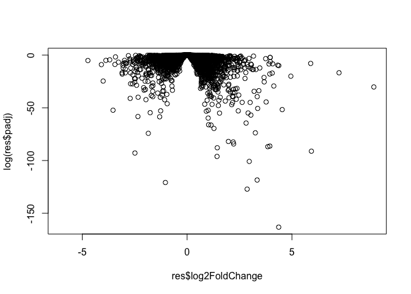

# Class 13 DESeq Analysis
Yane Lee PID A17670350

This week we are looking at differential expression analysis.

The data for this hands-on session comes from a published RNA-seq
experiment where airway smooth muscle cells were treated with
dexamethasone, a synthetic glucocorticoid steroid with anti-inflammatory
effects (Himes et al. 2014).

## Import/Read the data from Himes et al.

``` r
counts <- read.csv("airway_scaledcounts.csv",
                   row.names=1)

metadata <- read.csv("airway_metadata.csv")
```

Let’s have a wee peek at this data

``` r
head(metadata)
```

              id     dex celltype     geo_id
    1 SRR1039508 control   N61311 GSM1275862
    2 SRR1039509 treated   N61311 GSM1275863
    3 SRR1039512 control  N052611 GSM1275866
    4 SRR1039513 treated  N052611 GSM1275867
    5 SRR1039516 control  N080611 GSM1275870
    6 SRR1039517 treated  N080611 GSM1275871

Sanity check on correspondence of counts and metadata

``` r
all( metadata$id == colnames(counts) )
```

    [1] TRUE

> Q1. How many genes are in this dataset?

There are 38694 genes in this dataset.

> Q2. How many ‘control’ cell lines do we have?

There are 4 control cell lines in this dataset.

### Extract and sumarize the control samples

To find out where the control samples are we need the metadata

``` r
control <- metadata[metadata$dex == "control", ]
control.counts <- counts[ , control$id]
control.mean <- rowMeans(control.counts)
head(control.mean)
```

    ENSG00000000003 ENSG00000000005 ENSG00000000419 ENSG00000000457 ENSG00000000460 
             900.75            0.00          520.50          339.75           97.25 
    ENSG00000000938 
               0.75 

## Extract and summarize the treated (i.e. drug) samples

``` r
treated <- metadata[metadata$dex == "treated", ]
treated.counts <- counts[, treated$id]
treated.mean <- rowMeans(treated.counts)
```

Store these results together in a new data frame called `meancounts`

``` r
meancounts <- data.frame(control.mean, treated.mean)
```

Let’s make a plot to explore these results a little

``` r
plot(meancounts[,1], meancounts[,2])
```



``` r
library(ggplot2)

ggplot(meancounts) +
  aes(control.mean, treated.mean) +
  geom_point()
```



We will make a log-log plot to draw out this skewed data and see what is
going on.

``` r
plot(meancounts[,1], meancounts[,2], log="xy",
     xlab="log control counts", 
     ylab="log of treated counts")
```

    Warning in xy.coords(x, y, xlabel, ylabel, log): 15032 x values <= 0 omitted
    from logarithmic plot

    Warning in xy.coords(x, y, xlabel, ylabel, log): 15281 y values <= 0 omitted
    from logarithmic plot



We often log2 transformations when dealing with this sort of data.

``` r
log2(20/20)
```

    [1] 0

``` r
log2(40/20)
```

    [1] 1

``` r
log2(20/40)
```

    [1] -1

``` r
log2(80/20)
```

    [1] 2

This log2 transformation has this nice property where if there is no
change the log2 value will be zero and if it double the log2 value will
be 1 and if halved it will be -1.

So let’s add a log2 fold change column to our results so far

``` r
meancounts$log2fc <- log2( meancounts$treated.mean / meancounts$control.mean )
```

``` r
head(meancounts)
```

                    control.mean treated.mean      log2fc
    ENSG00000000003       900.75       658.00 -0.45303916
    ENSG00000000005         0.00         0.00         NaN
    ENSG00000000419       520.50       546.00  0.06900279
    ENSG00000000457       339.75       316.50 -0.10226805
    ENSG00000000460        97.25        78.75 -0.30441833
    ENSG00000000938         0.75         0.00        -Inf

We need to get ride of zero count genes that we can not say anything
about

``` r
zero.values <- which( meancounts[,1:2]==0, arr.ind=TRUE )
to.rm <- unique(zero.values[,1])
mycounts <- meancounts[-to.rm, ]
```

``` r
head(mycounts)
```

                    control.mean treated.mean      log2fc
    ENSG00000000003       900.75       658.00 -0.45303916
    ENSG00000000419       520.50       546.00  0.06900279
    ENSG00000000457       339.75       316.50 -0.10226805
    ENSG00000000460        97.25        78.75 -0.30441833
    ENSG00000000971      5219.00      6687.50  0.35769358
    ENSG00000001036      2327.00      1785.75 -0.38194109

How many genes are remaining?

``` r
nrow(mycounts)
```

    [1] 21817

# Use fold change to see up and down regulated genes.

A common threshold used for calling something differentially expressed
is a log2(FoldChange) of greater than 2 or less than -2. Let’s filter
the dataset both ways to see how many genes are up or down-regulated.

``` r
sum(mycounts$log2fc > 2)
```

    [1] 250

and down regulated

``` r
sum(mycounts$log2fc < -2)
```

    [1] 367

Do we trust these results? Well not fully because we don’t yet know if
these changes are significant…

## DESeq2 analysis

Let’s do this the right way. DESeq2 is an R package specifically for
analyzing count-based NGS data like RNA-seq. It is available from
Bioconductor. Bioconductor is a project to provide tools for analyzing
high-throughput genomic data including RNA-seq, ChIP-seq and arrays.

``` r
# load up DESeq2
library(DESeq2)
```

    Loading required package: S4Vectors

    Loading required package: stats4

    Loading required package: BiocGenerics

    Loading required package: generics


    Attaching package: 'generics'

    The following objects are masked from 'package:base':

        as.difftime, as.factor, as.ordered, intersect, is.element, setdiff,
        setequal, union


    Attaching package: 'BiocGenerics'

    The following objects are masked from 'package:stats':

        IQR, mad, sd, var, xtabs

    The following objects are masked from 'package:base':

        anyDuplicated, aperm, append, as.data.frame, basename, cbind,
        colnames, dirname, do.call, duplicated, eval, evalq, Filter, Find,
        get, grep, grepl, is.unsorted, lapply, Map, mapply, match, mget,
        order, paste, pmax, pmax.int, pmin, pmin.int, Position, rank,
        rbind, Reduce, rownames, sapply, saveRDS, table, tapply, unique,
        unsplit, which.max, which.min


    Attaching package: 'S4Vectors'

    The following object is masked from 'package:utils':

        findMatches

    The following objects are masked from 'package:base':

        expand.grid, I, unname

    Loading required package: IRanges

    Loading required package: GenomicRanges

    Loading required package: Seqinfo

    Loading required package: SummarizedExperiment

    Loading required package: MatrixGenerics

    Loading required package: matrixStats


    Attaching package: 'MatrixGenerics'

    The following objects are masked from 'package:matrixStats':

        colAlls, colAnyNAs, colAnys, colAvgsPerRowSet, colCollapse,
        colCounts, colCummaxs, colCummins, colCumprods, colCumsums,
        colDiffs, colIQRDiffs, colIQRs, colLogSumExps, colMadDiffs,
        colMads, colMaxs, colMeans2, colMedians, colMins, colOrderStats,
        colProds, colQuantiles, colRanges, colRanks, colSdDiffs, colSds,
        colSums2, colTabulates, colVarDiffs, colVars, colWeightedMads,
        colWeightedMeans, colWeightedMedians, colWeightedSds,
        colWeightedVars, rowAlls, rowAnyNAs, rowAnys, rowAvgsPerColSet,
        rowCollapse, rowCounts, rowCummaxs, rowCummins, rowCumprods,
        rowCumsums, rowDiffs, rowIQRDiffs, rowIQRs, rowLogSumExps,
        rowMadDiffs, rowMads, rowMaxs, rowMeans2, rowMedians, rowMins,
        rowOrderStats, rowProds, rowQuantiles, rowRanges, rowRanks,
        rowSdDiffs, rowSds, rowSums2, rowTabulates, rowVarDiffs, rowVars,
        rowWeightedMads, rowWeightedMeans, rowWeightedMedians,
        rowWeightedSds, rowWeightedVars

    Loading required package: Biobase

    Welcome to Bioconductor

        Vignettes contain introductory material; view with
        'browseVignettes()'. To cite Bioconductor, see
        'citation("Biobase")', and for packages 'citation("pkgname")'.


    Attaching package: 'Biobase'

    The following object is masked from 'package:MatrixGenerics':

        rowMedians

    The following objects are masked from 'package:matrixStats':

        anyMissing, rowMedians

``` r
dds <- DESeqDataSetFromMatrix(countData=counts,
                       colData=metadata,
                       design=~dex)
```

    converting counts to integer mode

    Warning in DESeqDataSet(se, design = design, ignoreRank): some variables in
    design formula are characters, converting to factors

``` r
dds <- DESeq(dds)
```

    estimating size factors

    estimating dispersions

    gene-wise dispersion estimates

    mean-dispersion relationship

    final dispersion estimates

    fitting model and testing

``` r
res <- results(dds)
res
```

    log2 fold change (MLE): dex treated vs control 
    Wald test p-value: dex treated vs control 
    DataFrame with 38694 rows and 6 columns
                     baseMean log2FoldChange     lfcSE      stat    pvalue
                    <numeric>      <numeric> <numeric> <numeric> <numeric>
    ENSG00000000003  747.1942      -0.350703  0.168242 -2.084514 0.0371134
    ENSG00000000005    0.0000             NA        NA        NA        NA
    ENSG00000000419  520.1342       0.206107  0.101042  2.039828 0.0413675
    ENSG00000000457  322.6648       0.024527  0.145134  0.168996 0.8658000
    ENSG00000000460   87.6826      -0.147143  0.256995 -0.572550 0.5669497
    ...                   ...            ...       ...       ...       ...
    ENSG00000283115  0.000000             NA        NA        NA        NA
    ENSG00000283116  0.000000             NA        NA        NA        NA
    ENSG00000283119  0.000000             NA        NA        NA        NA
    ENSG00000283120  0.974916       -0.66825   1.69441 -0.394385  0.693297
    ENSG00000283123  0.000000             NA        NA        NA        NA
                         padj
                    <numeric>
    ENSG00000000003  0.163017
    ENSG00000000005        NA
    ENSG00000000419  0.175937
    ENSG00000000457  0.961682
    ENSG00000000460  0.815805
    ...                   ...
    ENSG00000283115        NA
    ENSG00000283116        NA
    ENSG00000283119        NA
    ENSG00000283120        NA
    ENSG00000283123        NA

We can get some basic summary tallies using the `summary()` function

``` r
summary(res, alpha=0.05)
```


    out of 25258 with nonzero total read count
    adjusted p-value < 0.05
    LFC > 0 (up)       : 1242, 4.9%
    LFC < 0 (down)     : 939, 3.7%
    outliers [1]       : 142, 0.56%
    low counts [2]     : 9971, 39%
    (mean count < 10)
    [1] see 'cooksCutoff' argument of ?results
    [2] see 'independentFiltering' argument of ?results

# Volcano plot

Make a summary plot of our results.

``` r
plot(res$log2FoldChange, log(res$padj))
```



``` r
log(0.1)
```

    [1] -2.302585

``` r
log(0.005)
```

    [1] -5.298317

Finish for today by saving our

## Save our results to a CSV file

``` r
write.csv(res, file="DESeq2_results.csv")
```

## Add annotation data

We need to add missing annotation data to our main `res` results object.
This includes the common gene “symbol”

``` r
head(res)
```

    log2 fold change (MLE): dex treated vs control 
    Wald test p-value: dex treated vs control 
    DataFrame with 6 rows and 6 columns
                      baseMean log2FoldChange     lfcSE      stat    pvalue
                     <numeric>      <numeric> <numeric> <numeric> <numeric>
    ENSG00000000003 747.194195      -0.350703  0.168242 -2.084514 0.0371134
    ENSG00000000005   0.000000             NA        NA        NA        NA
    ENSG00000000419 520.134160       0.206107  0.101042  2.039828 0.0413675
    ENSG00000000457 322.664844       0.024527  0.145134  0.168996 0.8658000
    ENSG00000000460  87.682625      -0.147143  0.256995 -0.572550 0.5669497
    ENSG00000000938   0.319167      -1.732289  3.493601 -0.495846 0.6200029
                         padj
                    <numeric>
    ENSG00000000003  0.163017
    ENSG00000000005        NA
    ENSG00000000419  0.175937
    ENSG00000000457  0.961682
    ENSG00000000460  0.815805
    ENSG00000000938        NA

We will use R and bioconductor to do this “ID mapping”

``` r
library("AnnotationDbi")
library("org.Hs.eg.db")
```

Let’s see what databases we can use for translation/mapping…

``` r
columns(org.Hs.eg.db)
```

     [1] "ACCNUM"       "ALIAS"        "ENSEMBL"      "ENSEMBLPROT"  "ENSEMBLTRANS"
     [6] "ENTREZID"     "ENZYME"       "EVIDENCE"     "EVIDENCEALL"  "GENENAME"    
    [11] "GENETYPE"     "GO"           "GOALL"        "IPI"          "MAP"         
    [16] "OMIM"         "ONTOLOGY"     "ONTOLOGYALL"  "PATH"         "PFAM"        
    [21] "PMID"         "PROSITE"      "REFSEQ"       "SYMBOL"       "UCSCKG"      
    [26] "UNIPROT"     

We can use the `mapIds()` function now to “translate” between any of
these databases.

``` r
res$symbol <- mapIds(org.Hs.eg.db,
                     keys=row.names(res), # Our genenames
                     keytype="ENSEMBL",   # Their format
                     column="SYMBOL")     # Format we want
```

    'select()' returned 1:many mapping between keys and columns

> Q. Also add “ENTREZID”, “GENENAME” IDs to our `res` object”

``` r
res$entres <- mapIds(org.Hs.eg.db,
                     keys=row.names(res), # Our genenames
                     keytype="ENSEMBL",   # Their format
                     column="ENTREZID",
                     multiVals = "list")
```

    'select()' returned 1:many mapping between keys and columns

``` r
res$genename <- mapIds(org.Hs.eg.db,
                     keys=row.names(res), # Our genenames
                     keytype="ENSEMBL",   # Their format
                     column="GENENAME",
                     multiVals = "list")
```

    'select()' returned 1:many mapping between keys and columns

``` r
head(res)
```

    log2 fold change (MLE): dex treated vs control 
    Wald test p-value: dex treated vs control 
    DataFrame with 6 rows and 9 columns
                      baseMean log2FoldChange     lfcSE      stat    pvalue
                     <numeric>      <numeric> <numeric> <numeric> <numeric>
    ENSG00000000003 747.194195      -0.350703  0.168242 -2.084514 0.0371134
    ENSG00000000005   0.000000             NA        NA        NA        NA
    ENSG00000000419 520.134160       0.206107  0.101042  2.039828 0.0413675
    ENSG00000000457 322.664844       0.024527  0.145134  0.168996 0.8658000
    ENSG00000000460  87.682625      -0.147143  0.256995 -0.572550 0.5669497
    ENSG00000000938   0.319167      -1.732289  3.493601 -0.495846 0.6200029
                         padj      symbol entres               genename
                    <numeric> <character> <list>                 <list>
    ENSG00000000003  0.163017      TSPAN6   7105          tetraspanin 6
    ENSG00000000005        NA        TNMD  64102            tenomodulin
    ENSG00000000419  0.175937        DPM1   8813 dolichyl-phosphate m..
    ENSG00000000457  0.961682       SCYL3  57147 SCY1 like pseudokina..
    ENSG00000000460  0.815805       FIRRM  55732 FIGNL1 interacting r..
    ENSG00000000938        NA         FGR   2268 FGR proto-oncogene, ..

## Pathway analysis

What known biological pathways do our differentially expressed genes
overlap with (i.e. play a role in)?

There are lot’s of bioconductor packages to do this type of analysis.

We will use one of the oldest called **gage** along with **pathview** to
render ncice pics of the pathways we find.

We can install these with the command:
`BiocManager::install( c("pathview", "gage", "gageData") )`

``` r
library(pathview)
library(gage)
library(gageData)
```

Have a wee peek what is in `gageData`

``` r
# Examine the first 2 pathways in this kegg set for humans
data(kegg.sets.hs)
head(kegg.sets.hs, 2)
```

    $`hsa00232 Caffeine metabolism`
    [1] "10"   "1544" "1548" "1549" "1553" "7498" "9"   

    $`hsa00983 Drug metabolism - other enzymes`
     [1] "10"     "1066"   "10720"  "10941"  "151531" "1548"   "1549"   "1551"  
     [9] "1553"   "1576"   "1577"   "1806"   "1807"   "1890"   "221223" "2990"  
    [17] "3251"   "3614"   "3615"   "3704"   "51733"  "54490"  "54575"  "54576" 
    [25] "54577"  "54578"  "54579"  "54600"  "54657"  "54658"  "54659"  "54963" 
    [33] "574537" "64816"  "7083"   "7084"   "7172"   "7363"   "7364"   "7365"  
    [41] "7366"   "7367"   "7371"   "7372"   "7378"   "7498"   "79799"  "83549" 
    [49] "8824"   "8833"   "9"      "978"   

The main `gage()` function that does the work wants a simple vector as
input.

``` r
foldchanges = res$log2FoldChange
names(foldchanges) = res$symbol
head(foldchanges)
```

         TSPAN6        TNMD        DPM1       SCYL3       FIRRM         FGR 
    -0.35070296          NA  0.20610728  0.02452701 -0.14714263 -1.73228897 

The KEGG database uses ENTREZ ids so we need to provide these in our
input vector for **gage**:

``` r
names(foldchanges) <- res$entres
```

Now we can run `gage()`

``` r
# Get the results
keggres = gage(foldchanges, gsets=kegg.sets.hs)
```

What is in the output object `keggres`

``` r
attributes(keggres)
```

    $names
    [1] "greater" "less"    "stats"  

``` r
# Look at the first three down (less) pathways
head(keggres$less, 3)
```

                                          p.geomean stat.mean        p.val
    hsa05332 Graft-versus-host disease 0.0004250607 -3.473335 0.0004250607
    hsa04940 Type I diabetes mellitus  0.0017820379 -3.002350 0.0017820379
    hsa05310 Asthma                    0.0020046180 -3.009045 0.0020046180
                                            q.val set.size         exp1
    hsa05332 Graft-versus-host disease 0.09053792       40 0.0004250607
    hsa04940 Type I diabetes mellitus  0.14232788       42 0.0017820379
    hsa05310 Asthma                    0.14232788       29 0.0020046180

We can use the **pathview** function to render a figure of any of these
pathways along with annotation for our DEGs

Let’s see the hsa05310 Asthma pathway with our DEGs colored up:

``` r
pathview(gene.data=foldchanges, pathway.id="hsa05310")
```

    'select()' returned 1:1 mapping between keys and columns

    Info: Working in directory /Users/yanelee/Downloads/BIMM143/class15/bimm143/class13/class13lab

    Info: Writing image file hsa05310.pathview.png


> Q. Can you render and insert here the pathway figure for
> “Graft-versus-host disease” and “Type I diabetes”?

For “Graft-versus-host-disease”…

``` r
pathview(gene.data=foldchanges, pathway.id="hsa05332")
```

    'select()' returned 1:1 mapping between keys and columns

    Info: Working in directory /Users/yanelee/Downloads/BIMM143/class15/bimm143/class13/class13lab

    Info: Writing image file hsa05332.pathview.png


For “Type 1 diabetes”…

``` r
pathview(gene.data=foldchanges, pathway.id="hsa04940")
```

    'select()' returned 1:1 mapping between keys and columns

    Info: Working in directory /Users/yanelee/Downloads/BIMM143/class15/bimm143/class13/class13lab

    Info: Writing image file hsa04940.pathview.png


