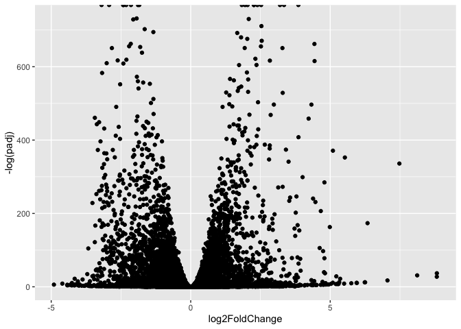
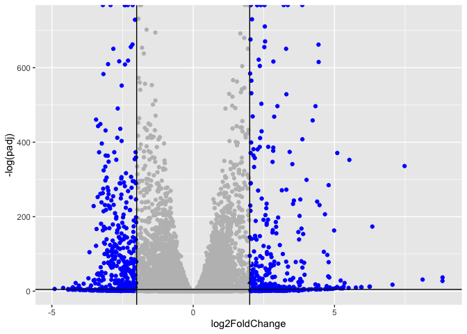

# Class 14 - RNA Seq Analysis
Yane Lee PID A17670350

# RNA Seq Analysis

## Background

Our data for today comes froma HOX gene knock-out study

The authors report on differential analysis of lung fibroblasts in
response to loss of the developmental transcription factor HOXA1

## Data Import

We have 2 key input files: counts and metadata

``` r
library(DESeq2)
```

    Loading required package: S4Vectors

    Loading required package: stats4

    Loading required package: BiocGenerics

    Loading required package: generics


    Attaching package: 'generics'

    The following objects are masked from 'package:base':

        as.difftime, as.factor, as.ordered, intersect, is.element, setdiff,
        setequal, union


    Attaching package: 'BiocGenerics'

    The following objects are masked from 'package:stats':

        IQR, mad, sd, var, xtabs

    The following objects are masked from 'package:base':

        anyDuplicated, aperm, append, as.data.frame, basename, cbind,
        colnames, dirname, do.call, duplicated, eval, evalq, Filter, Find,
        get, grep, grepl, is.unsorted, lapply, Map, mapply, match, mget,
        order, paste, pmax, pmax.int, pmin, pmin.int, Position, rank,
        rbind, Reduce, rownames, sapply, saveRDS, table, tapply, unique,
        unsplit, which.max, which.min


    Attaching package: 'S4Vectors'

    The following object is masked from 'package:utils':

        findMatches

    The following objects are masked from 'package:base':

        expand.grid, I, unname

    Loading required package: IRanges

    Loading required package: GenomicRanges

    Loading required package: Seqinfo

    Loading required package: SummarizedExperiment

    Loading required package: MatrixGenerics

    Loading required package: matrixStats


    Attaching package: 'MatrixGenerics'

    The following objects are masked from 'package:matrixStats':

        colAlls, colAnyNAs, colAnys, colAvgsPerRowSet, colCollapse,
        colCounts, colCummaxs, colCummins, colCumprods, colCumsums,
        colDiffs, colIQRDiffs, colIQRs, colLogSumExps, colMadDiffs,
        colMads, colMaxs, colMeans2, colMedians, colMins, colOrderStats,
        colProds, colQuantiles, colRanges, colRanks, colSdDiffs, colSds,
        colSums2, colTabulates, colVarDiffs, colVars, colWeightedMads,
        colWeightedMeans, colWeightedMedians, colWeightedSds,
        colWeightedVars, rowAlls, rowAnyNAs, rowAnys, rowAvgsPerColSet,
        rowCollapse, rowCounts, rowCummaxs, rowCummins, rowCumprods,
        rowCumsums, rowDiffs, rowIQRDiffs, rowIQRs, rowLogSumExps,
        rowMadDiffs, rowMads, rowMaxs, rowMeans2, rowMedians, rowMins,
        rowOrderStats, rowProds, rowQuantiles, rowRanges, rowRanks,
        rowSdDiffs, rowSds, rowSums2, rowTabulates, rowVarDiffs, rowVars,
        rowWeightedMads, rowWeightedMeans, rowWeightedMedians,
        rowWeightedSds, rowWeightedVars

    Loading required package: Biobase

    Welcome to Bioconductor

        Vignettes contain introductory material; view with
        'browseVignettes()'. To cite Bioconductor, see
        'citation("Biobase")', and for packages 'citation("pkgname")'.


    Attaching package: 'Biobase'

    The following object is masked from 'package:MatrixGenerics':

        rowMedians

    The following objects are masked from 'package:matrixStats':

        anyMissing, rowMedians

``` r
metaFile <- "GSE37704_metadata.csv"
countFile <- "GSE37704_featurecounts.csv"

# Import metadata and take a peek
colData = read.csv(metaFile, row.names=1)
# head(colData)
```

``` r
countData = read.csv(countFile, row.names=1)
# head(countData)
```

We need to remove the odd first “length” column from
`countData to have a 1:1 correspondence with`calData\` rows

``` r
countData <- as.matrix(countData[, -1])
# head(countData)
```

``` r
rownames(colData) == colnames(countData)
```

    [1] TRUE TRUE TRUE TRUE TRUE TRUE

## Remove zero count genes

Some genes (rows) have no count data (i.e. zero values). We should
remove these before any further analysis.

``` r
to.keep <- rowSums(countData > 0)
```

## Setup for DeSeq

``` r
dds <- DESeqDataSetFromMatrix(countData = countData,
                              colData = colData,
                              design = ~condition)
```

    Warning in DESeqDataSet(se, design = design, ignoreRank): some variables in
    design formula are characters, converting to factors

### Run DESeq

``` r
dds <- DESeq(dds)
```

    estimating size factors

    estimating dispersions

    gene-wise dispersion estimates

    mean-dispersion relationship

    final dispersion estimates

    fitting model and testing

### Get results

``` r
res <- results(dds)
```

# Results

``` r
# head(res)
```

# Volcano plot

``` r
library(ggplot2)

ggplot(res) +
  aes(log2FoldChange,
      -log(padj)) + 
  geom_point()
```

    Warning: Removed 5054 rows containing missing values or values outside the scale range
    (`geom_point()`).



Let’s add some color to this plot along with cutoff lines for
fold-change and P-value

``` r
mycols <- rep("gray", nrow(res))
mycols[ abs(res$log2FoldChange) > 2] <- "blue"
mycols[ res$padj > 0.01 ] 
```

        [1] NA     NA     "gray" NA     NA     "gray" "gray" "gray" NA     "gray"
       [11] NA     "gray" "gray" "gray" "gray" "gray" "gray" "gray" "gray" "gray"
       [21] "gray" "gray" NA     "gray" "gray" "gray" "gray" NA     "gray" "gray"
       [31] "gray" "gray" "gray" "gray" "gray" "gray" NA     NA     "gray" "gray"
       [41] "gray" "gray" "gray" "gray" NA     NA     "gray" NA     "gray" "gray"
       [51] "gray" "gray" "gray" "gray" "gray" "gray" "gray" "gray" "gray" "gray"
       [61] "gray" "gray" NA     "gray" "blue" "gray" NA     "gray" "gray" "gray"
       [71] "gray" "gray" NA     "blue" "gray" NA     NA     "gray" "gray" "gray"
       [81] NA     "gray" "gray" NA     "gray" "gray" "gray" "gray" "gray" "gray"
       [91] "gray" NA     NA     "gray" "gray" "gray" "gray" "gray" "gray" "gray"
      [101] NA     "gray" "blue" "gray" "gray" "gray" "gray" NA     NA     NA    
      [111] NA     NA     NA     "gray" NA     NA     NA     NA     NA     NA    
      [121] NA     NA     NA     NA     "gray" NA     NA     NA     NA     NA    
      [131] NA     NA     NA     NA     NA     "gray" NA     NA     NA     "gray"
      [141] "gray" NA     "gray" NA     "gray" "gray" "gray" "gray" NA     NA    
      [151] "blue" "gray" "gray" "gray" "gray" NA     "gray" NA     "gray" NA    
      [161] NA     NA     "gray" NA     NA     NA     NA     "gray" NA     NA    
      [171] NA     NA     NA     "gray" "gray" "gray" "gray" "gray" "gray" NA    
      [181] NA     NA     "gray" NA     NA     "gray" NA     NA     NA     NA    
      [191] NA     "gray" "gray" "gray" "gray" "gray" "gray" "gray" "gray" NA    
      [201] NA     "gray" "gray" NA     NA     NA     NA     "gray" NA     NA    
      [211] "gray" "gray" "gray" "gray" "blue" "gray" NA     "gray" NA     NA    
      [221] "gray" NA     "gray" "gray" "gray" NA     "gray" NA     NA     "gray"
      [231] NA     "blue" "gray" NA     "gray" "gray" "gray" NA     NA     NA    
      [241] "gray" NA     "gray" "gray" NA     NA     "gray" NA     "gray" "gray"
      [251] "blue" NA     NA     "gray" "gray" "gray" NA     NA     "gray" "gray"
      [261] "gray" "gray" "gray" "gray" "gray" "gray" "gray" "gray" "gray" "gray"
      [271] "blue" "gray" "gray" "gray" "gray" "gray" "gray" "gray" "gray" "gray"
      [281] "gray" "gray" "gray" NA     "gray" "gray" "gray" NA     NA     "gray"
      [291] "gray" "gray" "gray" "gray" "gray" "gray" "gray" "gray" "gray" NA    
      [301] NA     "gray" "gray" NA     NA     NA     "blue" NA     "gray" "gray"
      [311] "gray" "gray" "gray" "gray" "gray" "blue" "gray" "gray" "gray" "gray"
      [321] "gray" "gray" "gray" NA     NA     "gray" "gray" NA     "gray" NA    
      [331] "gray" "gray" "blue" NA     NA     "gray" "gray" "gray" NA     NA    
      [341] "gray" NA     "gray" "gray" NA     "gray" "gray" "gray" "gray" "gray"
      [351] "gray" "gray" "gray" "gray" "gray" "gray" "gray" NA     NA     NA    
      [361] NA     "gray" NA     "gray" "gray" NA     "gray" "gray" "gray" "gray"
      [371] "gray" NA     NA     NA     "gray" "gray" "gray" "gray" "gray" "gray"
      [381] "gray" "gray" "gray" "gray" "gray" "gray" "gray" "gray" "gray" "gray"
      [391] "gray" "gray" "gray" NA     "gray" NA     "gray" "gray" "gray" "gray"
      [401] "gray" NA     NA     "gray" "gray" "gray" NA     NA     NA     NA    
      [411] NA     NA     NA     "gray" "gray" "gray" "blue" NA     "blue" NA    
      [421] "gray" NA     NA     NA     "gray" "gray" "gray" "gray" "gray" "gray"
      [431] "gray" "gray" "gray" "gray" NA     "gray" "gray" "gray" NA     "gray"
      [441] "gray" "gray" NA     "gray" "gray" "gray" NA     "gray" NA     NA    
      [451] "gray" "gray" "gray" NA     NA     "gray" "gray" NA     NA     NA    
      [461] NA     "gray" "gray" NA     NA     "gray" "gray" "gray" NA     "gray"
      [471] NA     NA     NA     "gray" "gray" NA     "gray" NA     "gray" "gray"
      [481] "gray" "gray" NA     NA     NA     NA     "gray" "gray" "gray" "gray"
      [491] "gray" "gray" NA     "gray" NA     "gray" "gray" NA     NA     NA    
      [501] "gray" NA     "gray" "gray" "gray" NA     "gray" "gray" "gray" "gray"
      [511] "gray" "gray" "gray" "gray" NA     "gray" "gray" "blue" "gray" "gray"
      [521] NA     NA     "gray" "gray" NA     "gray" "gray" NA     "blue" NA    
      [531] NA     "gray" NA     "gray" NA     "gray" NA     "blue" "gray" NA    
      [541] "gray" "gray" "gray" "gray" "gray" "gray" "gray" "gray" "gray" "gray"
      [551] "gray" "gray" "blue" "gray" "gray" "gray" "gray" "gray" "gray" "gray"
      [561] "gray" NA     "gray" "gray" "gray" NA     NA     NA     NA     "gray"
      [571] "gray" NA     NA     "gray" "gray" "gray" "gray" "gray" NA     "gray"
      [581] "blue" "gray" "gray" "gray" "gray" "gray" "gray" "gray" NA     "gray"
      [591] "gray" NA     "gray" "gray" NA     "gray" "gray" "gray" NA     NA    
      [601] "gray" "gray" "gray" "gray" NA     NA     "gray" "gray" NA     "gray"
      [611] "gray" "gray" "gray" "gray" NA     "gray" "gray" "gray" NA     NA    
      [621] "gray" "gray" "gray" "gray" "gray" NA     "gray" "blue" "gray" "gray"
      [631] "gray" "gray" "gray" "gray" NA     NA     "gray" "gray" NA     NA    
      [641] "gray" NA     NA     "gray" NA     "gray" "gray" NA     NA     "gray"
      [651] NA     "gray" "gray" NA     "gray" NA     NA     NA     NA     NA    
      [661] NA     "gray" "gray" "gray" NA     "blue" NA     NA     NA     NA    
      [671] "gray" "gray" "gray" NA     "gray" "gray" "gray" "gray" "gray" "gray"
      [681] "gray" "gray" "gray" "gray" NA     "gray" NA     "gray" NA     NA    
      [691] "gray" "gray" "gray" "gray" NA     NA     "gray" "gray" "gray" NA    
      [701] "gray" "gray" NA     NA     "blue" "gray" "gray" "gray" NA     "gray"
      [711] "blue" NA     "gray" "gray" "blue" "gray" "gray" "gray" "gray" "gray"
      [721] "gray" "gray" NA     "gray" "gray" "gray" "gray" "gray" "gray" NA    
      [731] "gray" "gray" "gray" "gray" "gray" "gray" "gray" "gray" "gray" "gray"
      [741] NA     "gray" "gray" "gray" "gray" "gray" "gray" NA     NA     "gray"
      [751] "gray" NA     NA     "gray" "gray" "gray" "gray" NA     "gray" NA    
      [761] "gray" "gray" NA     NA     NA     NA     NA     NA     NA     NA    
      [771] NA     NA     NA     NA     NA     "gray" NA     NA     NA     NA    
      [781] NA     NA     NA     NA     NA     NA     NA     NA     NA     NA    
      [791] NA     NA     NA     NA     NA     NA     NA     NA     NA     NA    
      [801] NA     NA     NA     NA     NA     NA     NA     NA     NA     "blue"
      [811] "gray" "gray" "gray" "gray" "gray" "gray" NA     NA     "gray" "gray"
      [821] "gray" "gray" "gray" "gray" NA     NA     "gray" NA     NA     "blue"
      [831] "gray" NA     NA     "blue" NA     "gray" NA     "gray" "gray" "gray"
      [841] "gray" NA     "gray" "gray" NA     NA     "gray" "gray" NA     "gray"
      [851] "gray" "gray" "gray" "gray" NA     "gray" "gray" NA     "gray" "gray"
      [861] NA     "gray" NA     "gray" "gray" NA     "gray" NA     NA     NA    
      [871] "gray" "gray" NA     "gray" "gray" "gray" "gray" "gray" "gray" NA    
      [881] NA     "gray" NA     NA     NA     NA     NA     NA     NA     NA    
      [891] NA     NA     NA     NA     NA     NA     NA     NA     NA     NA    
      [901] NA     NA     NA     NA     NA     NA     NA     NA     "blue" NA    
      [911] NA     NA     NA     NA     NA     NA     NA     NA     "gray" NA    
      [921] "gray" "gray" "gray" NA     "gray" NA     NA     NA     NA     NA    
      [931] NA     "gray" "gray" "gray" "blue" NA     NA     NA     NA     NA    
      [941] NA     NA     NA     NA     "gray" NA     "gray" "gray" NA     "blue"
      [951] "gray" "gray" "gray" "gray" "gray" "gray" "gray" NA     "gray" "gray"
      [961] NA     "gray" "gray" NA     "gray" "gray" NA     NA     NA     "gray"
      [971] "gray" "gray" "gray" NA     NA     "gray" "gray" NA     NA     NA    
      [981] "gray" "gray" "gray" "gray" NA     NA     NA     "gray" NA     NA    
      [991] "gray" "gray" "gray" NA     NA     NA     "gray" "gray" NA     NA    
     [1001] NA     NA     "gray" NA     "gray" NA     "gray" "blue" "gray" "gray"
     [1011] NA     "gray" "gray" NA     "gray" "gray" NA     "gray" "gray" "gray"
     [1021] NA     NA     NA     NA     "gray" "blue" "blue" "gray" NA     "gray"
     [1031] "gray" "gray" NA     NA     NA     NA     "gray" "gray" "gray" "gray"
     [1041] "gray" "gray" "gray" NA     NA     "gray" NA     NA     "gray" "gray"
     [1051] NA     "gray" NA     "gray" "gray" "gray" NA     "gray" "gray" "gray"
     [1061] NA     "gray" NA     "blue" NA     NA     NA     "gray" "gray" "gray"
     [1071] NA     NA     NA     NA     NA     NA     NA     "gray" "gray" "gray"
     [1081] NA     NA     "gray" NA     "gray" NA     NA     "gray" "gray" "gray"
     [1091] "blue" NA     NA     "gray" "gray" "gray" NA     NA     NA     NA    
     [1101] "gray" "gray" NA     NA     "gray" "gray" "gray" NA     "gray" "gray"
     [1111] "gray" "gray" "gray" "gray" "blue" "gray" "gray" "gray" NA     NA    
     [1121] "blue" "gray" "gray" "gray" "gray" NA     NA     NA     NA     NA    
     [1131] "gray" NA     NA     "blue" "blue" NA     NA     NA     "gray" NA    
     [1141] NA     NA     NA     NA     "blue" "gray" "gray" "gray" "gray" "gray"
     [1151] NA     "gray" "gray" "gray" NA     "gray" "gray" "gray" "gray" "gray"
     [1161] "gray" "gray" "gray" "gray" "gray" "gray" NA     "gray" "gray" NA    
     [1171] "gray" "gray" "gray" "gray" "gray" "gray" "gray" NA     "gray" "gray"
     [1181] "gray" NA     NA     "gray" "gray" "gray" "gray" "gray" NA     NA    
     [1191] "gray" NA     "gray" "gray" NA     "gray" "gray" "gray" "gray" "gray"
     [1201] NA     "gray" NA     "gray" "gray" "gray" "gray" "gray" NA     "gray"
     [1211] "gray" NA     "gray" NA     "gray" "gray" "gray" "gray" "gray" "gray"
     [1221] "blue" "gray" "blue" "gray" "gray" "gray" NA     "gray" "gray" "gray"
     [1231] "gray" "gray" "gray" "gray" "gray" NA     "gray" "gray" "gray" "gray"
     [1241] "gray" NA     "gray" NA     "gray" NA     NA     NA     NA     "gray"
     [1251] "gray" "gray" "gray" "gray" "gray" NA     NA     NA     "gray" "blue"
     [1261] "gray" "gray" "blue" "gray" "gray" "gray" "gray" "gray" "gray" "blue"
     [1271] NA     "gray" "gray" "gray" NA     NA     NA     NA     NA     NA    
     [1281] NA     NA     NA     NA     NA     NA     "gray" "gray" NA     NA    
     [1291] NA     NA     NA     NA     NA     NA     NA     NA     NA     NA    
     [1301] NA     NA     NA     NA     NA     NA     NA     NA     NA     NA    
     [1311] NA     NA     NA     NA     NA     NA     NA     NA     NA     "gray"
     [1321] "gray" "gray" NA     "gray" "blue" NA     "gray" "blue" NA     "gray"
     [1331] "gray" NA     "gray" "blue" NA     NA     "gray" "gray" "gray" "gray"
     [1341] "gray" "gray" "gray" "gray" "gray" "gray" "gray" "gray" "blue" "gray"
     [1351] "gray" NA     "gray" NA     NA     "gray" "gray" "gray" NA     "gray"
     [1361] "gray" NA     "gray" "gray" "gray" "blue" "gray" NA     NA     "gray"
     [1371] "gray" "gray" "gray" "gray" NA     NA     "gray" "gray" "gray" "gray"
     [1381] "gray" "gray" "gray" "gray" "gray" "gray" "gray" "gray" NA     NA    
     [1391] NA     "gray" NA     "gray" "gray" "gray" "gray" NA     NA     "gray"
     [1401] NA     "gray" "gray" "gray" "gray" "gray" NA     "gray" "gray" "gray"
     [1411] "blue" NA     "gray" "gray" "gray" "gray" "gray" "gray" "gray" "gray"
     [1421] "gray" NA     NA     "gray" "blue" NA     "gray" "gray" "gray" NA    
     [1431] "gray" "gray" "gray" "gray" NA     "gray" NA     "gray" "gray" "gray"
     [1441] "gray" "gray" "gray" "gray" "gray" "blue" "gray" "gray" NA     NA    
     [1451] NA     "gray" "gray" "gray" NA     NA     "gray" NA     NA     NA    
     [1461] "gray" "gray" "gray" "gray" "gray" NA     "gray" "gray" "gray" NA    
     [1471] NA     NA     NA     NA     "gray" "gray" "gray" "gray" "gray" "gray"
     [1481] NA     NA     "gray" "gray" "gray" "gray" "gray" "gray" "gray" "gray"
     [1491] "gray" "gray" "gray" "gray" NA     "gray" "gray" "gray" "gray" "gray"
     [1501] NA     "gray" "gray" NA     "gray" "gray" "gray" "gray" NA     "gray"
     [1511] "gray" "gray" NA     "gray" NA     NA     NA     "gray" "gray" "gray"
     [1521] NA     "gray" "gray" "gray" "gray" "gray" NA     NA     NA     NA    
     [1531] "gray" "gray" "gray" "gray" "gray" "gray" "gray" "gray" "gray" "gray"
     [1541] NA     NA     "gray" "gray" NA     "gray" "gray" NA     "gray" NA    
     [1551] "gray" "gray" "gray" "gray" "gray" NA     "gray" "gray" "gray" "gray"
     [1561] "gray" NA     "gray" "gray" "gray" "gray" "gray" "gray" NA     NA    
     [1571] NA     NA     NA     "blue" NA     "blue" NA     "gray" "gray" "gray"
     [1581] "gray" NA     "gray" "gray" "gray" NA     NA     "gray" "gray" "gray"
     [1591] "gray" "gray" "gray" "gray" NA     NA     "gray" NA     "gray" "blue"
     [1601] "gray" NA     NA     "gray" NA     NA     "gray" NA     NA     NA    
     [1611] "gray" "gray" "gray" "gray" "gray" "gray" NA     "gray" NA     NA    
     [1621] "gray" "gray" "gray" "gray" NA     "gray" "gray" "gray" NA     "gray"
     [1631] "gray" "gray" "gray" "gray" "gray" "gray" NA     "gray" "gray" "blue"
     [1641] NA     "gray" "gray" "gray" "gray" NA     "gray" "gray" "gray" "gray"
     [1651] "gray" "gray" "gray" "gray" NA     "gray" "gray" "gray" "blue" "blue"
     [1661] "blue" "blue" NA     "blue" "gray" NA     NA     "gray" "gray" NA    
     [1671] "gray" "gray" "blue" NA     NA     NA     "gray" "gray" NA     NA    
     [1681] "gray" "blue" "gray" "gray" NA     NA     NA     NA     "gray" "gray"
     [1691] "gray" "gray" "gray" "gray" "gray" "gray" "gray" NA     NA     NA    
     [1701] NA     NA     NA     NA     NA     "gray" "gray" "gray" "gray" NA    
     [1711] "gray" "gray" "gray" NA     NA     NA     "gray" "gray" "gray" NA    
     [1721] NA     "gray" "gray" "gray" NA     "gray" NA     "gray" NA     "gray"
     [1731] "gray" "gray" "gray" "gray" "gray" "blue" "gray" NA     "gray" "gray"
     [1741] "gray" "gray" "gray" "gray" "gray" "gray" "gray" NA     NA     NA    
     [1751] NA     "gray" NA     NA     "gray" "gray" "gray" "gray" NA     NA    
     [1761] "blue" NA     "gray" "gray" NA     NA     NA     NA     "gray" "gray"
     [1771] "gray" "gray" "gray" "gray" "gray" "gray" "gray" "gray" "blue" "gray"
     [1781] NA     "gray" "gray" NA     "gray" NA     "gray" NA     NA     "gray"
     [1791] "gray" "gray" NA     NA     "gray" "gray" "gray" NA     NA     "gray"
     [1801] "gray" NA     NA     "gray" "gray" "gray" "gray" "gray" NA     "gray"
     [1811] "gray" "gray" NA     NA     NA     NA     "gray" NA     "blue" "gray"
     [1821] "gray" "gray" "gray" "gray" "gray" "gray" "blue" NA     NA     "blue"
     [1831] "gray" "gray" "gray" "gray" "gray" "gray" "gray" NA     "gray" "gray"
     [1841] "gray" NA     NA     NA     NA     NA     NA     NA     NA     NA    
     [1851] NA     NA     "gray" "gray" "gray" "gray" "gray" "gray" "gray" "gray"
     [1861] NA     NA     "gray" NA     "gray" "gray" "gray" "gray" "gray" "gray"
     [1871] "gray" "gray" NA     "gray" NA     "blue" "gray" "gray" "gray" "gray"
     [1881] "gray" "gray" "gray" "gray" "gray" "gray" "gray" "gray" "gray" "gray"
     [1891] "gray" "gray" NA     NA     "gray" "blue" "gray" "gray" "gray" NA    
     [1901] "gray" "gray" "gray" "gray" "gray" "gray" "gray" "gray" "blue" "gray"
     [1911] "gray" "gray" NA     NA     NA     "gray" "gray" NA     NA     "gray"
     [1921] "gray" NA     "gray" "gray" "gray" "gray" NA     NA     NA     NA    
     [1931] NA     NA     "gray" NA     "gray" NA     NA     NA     "gray" "gray"
     [1941] NA     "gray" "gray" "gray" NA     NA     NA     NA     NA     "gray"
     [1951] "gray" "gray" NA     "gray" NA     "gray" "gray" "gray" NA     NA    
     [1961] NA     "gray" NA     NA     NA     NA     "gray" "gray" "gray" "gray"
     [1971] "gray" "gray" "gray" "gray" NA     "gray" NA     "blue" NA     "gray"
     [1981] "gray" "gray" NA     NA     "gray" NA     "gray" NA     "gray" NA    
     [1991] "gray" "gray" "blue" "gray" "gray" NA     NA     "gray" "gray" "gray"
     [2001] "gray" "gray" "gray" "gray" NA     "gray" "blue" NA     "gray" "gray"
     [2011] "gray" NA     NA     "gray" "gray" NA     NA     NA     "gray" NA    
     [2021] NA     "gray" "gray" "gray" NA     "gray" "gray" NA     "gray" NA    
     [2031] "gray" NA     NA     NA     NA     NA     NA     NA     NA     NA    
     [2041] NA     "blue" NA     "gray" NA     NA     NA     NA     "gray" NA    
     [2051] "gray" "gray" "gray" "gray" "gray" "gray" "gray" "gray" NA     NA    
     [2061] NA     NA     "gray" NA     "gray" "gray" "gray" "gray" NA     NA    
     [2071] "gray" NA     NA     NA     "gray" "gray" "gray" "gray" "gray" "gray"
     [2081] NA     NA     NA     NA     NA     "gray" "gray" "gray" "gray" "gray"
     [2091] NA     NA     NA     "gray" "gray" "gray" "gray" NA     "gray" "gray"
     [2101] "gray" NA     "gray" NA     "gray" "gray" NA     NA     "gray" "gray"
     [2111] NA     NA     "gray" "gray" "gray" "gray" "gray" "gray" NA     "gray"
     [2121] "gray" "gray" NA     NA     "gray" "gray" "gray" "gray" "gray" "gray"
     [2131] "gray" NA     "gray" "gray" "gray" "gray" "blue" "gray" "gray" NA    
     [2141] "gray" "gray" NA     "gray" "gray" "gray" "gray" "blue" "gray" "gray"
     [2151] "gray" "gray" NA     NA     "gray" "gray" "gray" "gray" NA     "gray"
     [2161] "gray" "gray" "gray" NA     NA     "gray" NA     "gray" NA     "gray"
     [2171] "gray" "gray" "gray" "gray" "gray" "gray" NA     "gray" "gray" "gray"
     [2181] NA     NA     "gray" "blue" NA     NA     NA     NA     "gray" "gray"
     [2191] "gray" "gray" "gray" "gray" "gray" NA     NA     "gray" "gray" NA    
     [2201] "blue" NA     NA     "blue" "blue" "gray" NA     "gray" "blue" "gray"
     [2211] NA     "gray" "gray" "gray" "gray" "gray" "gray" "gray" "gray" "gray"
     [2221] NA     "gray" "gray" "gray" "gray" "gray" NA     "gray" NA     "gray"
     [2231] "gray" NA     NA     "blue" NA     NA     "gray" NA     NA     NA    
     [2241] "gray" "gray" NA     NA     NA     NA     NA     "gray" "gray" "gray"
     [2251] "gray" NA     "gray" "gray" NA     "blue" "gray" "gray" "gray" "gray"
     [2261] "gray" "gray" "gray" "gray" NA     "gray" "gray" "gray" "gray" "gray"
     [2271] "gray" "gray" "gray" NA     "gray" "gray" "gray" "gray" "gray" "gray"
     [2281] "gray" "gray" "gray" NA     "gray" NA     "gray" "gray" NA     NA    
     [2291] "gray" "gray" NA     "gray" NA     "gray" "gray" "gray" "gray" "gray"
     [2301] "gray" NA     "gray" "gray" "gray" "gray" "gray" "gray" "gray" NA    
     [2311] NA     NA     NA     NA     "gray" NA     "gray" "gray" NA     NA    
     [2321] "gray" "gray" "gray" "gray" NA     "gray" NA     "gray" "gray" "gray"
     [2331] "gray" NA     "gray" NA     "gray" NA     "blue" "gray" "gray" "gray"
     [2341] NA     "gray" "gray" NA     "gray" "gray" "gray" NA     "blue" "gray"
     [2351] "gray" "gray" NA     "gray" "gray" NA     "gray" "gray" NA     NA    
     [2361] "gray" "gray" "gray" NA     "blue" NA     NA     "gray" "gray" "gray"
     [2371] "gray" "gray" NA     NA     "gray" NA     "gray" "gray" "gray" "gray"
     [2381] NA     "gray" "gray" "gray" NA     "gray" "gray" NA     NA     "blue"
     [2391] NA     "gray" NA     "gray" "gray" NA     NA     NA     NA     NA    
     [2401] NA     NA     NA     NA     NA     NA     NA     "gray" "gray" NA    
     [2411] "gray" "gray" NA     "gray" "gray" "gray" "gray" "gray" "gray" "gray"
     [2421] "gray" NA     NA     "gray" NA     NA     NA     NA     NA     "gray"
     [2431] "gray" "blue" "gray" NA     "gray" "gray" "gray" "gray" "gray" "gray"
     [2441] "gray" NA     NA     "gray" "gray" "gray" "gray" "gray" "gray" "gray"
     [2451] "gray" NA     NA     NA     "gray" NA     NA     NA     NA     NA    
     [2461] "gray" "gray" "gray" "gray" "gray" NA     "gray" NA     "gray" "gray"
     [2471] NA     NA     "gray" "gray" "gray" "blue" NA     NA     "gray" "gray"
     [2481] "gray" "gray" "gray" NA     NA     NA     "blue" "gray" "gray" "gray"
     [2491] "gray" NA     "gray" "gray" "gray" NA     "gray" NA     "gray" "gray"
     [2501] NA     NA     NA     "gray" NA     NA     NA     NA     "gray" NA    
     [2511] "gray" "gray" NA     "gray" NA     "blue" "gray" NA     NA     "gray"
     [2521] "gray" "gray" "gray" "gray" "gray" NA     NA     "gray" NA     "gray"
     [2531] NA     "gray" "gray" NA     "gray" "gray" NA     "gray" "gray" "gray"
     [2541] "gray" "gray" "gray" NA     "blue" "gray" "blue" "gray" "gray" "gray"
     [2551] "blue" "gray" "gray" "gray" NA     "gray" "gray" "gray" "gray" "gray"
     [2561] "gray" "blue" NA     "gray" NA     NA     "gray" NA     "gray" "gray"
     [2571] NA     "gray" NA     "gray" NA     "gray" "gray" "gray" "gray" "gray"
     [2581] "gray" "gray" "gray" NA     NA     NA     NA     "gray" NA     "gray"
     [2591] "gray" "gray" "gray" "gray" "gray" NA     "gray" "gray" "gray" "blue"
     [2601] "gray" NA     NA     NA     NA     "blue" "gray" NA     NA     "blue"
     [2611] NA     "gray" NA     "gray" NA     "gray" "gray" "gray" "gray" "gray"
     [2621] "gray" "gray" "gray" "gray" "gray" "gray" NA     "gray" NA     "gray"
     [2631] NA     NA     NA     NA     NA     "gray" NA     NA     NA     "gray"
     [2641] NA     "gray" "gray" "gray" NA     NA     NA     "gray" "gray" NA    
     [2651] "gray" NA     "gray" NA     "gray" NA     "gray" "gray" NA     NA    
     [2661] "gray" "gray" "gray" "gray" "gray" "gray" "gray" NA     "gray" "gray"
     [2671] "gray" "gray" "gray" NA     "gray" "gray" NA     NA     NA     "gray"
     [2681] "gray" "gray" "gray" "gray" NA     "gray" "gray" "gray" "gray" NA    
     [2691] NA     NA     NA     NA     NA     NA     NA     NA     "gray" NA    
     [2701] NA     "gray" NA     "gray" "gray" "gray" NA     NA     "gray" NA    
     [2711] NA     "blue" "gray" "gray" "gray" "gray" "blue" NA     "gray" NA    
     [2721] "gray" NA     "gray" NA     NA     "gray" NA     "gray" "gray" "gray"
     [2731] "gray" "gray" "gray" "gray" "gray" "gray" "gray" "gray" "gray" "gray"
     [2741] "gray" "gray" "gray" "gray" "gray" "gray" "gray" "gray" "gray" "gray"
     [2751] "gray" "gray" "gray" "gray" NA     "gray" "gray" "gray" "gray" "gray"
     [2761] "gray" NA     "gray" "gray" "gray" "gray" "gray" "gray" "gray" "gray"
     [2771] NA     "gray" NA     "gray" NA     "gray" "gray" "gray" "gray" "gray"
     [2781] "gray" NA     NA     "gray" "gray" NA     "gray" "gray" "gray" "gray"
     [2791] "gray" NA     "gray" "gray" NA     "gray" "gray" "gray" "gray" NA    
     [2801] NA     NA     NA     NA     NA     NA     NA     NA     NA     NA    
     [2811] NA     NA     NA     NA     NA     NA     NA     NA     NA     NA    
     [2821] NA     NA     "gray" NA     "gray" NA     "gray" "gray" "gray" NA    
     [2831] "gray" "gray" "gray" NA     NA     NA     NA     NA     "gray" "gray"
     [2841] "gray" "gray" "gray" "gray" NA     "gray" NA     "gray" NA     "gray"
     [2851] NA     "gray" NA     NA     NA     "gray" NA     NA     "gray" "gray"
     [2861] "gray" "gray" "gray" NA     "gray" "gray" "gray" "gray" NA     "blue"
     [2871] "gray" "blue" "gray" NA     NA     "gray" NA     NA     "gray" "gray"
     [2881] "gray" "gray" "gray" "gray" NA     NA     "gray" "gray" NA     "gray"
     [2891] "gray" "gray" "gray" NA     "blue" "gray" NA     NA     "gray" "gray"
     [2901] "gray" "gray" "gray" NA     NA     "gray" NA     "gray" "gray" NA    
     [2911] NA     NA     NA     "gray" NA     NA     NA     NA     NA     NA    
     [2921] "gray" NA     NA     NA     NA     NA     "gray" NA     NA     NA    
     [2931] NA     NA     NA     NA     NA     NA     NA     NA     NA     NA    
     [2941] NA     NA     NA     NA     NA     "gray" "gray" "gray" "gray" "gray"
     [2951] NA     NA     "gray" "gray" NA     NA     NA     "blue" NA     NA    
     [2961] "gray" NA     "gray" "gray" "gray" "gray" "gray" NA     NA     NA    
     [2971] NA     "gray" "gray" "gray" "gray" NA     "gray" "gray" "gray" "gray"
     [2981] "gray" "gray" NA     "gray" "gray" NA     NA     "gray" "gray" "gray"
     [2991] "gray" "gray" "gray" "gray" "gray" NA     "gray" "gray" "gray" "gray"
     [3001] "gray" "gray" "gray" "gray" "gray" "gray" "gray" "gray" NA     NA    
     [3011] NA     NA     NA     "gray" "gray" NA     NA     "gray" "gray" NA    
     [3021] NA     NA     NA     NA     "gray" NA     "blue" "gray" NA     "blue"
     [3031] NA     "blue" NA     NA     NA     "gray" NA     NA     NA     NA    
     [3041] "gray" "gray" "gray" "gray" NA     "gray" "gray" "gray" NA     "gray"
     [3051] NA     "gray" "gray" "gray" "gray" "gray" "gray" "gray" "gray" "gray"
     [3061] "gray" NA     "gray" NA     NA     NA     "gray" "gray" "gray" "gray"
     [3071] NA     "gray" "blue" "gray" NA     "gray" "gray" NA     NA     NA    
     [3081] "gray" "gray" NA     "gray" "gray" "gray" "gray" "gray" "gray" "gray"
     [3091] NA     NA     "gray" NA     "gray" NA     NA     "gray" "gray" NA    
     [3101] "gray" "gray" NA     "gray" "gray" NA     "blue" "gray" "blue" "gray"
     [3111] "gray" "gray" NA     NA     "blue" NA     NA     NA     NA     NA    
     [3121] NA     "gray" "gray" NA     "gray" "gray" "gray" NA     "gray" "gray"
     [3131] "gray" NA     "gray" NA     "gray" NA     NA     NA     "gray" "gray"
     [3141] NA     "gray" "gray" NA     "gray" "gray" NA     "blue" "gray" "gray"
     [3151] "gray" "gray" "gray" "blue" "gray" "blue" "gray" "gray" "gray" NA    
     [3161] NA     NA     NA     "gray" "blue" "blue" "gray" "gray" "gray" NA    
     [3171] NA     "gray" "gray" "gray" "gray" NA     "gray" "gray" "gray" "gray"
     [3181] "gray" "gray" "blue" NA     NA     NA     NA     "gray" NA     "gray"
     [3191] NA     NA     "gray" NA     "gray" "gray" "gray" "gray" NA     "gray"
     [3201] "gray" NA     NA     NA     NA     "gray" "gray" "gray" "gray" NA    
     [3211] "gray" "gray" NA     NA     NA     "gray" "gray" "gray" "gray" "gray"
     [3221] "gray" "gray" NA     "gray" NA     "gray" "gray" NA     "gray" "gray"
     [3231] "gray" "gray" NA     "gray" NA     "gray" "gray" "gray" "blue" "gray"
     [3241] "gray" NA     "gray" "gray" "gray" "gray" "gray" "gray" NA     "gray"
     [3251] NA     NA     NA     "gray" "gray" "gray" "gray" "gray" NA     "gray"
     [3261] "gray" NA     "gray" "gray" "gray" NA     "gray" "gray" "gray" "gray"
     [3271] "gray" "gray" "gray" "blue" "gray" "gray" "gray" "gray" NA     "gray"
     [3281] NA     "gray" "gray" "gray" "gray" NA     NA     NA     NA     "blue"
     [3291] "gray" NA     "gray" NA     "gray" NA     "gray" "gray" NA     NA    
     [3301] "gray" NA     "gray" NA     NA     "gray" NA     "gray" "gray" "gray"
     [3311] "gray" "gray" "gray" "gray" NA     "gray" "gray" "gray" "gray" "gray"
     [3321] "gray" "blue" "gray" "blue" "gray" "gray" "gray" "gray" "gray" NA    
     [3331] NA     "gray" "gray" NA     "gray" "gray" "gray" "gray" "gray" "gray"
     [3341] "gray" "gray" "gray" "gray" NA     "gray" NA     "gray" "gray" "gray"
     [3351] "gray" NA     "gray" "gray" "gray" NA     "gray" "gray" NA     "gray"
     [3361] NA     "gray" "gray" "gray" "gray" "gray" "gray" "gray" "blue" "gray"
     [3371] "gray" "gray" "gray" "gray" "gray" NA     "gray" NA     "gray" "gray"
     [3381] "gray" "gray" "gray" "gray" "gray" "gray" NA     "gray" "gray" "gray"
     [3391] NA     NA     "gray" "gray" "gray" "gray" "gray" "gray" "gray" "gray"
     [3401] NA     "gray" "gray" NA     NA     "gray" "gray" "gray" "gray" "gray"
     [3411] "gray" "gray" NA     "gray" NA     NA     "gray" "gray" NA     NA    
     [3421] "gray" "gray" "gray" "gray" NA     "gray" NA     NA     "gray" "gray"
     [3431] NA     "gray" "gray" NA     NA     NA     NA     NA     "gray" "gray"
     [3441] NA     NA     NA     NA     NA     "gray" "gray" "gray" "gray" "gray"
     [3451] "gray" "gray" NA     "gray" "gray" "gray" "gray" "gray" "gray" "gray"
     [3461] NA     NA     NA     "gray" NA     NA     NA     "gray" NA     "gray"
     [3471] "gray" NA     NA     "gray" "gray" NA     "gray" "gray" "gray" "gray"
     [3481] "gray" "gray" "gray" "gray" "gray" NA     "gray" "gray" "gray" NA    
     [3491] "gray" "gray" "blue" "gray" NA     NA     "gray" "gray" "gray" "gray"
     [3501] "gray" "gray" "gray" "gray" "gray" NA     "gray" "gray" "gray" "gray"
     [3511] "blue" NA     "blue" "gray" NA     "gray" NA     NA     NA     NA    
     [3521] NA     NA     "gray" "gray" NA     "gray" NA     NA     "gray" "gray"
     [3531] "gray" "gray" "gray" "gray" "gray" "gray" "gray" "gray" "gray" "gray"
     [3541] "gray" NA     "gray" NA     "gray" NA     NA     NA     "gray" "blue"
     [3551] "gray" NA     NA     "gray" NA     NA     NA     NA     NA     NA    
     [3561] NA     "gray" "gray" NA     "gray" "gray" "gray" NA     "gray" "gray"
     [3571] "gray" "gray" NA     "gray" NA     "gray" NA     NA     "gray" "gray"
     [3581] "gray" NA     NA     "gray" "gray" NA     "gray" "gray" "blue" NA    
     [3591] NA     NA     "gray" "gray" NA     NA     NA     "gray" NA     "gray"
     [3601] "gray" NA     "gray" NA     NA     NA     NA     NA     NA     "gray"
     [3611] "gray" "gray" "gray" NA     NA     NA     NA     NA     "gray" NA    
     [3621] NA     "gray" NA     NA     "gray" "gray" "gray" NA     "gray" NA    
     [3631] NA     "gray" NA     NA     NA     "gray" "gray" "gray" "gray" NA    
     [3641] "gray" "gray" NA     "gray" "gray" NA     NA     "gray" "gray" "gray"
     [3651] "gray" "gray" "gray" "gray" "gray" NA     NA     NA     "gray" "gray"
     [3661] "gray" NA     "gray" "gray" "gray" "blue" "gray" "gray" NA     NA    
     [3671] "gray" "blue" "gray" NA     "gray" NA     "gray" "gray" NA     NA    
     [3681] NA     NA     NA     "gray" "gray" NA     "gray" "gray" "gray" "gray"
     [3691] "gray" "gray" "gray" "gray" "gray" "blue" "gray" "gray" "gray" "gray"
     [3701] "gray" "gray" NA     NA     "gray" "gray" NA     "gray" "gray" "gray"
     [3711] NA     "gray" NA     "gray" NA     "gray" "gray" "gray" NA     "gray"
     [3721] NA     NA     NA     "gray" "gray" "gray" "gray" "blue" "gray" "gray"
     [3731] "gray" "gray" "gray" NA     "gray" "gray" "gray" "gray" "gray" "gray"
     [3741] NA     NA     NA     NA     NA     "gray" "gray" "gray" NA     NA    
     [3751] "gray" "gray" NA     NA     NA     NA     NA     NA     NA     "gray"
     [3761] NA     "gray" NA     NA     "gray" NA     "gray" "gray" "gray" "gray"
     [3771] "blue" "gray" "gray" "gray" "gray" "gray" "gray" "blue" "gray" "gray"
     [3781] "gray" "gray" "gray" NA     NA     "blue" "blue" "blue" "gray" "gray"
     [3791] NA     "gray" "gray" "gray" "gray" NA     "gray" NA     "gray" "gray"
     [3801] NA     "gray" "gray" NA     NA     "gray" "gray" "gray" NA     NA    
     [3811] "blue" "gray" NA     "gray" NA     "gray" NA     "gray" "gray" "gray"
     [3821] "gray" "gray" "gray" NA     "gray" "gray" "gray" "gray" NA     NA    
     [3831] "gray" "gray" NA     NA     NA     NA     NA     NA     NA     NA    
     [3841] NA     NA     NA     NA     NA     "gray" NA     NA     NA     "gray"
     [3851] "gray" "gray" NA     NA     NA     NA     "gray" "gray" NA     "gray"
     [3861] "gray" "gray" "gray" "gray" "gray" "gray" "gray" "gray" NA     NA    
     [3871] NA     NA     NA     "gray" NA     NA     "blue" "gray" NA     NA    
     [3881] "gray" "gray" NA     NA     NA     NA     NA     NA     "gray" "gray"
     [3891] "gray" "gray" NA     NA     NA     NA     NA     NA     NA     "gray"
     [3901] NA     "gray" "gray" "gray" "gray" NA     "gray" "gray" NA     "gray"
     [3911] "gray" "gray" "gray" NA     "gray" NA     "gray" "gray" "gray" "gray"
     [3921] "gray" "gray" "gray" "gray" "gray" NA     NA     NA     NA     NA    
     [3931] NA     NA     NA     NA     "gray" NA     "gray" NA     "gray" NA    
     [3941] NA     "gray" "gray" "gray" "gray" "gray" "gray" "gray" "gray" "gray"
     [3951] NA     "gray" "gray" NA     "gray" NA     "gray" NA     "gray" "gray"
     [3961] "blue" "gray" "gray" "gray" "gray" "gray" NA     NA     NA     NA    
     [3971] "gray" "gray" "gray" "gray" NA     NA     "gray" NA     "gray" "gray"
     [3981] "gray" "gray" "gray" NA     "gray" "gray" "gray" "gray" NA     NA    
     [3991] NA     NA     NA     "gray" NA     NA     "gray" NA     NA     "gray"
     [4001] NA     NA     NA     NA     "gray" NA     "gray" "gray" NA     "gray"
     [4011] "gray" NA     NA     "gray" "gray" "gray" "gray" "gray" "gray" NA    
     [4021] "gray" "gray" "gray" "gray" "gray" NA     "gray" "gray" "gray" "gray"
     [4031] "gray" "gray" NA     NA     "gray" "gray" "gray" "gray" "gray" "gray"
     [4041] NA     NA     "gray" "blue" "gray" "gray" NA     "gray" "gray" NA    
     [4051] "gray" NA     "gray" "gray" "gray" NA     NA     NA     NA     NA    
     [4061] NA     "blue" NA     "gray" NA     NA     NA     NA     NA     NA    
     [4071] NA     NA     NA     NA     NA     NA     NA     NA     NA     NA    
     [4081] NA     "gray" "gray" NA     NA     NA     NA     "gray" "gray" NA    
     [4091] "gray" "gray" NA     NA     NA     NA     NA     NA     NA     "gray"
     [4101] "gray" "gray" "gray" NA     NA     "gray" NA     "gray" "gray" "blue"
     [4111] "gray" NA     "gray" "gray" "gray" NA     NA     "gray" NA     NA    
     [4121] NA     "gray" "gray" "gray" "gray" "gray" "gray" "gray" "gray" "gray"
     [4131] "blue" "gray" "gray" NA     "gray" "gray" "gray" NA     "gray" "gray"
     [4141] NA     NA     "gray" NA     "gray" NA     "blue" NA     "gray" "gray"
     [4151] NA     "gray" "gray" "gray" NA     NA     "gray" NA     "gray" "gray"
     [4161] "gray" "gray" NA     "gray" "gray" "gray" NA     NA     "gray" NA    
     [4171] NA     "gray" "gray" NA     NA     NA     "gray" NA     "gray" "gray"
     [4181] "gray" "gray" "gray" "gray" "gray" NA     "gray" NA     "gray" "gray"
     [4191] "gray" "gray" "gray" "gray" "gray" "gray" NA     "gray" NA     "gray"
     [4201] NA     "gray" NA     "gray" "gray" NA     NA     "gray" "gray" "gray"
     [4211] "gray" "gray" "gray" NA     NA     "gray" "gray" NA     NA     NA    
     [4221] "gray" NA     "gray" "blue" "gray" "gray" "gray" "gray" "gray" "gray"
     [4231] NA     NA     NA     "blue" NA     "gray" "gray" "gray" "gray" "gray"
     [4241] "gray" "gray" "gray" "gray" "gray" "gray" "gray" "gray" "blue" NA    
     [4251] NA     "gray" "gray" NA     NA     NA     NA     NA     NA     "gray"
     [4261] NA     "gray" "gray" "blue" "blue" "gray" "gray" NA     "gray" NA    
     [4271] "gray" NA     "gray" NA     "gray" "gray" "gray" "gray" "gray" "gray"
     [4281] "gray" "gray" NA     NA     "gray" "gray" NA     "gray" NA     NA    
     [4291] "gray" "gray" "gray" "gray" NA     "gray" NA     "gray" "gray" "blue"
     [4301] "gray" "gray" "gray" "gray" "gray" "gray" "gray" "gray" "gray" "gray"
     [4311] "gray" NA     "gray" "gray" "gray" NA     NA     "gray" "gray" "gray"
     [4321] NA     "gray" "gray" "gray" "gray" "gray" NA     "gray" "gray" "gray"
     [4331] "gray" NA     "gray" NA     NA     NA     NA     "gray" NA     NA    
     [4341] NA     "gray" "gray" NA     "gray" "gray" NA     NA     NA     NA    
     [4351] NA     NA     NA     NA     NA     NA     "gray" "gray" "gray" "gray"
     [4361] "gray" "gray" "gray" "gray" "gray" "gray" NA     "gray" "gray" "gray"
     [4371] NA     "gray" "gray" "gray" "gray" "gray" "gray" "gray" NA     "gray"
     [4381] "gray" "gray" "gray" "gray" NA     NA     NA     "gray" NA     "gray"
     [4391] NA     "gray" "gray" "gray" "gray" "gray" NA     "gray" "gray" NA    
     [4401] "gray" "gray" NA     NA     NA     "gray" "blue" NA     NA     "gray"
     [4411] NA     NA     "gray" NA     NA     NA     NA     NA     "gray" NA    
     [4421] NA     NA     NA     "gray" "gray" "gray" NA     "gray" "gray" "gray"
     [4431] "gray" NA     "gray" NA     NA     "gray" "gray" NA     NA     "gray"
     [4441] "gray" "gray" "gray" NA     "gray" "blue" NA     NA     "gray" "gray"
     [4451] NA     NA     NA     NA     "gray" "gray" NA     "gray" NA     "gray"
     [4461] "gray" NA     "gray" NA     "gray" NA     NA     NA     NA     NA    
     [4471] "gray" "gray" "gray" "gray" NA     "gray" "gray" "gray" NA     "blue"
     [4481] NA     "gray" NA     NA     NA     "gray" "gray" "gray" "gray" NA    
     [4491] "gray" "gray" "gray" NA     "gray" "gray" "gray" "gray" NA     "gray"
     [4501] NA     "blue" "gray" "gray" "gray" "blue" "gray" NA     "gray" "gray"
     [4511] NA     "gray" "blue" NA     NA     "gray" NA     NA     NA     "gray"
     [4521] NA     NA     NA     NA     "gray" "gray" "gray" NA     NA     "gray"
     [4531] NA     NA     NA     NA     NA     NA     NA     NA     "gray" "gray"
     [4541] "gray" "gray" NA     NA     "gray" NA     "gray" "gray" "gray" "gray"
     [4551] "gray" NA     NA     "gray" NA     "gray" NA     NA     "gray" "gray"
     [4561] "gray" NA     "gray" "gray" "gray" "gray" "gray" NA     "gray" "gray"
     [4571] "gray" "gray" "gray" NA     "gray" "gray" "gray" "gray" "gray" "gray"
     [4581] "gray" NA     "gray" "gray" "blue" "gray" NA     NA     "gray" "gray"
     [4591] "gray" "gray" NA     "gray" "gray" "gray" "gray" NA     "gray" "gray"
     [4601] "gray" "gray" "gray" "gray" "gray" NA     NA     NA     "gray" "gray"
     [4611] "gray" "gray" "gray" "gray" NA     "gray" "gray" "gray" "gray" "gray"
     [4621] "gray" "gray" "gray" NA     NA     NA     NA     NA     NA     NA    
     [4631] "gray" NA     NA     "gray" NA     NA     "gray" "gray" "gray" NA    
     [4641] "gray" "gray" "gray" NA     "gray" "gray" "gray" "gray" "gray" NA    
     [4651] "gray" NA     "blue" NA     NA     NA     "blue" NA     "gray" "gray"
     [4661] "gray" "gray" "gray" "gray" "gray" "gray" "gray" "gray" "gray" "gray"
     [4671] NA     "gray" "gray" "gray" "gray" NA     "gray" "gray" "gray" NA    
     [4681] "gray" "gray" NA     NA     "gray" "gray" "gray" NA     "gray" NA    
     [4691] "gray" "gray" NA     "gray" "gray" "gray" "gray" "blue" NA     NA    
     [4701] "gray" "gray" "gray" "gray" "gray" "blue" "gray" NA     "gray" "gray"
     [4711] NA     NA     NA     NA     "gray" NA     "gray" "gray" "gray" "gray"
     [4721] "gray" NA     "gray" "gray" "gray" "gray" "gray" "gray" "gray" NA    
     [4731] "gray" "gray" "gray" NA     "gray" "gray" "gray" "gray" "gray" "gray"
     [4741] "gray" NA     "gray" "gray" NA     "gray" NA     "gray" "gray" "gray"
     [4751] "gray" "gray" NA     "gray" NA     "gray" NA     NA     NA     NA    
     [4761] "gray" NA     NA     NA     NA     NA     NA     "blue" "gray" "gray"
     [4771] NA     NA     "gray" "gray" NA     "gray" NA     NA     "gray" "gray"
     [4781] "gray" "gray" "gray" "gray" "gray" "gray" "gray" NA     "gray" "gray"
     [4791] "gray" NA     "blue" "gray" NA     "gray" NA     "gray" "gray" "gray"
     [4801] "gray" "blue" "gray" NA     "gray" "gray" "gray" "gray" NA     "gray"
     [4811] "gray" "gray" NA     "gray" NA     NA     "gray" NA     "gray" "gray"
     [4821] NA     "gray" "gray" "gray" "gray" NA     "gray" "gray" "gray" "gray"
     [4831] "gray" "gray" NA     "gray" NA     "blue" "gray" NA     "blue" NA    
     [4841] NA     NA     NA     NA     "gray" NA     NA     "gray" NA     NA    
     [4851] NA     NA     NA     NA     NA     NA     NA     "gray" "gray" "gray"
     [4861] NA     "gray" NA     NA     NA     "gray" NA     "gray" NA     NA    
     [4871] NA     NA     NA     NA     NA     NA     NA     "gray" NA     NA    
     [4881] NA     NA     "gray" NA     "gray" "gray" NA     "gray" "gray" "gray"
     [4891] "gray" "gray" "gray" "gray" "gray" "gray" NA     NA     "gray" "gray"
     [4901] "gray" NA     NA     NA     NA     "gray" NA     NA     NA     "gray"
     [4911] "gray" NA     "blue" "gray" "gray" "gray" "gray" NA     NA     NA    
     [4921] "gray" "gray" NA     NA     "gray" NA     "gray" "gray" NA     "gray"
     [4931] NA     NA     "gray" NA     "gray" "gray" "gray" "gray" "blue" "gray"
     [4941] "gray" "gray" NA     "gray" "gray" NA     NA     NA     "gray" "gray"
     [4951] NA     "gray" NA     "gray" "gray" "gray" "gray" NA     NA     NA    
     [4961] NA     NA     NA     NA     "gray" NA     NA     "gray" NA     "gray"
     [4971] "gray" NA     "gray" "gray" "gray" NA     NA     NA     NA     NA    
     [4981] "gray" "gray" "gray" "gray" NA     NA     NA     "gray" NA     "gray"
     [4991] NA     NA     "gray" "gray" "gray" NA     "gray" "gray" "gray" "gray"
     [5001] "gray" "gray" NA     NA     NA     "gray" "gray" "gray" "gray" "gray"
     [5011] "gray" NA     NA     "gray" "gray" NA     NA     "blue" "gray" NA    
     [5021] "gray" "gray" "gray" "gray" NA     NA     NA     NA     NA     NA    
     [5031] NA     NA     NA     NA     NA     NA     "gray" NA     "gray" NA    
     [5041] NA     NA     NA     NA     NA     NA     NA     "gray" NA     NA    
     [5051] NA     NA     "gray" "gray" NA     NA     NA     NA     "blue" "gray"
     [5061] "gray" "gray" NA     NA     "gray" "gray" "gray" "gray" NA     "gray"
     [5071] NA     "gray" "gray" "gray" "gray" "gray" "gray" "gray" NA     "gray"
     [5081] "gray" NA     NA     NA     NA     NA     NA     NA     "gray" "gray"
     [5091] "gray" "gray" "gray" NA     NA     NA     "gray" "gray" "gray" "gray"
     [5101] "gray" "gray" "gray" NA     "gray" NA     "gray" "gray" "gray" NA    
     [5111] "gray" "gray" "gray" NA     NA     NA     NA     NA     NA     NA    
     [5121] NA     NA     NA     NA     NA     NA     NA     NA     "gray" NA    
     [5131] "gray" NA     NA     "gray" NA     "gray" "gray" "gray" "gray" NA    
     [5141] NA     NA     NA     NA     NA     NA     NA     NA     "gray" "gray"
     [5151] "gray" "gray" "gray" "gray" "gray" "gray" "gray" "gray" "gray" NA    
     [5161] "gray" "gray" "gray" "gray" NA     NA     NA     NA     "gray" "gray"
     [5171] NA     "gray" NA     "gray" "gray" "gray" "gray" "gray" "gray" "gray"
     [5181] "gray" "gray" "gray" NA     NA     "gray" "gray" NA     "gray" "gray"
     [5191] "gray" "gray" "blue" "gray" NA     NA     "gray" NA     NA     NA    
     [5201] "gray" "gray" "gray" "gray" NA     NA     "gray" NA     NA     "gray"
     [5211] NA     "blue" "gray" "gray" NA     NA     NA     "gray" "gray" "gray"
     [5221] "gray" "gray" NA     NA     NA     NA     NA     "gray" NA     "gray"
     [5231] NA     "gray" NA     "gray" NA     NA     "gray" "gray" NA     "gray"
     [5241] "gray" NA     NA     NA     NA     NA     NA     NA     "gray" "gray"
     [5251] NA     NA     "gray" NA     "gray" NA     "gray" "gray" NA     NA    
     [5261] "gray" NA     "gray" NA     "gray" NA     "gray" "gray" "gray" "gray"
     [5271] "gray" "gray" "gray" "gray" NA     "gray" NA     "gray" "gray" NA    
     [5281] "blue" NA     "gray" NA     NA     NA     NA     "gray" "gray" "gray"
     [5291] "blue" "gray" NA     "gray" NA     "blue" "gray" "gray" NA     NA    
     [5301] "gray" "gray" "gray" NA     NA     "gray" "gray" "gray" NA     NA    
     [5311] NA     NA     "gray" "gray" NA     "gray" "gray" NA     NA     NA    
     [5321] "gray" NA     "gray" NA     "gray" NA     "gray" "gray" "gray" "gray"
     [5331] NA     NA     "gray" "gray" "gray" NA     NA     NA     NA     NA    
     [5341] NA     "gray" "gray" "gray" "blue" NA     "gray" "blue" "gray" "gray"
     [5351] "gray" NA     NA     NA     NA     NA     NA     "gray" "gray" NA    
     [5361] NA     NA     NA     NA     NA     NA     NA     NA     NA     NA    
     [5371] NA     NA     NA     "gray" "gray" "gray" NA     NA     NA     NA    
     [5381] NA     NA     NA     "gray" "gray" "gray" NA     NA     "gray" "gray"
     [5391] "gray" "gray" "gray" NA     "gray" "gray" NA     NA     NA     "gray"
     [5401] NA     "gray" NA     NA     NA     NA     "gray" NA     "gray" "gray"
     [5411] "gray" "gray" NA     "gray" "gray" "gray" NA     NA     NA     NA    
     [5421] NA     NA     NA     NA     NA     NA     "gray" NA     NA     "gray"
     [5431] NA     NA     "gray" NA     NA     "gray" NA     "blue" "gray" NA    
     [5441] NA     "gray" NA     "gray" NA     NA     NA     NA     NA     NA    
     [5451] NA     NA     NA     NA     NA     NA     NA     NA     "gray" NA    
     [5461] "gray" "gray" "gray" NA     NA     NA     NA     NA     NA     "gray"
     [5471] "gray" "gray" "gray" NA     NA     NA     NA     NA     NA     "gray"
     [5481] NA     NA     NA     NA     NA     NA     NA     NA     NA     "gray"
     [5491] "gray" NA     NA     "gray" NA     NA     "gray" NA     "gray" "gray"
     [5501] "gray" "blue" "gray" NA     "gray" "gray" "gray" "gray" "gray" "gray"
     [5511] NA     "gray" "gray" "gray" "gray" NA     NA     NA     NA     NA    
     [5521] NA     "gray" "gray" "gray" "gray" "gray" "gray" "gray" "gray" "gray"
     [5531] NA     "gray" NA     "gray" NA     "gray" "gray" "gray" "gray" "gray"
     [5541] NA     "gray" "gray" NA     "gray" "gray" NA     NA     "gray" "gray"
     [5551] NA     "gray" "gray" "gray" "gray" "gray" NA     NA     NA     NA    
     [5561] NA     NA     NA     NA     NA     NA     NA     NA     NA     NA    
     [5571] NA     NA     NA     NA     NA     NA     NA     NA     NA     NA    
     [5581] NA     NA     NA     NA     NA     "gray" "gray" "gray" "gray" NA    
     [5591] "gray" NA     "blue" NA     "gray" "gray" "gray" "gray" NA     "gray"
     [5601] NA     NA     NA     NA     NA     NA     NA     "gray" NA     "gray"
     [5611] "gray" "gray" "gray" "gray" "gray" "gray" NA     "gray" NA     "gray"
     [5621] NA     NA     "gray" NA     "gray" "gray" "blue" "gray" "gray" "gray"
     [5631] "gray" NA     "gray" NA     "gray" NA     "gray" "gray" "gray" NA    
     [5641] "gray" "gray" NA     NA     "gray" "gray" "gray" NA     "gray" "gray"
     [5651] NA     NA     "gray" NA     "gray" NA     NA     "gray" NA     NA    
     [5661] "blue" "gray" "gray" "gray" "gray" "gray" "gray" "gray" "gray" "gray"
     [5671] "gray" "gray" NA     NA     "blue" "gray" NA     NA     "gray" "gray"
     [5681] "gray" "gray" "gray" NA     "gray" "gray" "gray" NA     NA     NA    
     [5691] NA     "gray" NA     "gray" "gray" NA     NA     NA     "gray" "gray"
     [5701] "gray" NA     "gray" "gray" NA     "gray" "gray" "gray" NA     NA    
     [5711] "gray" NA     "gray" NA     NA     NA     "gray" "gray" NA     NA    
     [5721] "gray" "gray" "gray" "gray" NA     NA     "gray" "gray" "gray" NA    
     [5731] NA     NA     NA     "gray" "gray" "gray" "gray" "gray" "gray" NA    
     [5741] "gray" "gray" "gray" "gray" NA     "gray" "gray" "gray" "gray" "gray"
     [5751] "gray" "gray" NA     "gray" "gray" NA     NA     "gray" NA     NA    
     [5761] "gray" "gray" "gray" "gray" "gray" NA     "gray" NA     "gray" "gray"
     [5771] "gray" NA     NA     "gray" NA     NA     NA     "gray" "gray" NA    
     [5781] "gray" "gray" "gray" "gray" NA     NA     NA     NA     NA     "gray"
     [5791] "gray" NA     NA     NA     "gray" "blue" "gray" "gray" "gray" NA    
     [5801] "gray" "gray" "gray" "gray" "gray" NA     NA     "gray" "gray" "gray"
     [5811] "gray" "gray" "gray" "gray" "gray" "gray" "gray" "gray" NA     "gray"
     [5821] "gray" NA     NA     "gray" NA     "gray" "gray" "gray" NA     "gray"
     [5831] NA     "gray" "gray" NA     NA     NA     NA     "blue" "gray" NA    
     [5841] NA     "gray" "blue" "gray" "gray" "gray" "gray" "gray" NA     "gray"
     [5851] "gray" "gray" "gray" NA     "gray" "gray" "gray" "gray" "gray" "gray"
     [5861] NA     NA     "gray" NA     NA     "gray" "gray" "blue" NA     NA    
     [5871] NA     "gray" "gray" "blue" "blue" "gray" NA     "gray" NA     "gray"
     [5881] NA     "gray" "gray" "gray" "blue" "gray" "gray" "gray" "gray" "gray"
     [5891] NA     NA     NA     NA     NA     NA     "gray" NA     NA     NA    
     [5901] "gray" NA     "gray" "gray" "gray" "gray" "gray" "gray" "gray" "gray"
     [5911] NA     "gray" "gray" "gray" "gray" "gray" NA     "gray" "gray" "gray"
     [5921] "gray" "gray" "gray" NA     "blue" "gray" "gray" "gray" "gray" "gray"
     [5931] "gray" "gray" "gray" "gray" "gray" NA     "gray" "gray" "gray" "gray"
     [5941] "gray" "gray" "gray" NA     "blue" "gray" "blue" NA     "blue" "gray"
     [5951] "gray" NA     "gray" "gray" "gray" NA     "gray" NA     NA     "gray"
     [5961] "gray" "gray" NA     "gray" "gray" NA     "gray" "gray" "gray" "gray"
     [5971] NA     "gray" "gray" "gray" NA     "blue" NA     "gray" "gray" NA    
     [5981] "gray" NA     NA     NA     NA     NA     NA     NA     NA     NA    
     [5991] NA     NA     NA     NA     NA     "gray" "gray" NA     "gray" NA    
     [6001] NA     "gray" NA     NA     "blue" NA     NA     "gray" "gray" "gray"
     [6011] NA     "gray" "gray" NA     NA     "gray" "gray" "gray" "gray" "gray"
     [6021] "gray" "blue" NA     "gray" "gray" "gray" "gray" "gray" "gray" NA    
     [6031] "gray" NA     "gray" NA     NA     "gray" "gray" NA     "gray" "gray"
     [6041] "gray" "gray" "gray" NA     "gray" "gray" "gray" "gray" NA     "gray"
     [6051] "gray" "gray" NA     NA     "gray" NA     "gray" "gray" "gray" NA    
     [6061] "gray" "gray" NA     "gray" NA     NA     "gray" "gray" "gray" "gray"
     [6071] "gray" NA     NA     "gray" NA     NA     NA     "gray" "gray" NA    
     [6081] NA     NA     NA     NA     NA     "gray" NA     NA     "gray" NA    
     [6091] NA     "gray" NA     "blue" NA     NA     "blue" "gray" "gray" NA    
     [6101] "gray" NA     "gray" NA     NA     NA     "gray" NA     "gray" "gray"
     [6111] "gray" NA     "blue" "gray" "gray" NA     NA     NA     "gray" NA    
     [6121] "gray" "gray" "gray" "gray" "gray" "gray" "gray" "gray" "gray" "gray"
     [6131] "gray" "gray" "gray" "gray" "gray" "gray" "gray" "gray" NA     NA    
     [6141] "gray" "gray" "gray" NA     NA     "blue" "blue" "gray" "gray" "gray"
     [6151] NA     "blue" "gray" "blue" "gray" "gray" "gray" NA     "gray" "gray"
     [6161] NA     NA     NA     "gray" "gray" "gray" NA     "gray" "gray" "gray"
     [6171] "gray" "gray" "gray" "gray" "gray" "gray" "gray" "gray" NA     "gray"
     [6181] "gray" "gray" "gray" "gray" "gray" "gray" "gray" NA     "gray" "gray"
     [6191] "gray" "gray" "gray" NA     NA     NA     NA     NA     NA     NA    
     [6201] NA     NA     NA     "gray" "gray" NA     "gray" NA     NA     "blue"
     [6211] "gray" "gray" "gray" "gray" NA     "gray" "gray" "blue" "gray" "gray"
     [6221] NA     "gray" "gray" "gray" "gray" "gray" "gray" "gray" "gray" "gray"
     [6231] "gray" NA     "gray" NA     "gray" "gray" "gray" "gray" NA     NA    
     [6241] NA     "gray" NA     "gray" "gray" "gray" "gray" "gray" "gray" "gray"
     [6251] "gray" NA     "gray" "gray" "blue" NA     NA     "gray" NA     NA    
     [6261] NA     NA     NA     NA     NA     "gray" "gray" NA     "gray" NA    
     [6271] "gray" NA     NA     NA     "gray" "gray" NA     "gray" "gray" "gray"
     [6281] "gray" "gray" NA     "gray" "gray" "gray" "gray" "gray" "gray" "gray"
     [6291] NA     "gray" NA     NA     "gray" "gray" "gray" "gray" "gray" "gray"
     [6301] "gray" "gray" NA     "gray" "gray" "gray" "gray" "gray" "gray" "gray"
     [6311] "gray" "gray" "gray" "gray" "gray" "gray" NA     "gray" "gray" "gray"
     [6321] "gray" "gray" "gray" "blue" "gray" "gray" NA     "gray" "gray" "gray"
     [6331] "gray" "gray" "blue" "gray" "gray" "gray" "gray" "gray" NA     "gray"
     [6341] "gray" NA     NA     "gray" "gray" "gray" "gray" "gray" "gray" NA    
     [6351] "gray" "gray" "gray" NA     NA     "gray" "gray" "gray" NA     NA    
     [6361] NA     NA     NA     NA     NA     "gray" "gray" NA     NA     NA    
     [6371] "gray" "gray" "gray" "gray" "gray" "gray" NA     NA     NA     NA    
     [6381] NA     "gray" NA     "gray" "gray" "gray" "gray" "gray" "blue" NA    
     [6391] "blue" "blue" NA     NA     "gray" "gray" "gray" NA     NA     NA    
     [6401] "gray" "gray" "gray" "gray" "gray" "blue" "gray" "gray" NA     "gray"
     [6411] "gray" "blue" "gray" "blue" NA     "gray" "gray" "gray" "gray" "gray"
     [6421] NA     "gray" NA     NA     "gray" NA     "gray" NA     "gray" "gray"
     [6431] "gray" "gray" "gray" "gray" "gray" "gray" "gray" "gray" "gray" "gray"
     [6441] "gray" "gray" "gray" "gray" "gray" "gray" "gray" "gray" "gray" NA    
     [6451] "gray" NA     NA     NA     NA     NA     NA     NA     "gray" NA    
     [6461] NA     "gray" NA     NA     "gray" NA     NA     NA     NA     NA    
     [6471] "gray" "gray" NA     NA     "gray" "gray" "gray" NA     NA     "blue"
     [6481] NA     "gray" "gray" "gray" NA     "gray" NA     NA     NA     NA    
     [6491] NA     NA     NA     NA     NA     NA     NA     NA     NA     NA    
     [6501] NA     NA     NA     NA     NA     NA     NA     NA     NA     NA    
     [6511] NA     NA     NA     "gray" NA     "gray" NA     NA     "gray" NA    
     [6521] NA     NA     NA     NA     NA     NA     NA     NA     NA     NA    
     [6531] "gray" NA     NA     NA     NA     NA     NA     NA     NA     NA    
     [6541] NA     NA     NA     NA     NA     NA     NA     NA     NA     NA    
     [6551] NA     NA     "blue" "gray" "gray" NA     "gray" "gray" "gray" "gray"
     [6561] NA     "gray" "gray" "gray" "gray" "gray" NA     NA     "gray" NA    
     [6571] NA     NA     NA     NA     "gray" "gray" NA     NA     NA     "gray"
     [6581] "gray" "gray" NA     NA     NA     NA     NA     NA     NA     "gray"
     [6591] "gray" "gray" "gray" NA     "gray" "gray" "gray" "gray" "gray" "gray"
     [6601] "gray" "gray" NA     "gray" "gray" "gray" "gray" "gray" NA     "gray"
     [6611] NA     "gray" NA     "gray" "gray" "blue" "gray" "gray" NA     NA    
     [6621] NA     NA     NA     "gray" "gray" "gray" NA     "gray" NA     NA    
     [6631] NA     NA     NA     "gray" "gray" "gray" "gray" NA     NA     NA    
     [6641] "gray" NA     NA     "gray" "gray" NA     NA     NA     NA     "gray"
     [6651] "gray" "gray" NA     "gray" "gray" NA     NA     "gray" NA     "gray"
     [6661] NA     NA     "gray" "gray" "gray" "gray" "gray" "gray" NA     "gray"
     [6671] NA     "blue" "gray" "gray" "gray" "gray" "gray" "gray" "gray" NA    
     [6681] "blue" "gray" "gray" "gray" NA     "gray" "gray" "gray" "gray" NA    
     [6691] "gray" "gray" NA     "gray" NA     "gray" "gray" "gray" "blue" "gray"
     [6701] "gray" "gray" "gray" "gray" "gray" "gray" "gray" "gray" "gray" "gray"
     [6711] "gray" NA     NA     "gray" "blue" "gray" "gray" "gray" NA     "gray"
     [6721] "gray" "gray" NA     NA     NA     NA     NA     NA     NA     NA    
     [6731] NA     NA     NA     NA     NA     NA     NA     NA     NA     NA    
     [6741] NA     NA     NA     NA     NA     NA     NA     NA     NA     NA    
     [6751] NA     NA     NA     NA     NA     NA     NA     NA     NA     NA    
     [6761] NA     NA     NA     NA     NA     NA     NA     NA     NA     NA    
     [6771] NA     NA     NA     NA     NA     NA     NA     NA     NA     NA    
     [6781] NA     NA     NA     NA     NA     "gray" NA     NA     NA     NA    
     [6791] "gray" "gray" "gray" NA     "gray" "gray" "gray" "gray" "gray" NA    
     [6801] "gray" "gray" "gray" NA     NA     NA     NA     NA     NA     NA    
     [6811] NA     NA     NA     NA     NA     NA     NA     "gray" NA     "gray"
     [6821] "blue" NA     NA     NA     NA     NA     NA     NA     NA     NA    
     [6831] "gray" NA     NA     NA     NA     NA     NA     NA     NA     NA    
     [6841] NA     NA     NA     NA     NA     NA     NA     NA     NA     NA    
     [6851] "gray" "gray" "gray" "gray" NA     NA     "gray" NA     NA     "gray"
     [6861] "gray" "gray" "gray" "gray" "gray" "gray" "gray" NA     "gray" "gray"
     [6871] "gray" NA     NA     NA     NA     NA     "gray" NA     NA     "gray"
     [6881] "gray" "gray" "gray" "gray" NA     "gray" "gray" "gray" "gray" "gray"
     [6891] "gray" "gray" "gray" "gray" "gray" "gray" "gray" "gray" "gray" NA    
     [6901] NA     NA     NA     NA     NA     NA     NA     NA     "gray" NA    
     [6911] "gray" "gray" "gray" "gray" NA     "gray" "gray" "gray" "gray" "gray"
     [6921] "gray" "gray" "gray" "gray" NA     NA     "gray" "gray" NA     NA    
     [6931] "gray" "gray" NA     "gray" "gray" NA     NA     "gray" "gray" NA    
     [6941] "gray" "gray" "gray" "gray" "gray" "gray" "gray" "gray" "gray" "gray"
     [6951] NA     "gray" "gray" "gray" NA     "gray" "gray" "gray" "gray" "gray"
     [6961] "gray" "gray" NA     "gray" "gray" "gray" "gray" "gray" "gray" "gray"
     [6971] "gray" NA     "gray" "gray" "gray" "gray" "gray" "gray" "gray" "blue"
     [6981] "gray" "gray" NA     "gray" "gray" "blue" "gray" "gray" "gray" "gray"
     [6991] "gray" "gray" "gray" "gray" NA     "gray" "gray" "gray" "gray" NA    
     [7001] "gray" "gray" NA     NA     NA     "gray" "gray" NA     "gray" "gray"
     [7011] NA     NA     "gray" "gray" "gray" "gray" "gray" NA     "gray" "gray"
     [7021] NA     NA     NA     NA     "gray" "gray" NA     NA     NA     "gray"
     [7031] NA     NA     "gray" "gray" "gray" "gray" "gray" "gray" "gray" "gray"
     [7041] NA     NA     "blue" "gray" "gray" "gray" "blue" "blue" "gray" "gray"
     [7051] "gray" "gray" "gray" NA     "gray" "gray" "gray" "gray" "gray" "gray"
     [7061] NA     "gray" "blue" "gray" "gray" "gray" NA     "gray" "gray" "blue"
     [7071] "gray" "gray" "gray" "gray" NA     "blue" "gray" NA     "gray" "gray"
     [7081] NA     NA     "gray" "gray" "gray" "gray" NA     "gray" "gray" "gray"
     [7091] "gray" "gray" "gray" NA     "gray" "gray" "gray" "gray" "gray" "gray"
     [7101] NA     NA     NA     NA     NA     NA     NA     NA     NA     NA    
     [7111] "gray" "gray" "blue" "gray" NA     "gray" "gray" "blue" "gray" NA    
     [7121] "gray" "gray" "gray" "gray" "gray" "gray" "gray" NA     "gray" "gray"
     [7131] "gray" "gray" NA     NA     NA     "gray" "gray" "gray" "gray" NA    
     [7141] NA     "blue" "gray" "blue" NA     NA     NA     NA     "gray" "blue"
     [7151] "gray" "gray" NA     "gray" NA     "gray" "gray" "gray" "gray" "gray"
     [7161] NA     NA     NA     NA     "gray" "gray" NA     "gray" "gray" "blue"
     [7171] NA     NA     "gray" "gray" "gray" "gray" NA     "gray" NA     "gray"
     [7181] NA     "gray" NA     NA     "gray" "gray" NA     NA     NA     NA    
     [7191] "gray" NA     NA     NA     NA     NA     "gray" "gray" NA     NA    
     [7201] NA     "gray" "gray" "gray" "gray" NA     NA     "gray" NA     NA    
     [7211] NA     NA     NA     "gray" NA     "gray" NA     NA     NA     NA    
     [7221] "gray" "gray" "gray" "gray" "gray" NA     "gray" "gray" NA     "gray"
     [7231] "gray" "gray" "gray" "gray" NA     "gray" NA     NA     NA     "gray"
     [7241] "gray" NA     "gray" "gray" "gray" NA     NA     "gray" "gray" "gray"
     [7251] NA     NA     NA     NA     NA     NA     NA     NA     NA     NA    
     [7261] NA     NA     NA     NA     NA     "blue" NA     NA     NA     NA    
     [7271] NA     NA     NA     NA     "gray" "gray" "gray" "gray" "gray" NA    
     [7281] NA     "gray" "gray" "blue" NA     NA     NA     NA     NA     "gray"
     [7291] "gray" "gray" "gray" NA     "blue" NA     NA     "gray" "gray" "gray"
     [7301] NA     "gray" "gray" NA     "gray" "gray" "gray" NA     "gray" "blue"
     [7311] "blue" "gray" NA     NA     "gray" "gray" "gray" NA     NA     NA    
     [7321] NA     NA     "gray" NA     "gray" "blue" "gray" "gray" "gray" "gray"
     [7331] "gray" "gray" "gray" "gray" "gray" "gray" "gray" NA     "gray" NA    
     [7341] "gray" "gray" "gray" "blue" "gray" "gray" "gray" "gray" "gray" "gray"
     [7351] "gray" "gray" "gray" NA     NA     "gray" "gray" "gray" NA     NA    
     [7361] "gray" "gray" NA     NA     "gray" NA     NA     "gray" NA     "gray"
     [7371] "gray" "blue" "gray" NA     NA     NA     "gray" "gray" "gray" "gray"
     [7381] "gray" NA     "gray" "gray" "gray" NA     "gray" NA     "gray" "gray"
     [7391] "gray" "gray" "gray" "gray" NA     NA     "gray" "gray" "gray" NA    
     [7401] "gray" "gray" "gray" NA     NA     "gray" NA     NA     "gray" "gray"
     [7411] "gray" "gray" NA     "gray" "gray" "gray" NA     NA     "gray" NA    
     [7421] "gray" "blue" NA     "gray" "gray" NA     "gray" "gray" NA     NA    
     [7431] NA     NA     NA     NA     NA     "blue" "gray" NA     NA     NA    
     [7441] NA     NA     "gray" "gray" "gray" "gray" "gray" NA     "gray" NA    
     [7451] NA     NA     "gray" NA     "gray" "gray" NA     "gray" "gray" "gray"
     [7461] "gray" "gray" "blue" NA     "gray" "gray" "gray" "gray" "gray" "blue"
     [7471] "gray" "gray" "blue" NA     "gray" "gray" "gray" NA     NA     "gray"
     [7481] NA     "gray" NA     "gray" "gray" NA     NA     "gray" "gray" "gray"
     [7491] "gray" "gray" NA     NA     "gray" "gray" "gray" "gray" "gray" "gray"
     [7501] "gray" "gray" "gray" NA     "gray" "gray" "gray" "gray" NA     NA    
     [7511] "gray" "gray" "gray" NA     "gray" "gray" "gray" "gray" "gray" "gray"
     [7521] NA     NA     "gray" NA     NA     "gray" "gray" NA     NA     NA    
     [7531] NA     NA     "gray" NA     NA     NA     NA     NA     "blue" "gray"
     [7541] NA     "gray" "gray" NA     NA     "gray" "gray" "gray" "gray" "gray"
     [7551] NA     NA     NA     NA     NA     NA     "gray" "gray" "gray" NA    
     [7561] "gray" "gray" "gray" "gray" "blue" NA     "gray" "gray" NA     "gray"
     [7571] "gray" NA     NA     NA     NA     NA     NA     "gray" NA     "gray"
     [7581] NA     "gray" NA     NA     NA     "gray" "gray" "gray" NA     "gray"
     [7591] "gray" "gray" "blue" NA     NA     "gray" NA     NA     NA     "gray"
     [7601] "blue" "gray" NA     "gray" "gray" NA     "gray" NA     NA     "gray"
     [7611] NA     "gray" NA     "gray" "gray" "gray" "gray" NA     NA     "gray"
     [7621] "gray" "gray" NA     "gray" "gray" "gray" "gray" "gray" "gray" "gray"
     [7631] "gray" "gray" NA     "gray" NA     NA     "blue" "gray" "gray" "gray"
     [7641] "gray" "gray" NA     NA     "gray" "gray" "gray" "gray" "gray" "gray"
     [7651] NA     "gray" "gray" "gray" "gray" "gray" "gray" "gray" NA     NA    
     [7661] "gray" "gray" "gray" "gray" NA     NA     NA     "gray" NA     "gray"
     [7671] NA     NA     "gray" NA     NA     NA     NA     "gray" "gray" NA    
     [7681] NA     "gray" NA     "gray" "gray" NA     "gray" "gray" "gray" "gray"
     [7691] "gray" NA     "gray" "gray" NA     NA     NA     NA     "gray" "gray"
     [7701] NA     "gray" "gray" "gray" "gray" NA     NA     NA     "gray" "gray"
     [7711] "gray" NA     "gray" "gray" "gray" NA     "gray" "gray" "gray" "blue"
     [7721] "gray" NA     NA     NA     "gray" "gray" "gray" NA     "gray" "gray"
     [7731] "gray" "gray" "gray" "gray" "gray" "gray" NA     "gray" NA     "blue"
     [7741] "gray" "gray" "gray" "gray" "gray" "gray" "gray" NA     "gray" "gray"
     [7751] NA     NA     "gray" "blue" "gray" "blue" NA     "gray" "blue" NA    
     [7761] "gray" "gray" NA     "blue" "gray" NA     NA     "gray" NA     "gray"
     [7771] "gray" NA     NA     NA     NA     NA     "gray" "gray" "gray" "gray"
     [7781] "gray" "gray" "gray" "gray" NA     "gray" "gray" "gray" "gray" "gray"
     [7791] "blue" "gray" "gray" "gray" "gray" "gray" "gray" "gray" "gray" "gray"
     [7801] "gray" "gray" "gray" "gray" "gray" NA     "gray" NA     NA     NA    
     [7811] NA     NA     NA     NA     "gray" "gray" "gray" NA     "gray" NA    
     [7821] NA     NA     NA     "gray" "gray" "gray" "gray" NA     NA     NA    
     [7831] NA     NA     NA     NA     NA     NA     NA     "gray" NA     "gray"
     [7841] "gray" NA     NA     NA     NA     NA     NA     NA     "gray" NA    
     [7851] NA     NA     "gray" "gray" NA     "gray" NA     "gray" "gray" "gray"
     [7861] "gray" "gray" "gray" NA     NA     NA     "gray" NA     NA     NA    
     [7871] NA     NA     "gray" "gray" "gray" "gray" NA     "gray" "gray" "gray"
     [7881] "gray" NA     "gray" "gray" NA     "gray" "gray" "gray" "gray" "gray"
     [7891] NA     "gray" NA     NA     "blue" NA     NA     "gray" NA     NA    
     [7901] NA     NA     "gray" NA     NA     NA     NA     NA     NA     NA    
     [7911] NA     "gray" "gray" "gray" "gray" "gray" "gray" NA     "gray" "gray"
     [7921] "gray" "gray" "gray" "gray" "blue" NA     "gray" NA     "gray" "gray"
     [7931] "gray" "gray" NA     "gray" "gray" "gray" "gray" "gray" NA     "gray"
     [7941] NA     "gray" "gray" NA     "gray" NA     "gray" "gray" "gray" "gray"
     [7951] NA     "gray" "gray" "gray" "gray" "gray" "gray" "blue" "gray" "gray"
     [7961] NA     NA     NA     "gray" NA     NA     "gray" "gray" "gray" "gray"
     [7971] "gray" NA     "gray" "gray" NA     "gray" "gray" "gray" "gray" NA    
     [7981] NA     "blue" "gray" "gray" "gray" "gray" "gray" "gray" NA     NA    
     [7991] NA     "gray" "gray" "blue" NA     NA     "gray" NA     NA     "blue"
     [8001] "gray" NA     "gray" NA     NA     NA     NA     NA     NA     NA    
     [8011] NA     NA     NA     NA     NA     NA     NA     NA     NA     NA    
     [8021] "blue" "gray" NA     "gray" "gray" "gray" "blue" "gray" "gray" NA    
     [8031] NA     "gray" "gray" "gray" "gray" NA     "gray" NA     NA     NA    
     [8041] NA     NA     "gray" "gray" "gray" "gray" "gray" "blue" NA     "gray"
     [8051] NA     NA     NA     NA     NA     NA     NA     NA     NA     NA    
     [8061] NA     NA     NA     NA     NA     NA     NA     NA     NA     NA    
     [8071] NA     NA     NA     NA     "gray" "gray" "gray" "gray" NA     "gray"
     [8081] "gray" "gray" "gray" "gray" "gray" "gray" "gray" NA     "gray" "gray"
     [8091] "gray" NA     "blue" "gray" "gray" NA     "gray" "gray" NA     "gray"
     [8101] "gray" "gray" "gray" "gray" NA     "gray" NA     "gray" NA     "gray"
     [8111] "gray" "gray" "gray" NA     "gray" NA     "gray" "gray" "gray" "gray"
     [8121] "gray" "gray" "gray" "gray" "gray" "gray" "gray" NA     "gray" "gray"
     [8131] "gray" "gray" "gray" "gray" "gray" NA     "gray" "gray" "gray" NA    
     [8141] "gray" NA     NA     "gray" NA     "gray" "gray" "gray" "gray" NA    
     [8151] NA     NA     "gray" "gray" "gray" "gray" NA     "gray" "gray" "gray"
     [8161] NA     "gray" "gray" NA     NA     "gray" "gray" "blue" NA     NA    
     [8171] "gray" NA     NA     NA     "gray" "gray" "gray" "gray" "gray" "gray"
     [8181] "gray" NA     NA     "gray" "gray" "gray" "gray" "blue" "blue" NA    
     [8191] "gray" NA     NA     NA     "gray" "gray" "gray" "gray" "gray" NA    
     [8201] NA     NA     "gray" "gray" NA     NA     NA     NA     NA     NA    
     [8211] "gray" "gray" "gray" "gray" "gray" "gray" NA     "gray" "blue" "gray"
     [8221] "gray" "gray" "gray" "gray" "gray" NA     "gray" NA     NA     "gray"
     [8231] NA     "gray" NA     NA     "gray" "gray" "gray" NA     NA     "gray"
     [8241] NA     NA     NA     "gray" "gray" "gray" "gray" "gray" "gray" NA    
     [8251] "gray" "gray" "gray" "gray" NA     NA     "gray" "gray" NA     NA    
     [8261] "gray" "gray" NA     "gray" "gray" "gray" "gray" "gray" "gray" "gray"
     [8271] "gray" "gray" "gray" "gray" NA     NA     NA     "gray" "gray" "gray"
     [8281] NA     "gray" NA     "blue" "gray" "gray" NA     NA     "gray" "gray"
     [8291] "gray" "gray" NA     "gray" "gray" "gray" NA     "blue" "gray" NA    
     [8301] NA     "gray" "gray" NA     "gray" NA     NA     "gray" "gray" NA    
     [8311] NA     "gray" NA     "gray" "gray" "gray" "blue" "gray" NA     "gray"
     [8321] "gray" "gray" "gray" "gray" "gray" "gray" "gray" NA     "gray" NA    
     [8331] "gray" NA     "gray" "gray" NA     "gray" NA     NA     NA     "gray"
     [8341] "gray" "gray" "gray" "gray" "gray" "gray" "gray" "gray" "gray" "gray"
     [8351] "gray" "gray" NA     NA     "gray" "gray" NA     "gray" NA     NA    
     [8361] NA     NA     "gray" "gray" "gray" "gray" "gray" "gray" "gray" "gray"
     [8371] "gray" "gray" NA     "gray" NA     "gray" "gray" "gray" "gray" "gray"
     [8381] NA     "gray" NA     "blue" NA     NA     "gray" "gray" "gray" NA    
     [8391] "gray" "gray" "gray" "gray" "gray" "gray" "gray" "gray" "gray" NA    
     [8401] NA     "blue" "gray" "gray" "gray" NA     "gray" NA     NA     "gray"
     [8411] "gray" NA     "gray" "gray" "gray" "gray" NA     "gray" "gray" "gray"
     [8421] NA     NA     "gray" NA     NA     NA     "gray" "gray" "gray" "gray"
     [8431] NA     NA     NA     "gray" "gray" "gray" "gray" NA     NA     "gray"
     [8441] "blue" NA     "gray" "gray" "gray" "gray" "gray" "blue" NA     NA    
     [8451] "gray" "gray" "gray" "gray" "gray" "gray" "gray" "gray" "gray" NA    
     [8461] NA     "gray" "gray" "gray" "blue" NA     "gray" "gray" "gray" "gray"
     [8471] "gray" "gray" "gray" NA     NA     NA     NA     NA     NA     "gray"
     [8481] NA     "gray" "gray" NA     "blue" "gray" "gray" "gray" "gray" "gray"
     [8491] NA     "gray" "gray" "gray" "gray" NA     "gray" "gray" "gray" "gray"
     [8501] NA     "gray" "gray" "gray" "gray" "gray" "gray" NA     NA     NA    
     [8511] NA     NA     NA     NA     NA     NA     "gray" NA     NA     NA    
     [8521] "gray" "blue" NA     "gray" "gray" NA     "gray" NA     "gray" "gray"
     [8531] "gray" "gray" "gray" "gray" NA     "gray" NA     NA     "gray" NA    
     [8541] "gray" "gray" NA     "gray" "gray" "gray" "gray" NA     "blue" "gray"
     [8551] "gray" "gray" NA     "gray" "gray" "gray" NA     "gray" NA     NA    
     [8561] "gray" "gray" "gray" "gray" "gray" "gray" "gray" NA     NA     "gray"
     [8571] "blue" "gray" "gray" "gray" "gray" "gray" "gray" "gray" NA     NA    
     [8581] "gray" NA     NA     "blue" "blue" NA     NA     NA     NA     NA    
     [8591] NA     NA     NA     NA     NA     NA     NA     NA     NA     NA    
     [8601] NA     "gray" NA     "gray" "gray" NA     NA     NA     NA     NA    
     [8611] NA     NA     "gray" NA     NA     NA     NA     NA     NA     NA    
     [8621] "gray" NA     "gray" NA     NA     NA     NA     "gray" "gray" NA    
     [8631] "gray" "gray" "gray" "gray" NA     NA     NA     NA     NA     "gray"
     [8641] "blue" "gray" NA     "gray" "gray" NA     "gray" "gray" NA     "gray"
     [8651] "gray" "gray" "gray" "gray" NA     NA     NA     NA     "gray" "gray"
     [8661] "gray" NA     "gray" "gray" "gray" "gray" NA     "gray" "gray" NA    
     [8671] "gray" "gray" "gray" "gray" "gray" "gray" "gray" NA     "gray" NA    
     [8681] "gray" "gray" "gray" NA     "gray" "gray" "gray" NA     "gray" NA    
     [8691] NA     NA     "gray" "gray" "gray" NA     NA     NA     NA     NA    
     [8701] "gray" "gray" "gray" "gray" "gray" "gray" "gray" "gray" "gray" "gray"
     [8711] "gray" "gray" NA     "gray" "gray" "gray" "gray" "gray" "gray" "gray"
     [8721] "gray" NA     "gray" "gray" NA     NA     NA     NA     "gray" "gray"
     [8731] NA     "gray" "gray" "gray" NA     NA     "gray" NA     "gray" "gray"
     [8741] NA     "gray" "gray" "gray" "gray" "gray" "gray" "gray" "gray" "gray"
     [8751] "gray" "gray" "blue" "gray" NA     "gray" "gray" "gray" "gray" "gray"
     [8761] "gray" "gray" "gray" NA     NA     "gray" "gray" NA     NA     "gray"
     [8771] "gray" "gray" "gray" "gray" "gray" "gray" "gray" "gray" NA     "gray"
     [8781] NA     "gray" NA     "gray" "gray" "gray" "gray" "gray" NA     "gray"
     [8791] NA     "gray" "gray" "gray" "gray" "gray" "gray" "gray" "gray" NA    
     [8801] "gray" NA     "gray" "gray" "gray" "gray" "gray" "gray" "gray" "gray"
     [8811] "gray" "gray" "gray" "gray" NA     "gray" "gray" "gray" NA     NA    
     [8821] "gray" NA     "gray" "gray" NA     "gray" "gray" "blue" "gray" "gray"
     [8831] "gray" "gray" NA     NA     "gray" "gray" "gray" "gray" "gray" "gray"
     [8841] "gray" "gray" NA     "gray" "gray" NA     "gray" "gray" "gray" "gray"
     [8851] NA     "gray" "gray" NA     NA     NA     "gray" "gray" "gray" "gray"
     [8861] "gray" "gray" "gray" "gray" "gray" "gray" NA     "gray" "gray" NA    
     [8871] "gray" NA     "gray" NA     NA     NA     NA     "gray" "gray" "gray"
     [8881] NA     "gray" "gray" "blue" "gray" "gray" NA     "gray" NA     NA    
     [8891] "gray" NA     "gray" "gray" "gray" NA     "gray" "gray" "gray" NA    
     [8901] "gray" "gray" NA     "gray" "blue" "gray" NA     "gray" "gray" "gray"
     [8911] NA     NA     NA     "gray" "gray" "gray" "blue" NA     NA     "gray"
     [8921] NA     "gray" NA     NA     NA     NA     NA     NA     "gray" NA    
     [8931] NA     "gray" "gray" NA     NA     "blue" "gray" "gray" "gray" NA    
     [8941] NA     "gray" "gray" "gray" "blue" "gray" "gray" "gray" "gray" "gray"
     [8951] "gray" "gray" "gray" NA     "gray" "gray" "gray" "gray" "gray" "gray"
     [8961] "gray" NA     "gray" "gray" NA     NA     NA     NA     "gray" NA    
     [8971] "gray" "gray" "gray" "gray" "gray" "gray" "gray" "gray" "gray" "gray"
     [8981] "gray" "gray" NA     NA     "gray" NA     NA     NA     NA     NA    
     [8991] NA     NA     NA     NA     "gray" "gray" "gray" NA     NA     NA    
     [9001] "gray" NA     NA     "gray" "gray" NA     "gray" "gray" "gray" NA    
     [9011] NA     NA     NA     "gray" "gray" NA     NA     NA     "blue" NA    
     [9021] "gray" "gray" NA     "gray" "blue" NA     "gray" "gray" "gray" "gray"
     [9031] "gray" NA     NA     "gray" "gray" NA     "gray" NA     "gray" NA    
     [9041] "gray" NA     NA     "gray" NA     NA     "gray" "gray" "gray" "gray"
     [9051] NA     "gray" "blue" "gray" "gray" NA     "gray" NA     "gray" "gray"
     [9061] "gray" "gray" "gray" "gray" "gray" "gray" "gray" "gray" NA     NA    
     [9071] NA     "gray" "gray" "gray" "gray" "gray" NA     "gray" "gray" NA    
     [9081] NA     "gray" "gray" NA     NA     "gray" NA     "gray" NA     "gray"
     [9091] NA     NA     "gray" "gray" "gray" "gray" NA     NA     NA     NA    
     [9101] "gray" "gray" "gray" "gray" "gray" NA     NA     NA     NA     NA    
     [9111] "gray" "gray" "gray" NA     NA     "gray" "gray" NA     "gray" "gray"
     [9121] "gray" "gray" "gray" "gray" "gray" "gray" NA     "gray" NA     NA    
     [9131] NA     NA     "gray" "gray" "gray" "gray" "gray" "gray" "gray" "gray"
     [9141] "gray" "gray" "gray" "gray" "gray" "gray" NA     NA     "gray" NA    
     [9151] NA     "gray" "gray" NA     "gray" NA     "gray" NA     "gray" NA    
     [9161] NA     "gray" "gray" "gray" "gray" "gray" "gray" "gray" "gray" NA    
     [9171] "gray" NA     "gray" "blue" "gray" NA     "gray" "gray" "gray" "gray"
     [9181] "gray" "gray" "gray" "gray" "gray" "blue" "gray" "gray" "gray" "gray"
     [9191] "gray" "gray" NA     "gray" "gray" "gray" "gray" "gray" "blue" "gray"
     [9201] "gray" "gray" NA     NA     NA     NA     "gray" NA     NA     "gray"
     [9211] NA     NA     "gray" "gray" NA     NA     NA     "gray" "blue" NA    
     [9221] "gray" "gray" "gray" NA     NA     NA     "gray" "gray" "gray" "gray"
     [9231] "gray" NA     NA     "gray" "gray" "gray" "gray" "gray" "blue" "gray"
     [9241] "gray" "gray" "gray" "gray" "gray" "gray" NA     "gray" "gray" NA    
     [9251] "gray" "gray" NA     "gray" NA     NA     "gray" "gray" NA     "gray"
     [9261] "gray" "gray" NA     "gray" "gray" "gray" "gray" NA     "gray" "gray"
     [9271] "gray" "gray" "gray" "gray" "gray" "gray" NA     "gray" "gray" "gray"
     [9281] "gray" "gray" "gray" "gray" "gray" "gray" "gray" "blue" "gray" "gray"
     [9291] "gray" "gray" "gray" "gray" NA     "gray" "gray" NA     NA     "gray"
     [9301] "gray" "gray" "gray" NA     NA     NA     "gray" "gray" "blue" "gray"
     [9311] NA     "gray" NA     "gray" NA     "gray" "gray" NA     NA     "gray"
     [9321] "gray" "gray" "gray" NA     NA     NA     "gray" NA     "blue" NA    
     [9331] "gray" "gray" NA     "gray" "gray" "gray" NA     NA     NA     "gray"
     [9341] NA     NA     NA     NA     "gray" "gray" "blue" "gray" NA     "gray"
     [9351] NA     "gray" "gray" "gray" NA     "gray" "gray" "gray" "gray" "gray"
     [9361] "gray" "gray" "gray" "gray" "gray" NA     NA     NA     "gray" NA    
     [9371] NA     "gray" NA     NA     NA     "gray" "gray" "gray" "gray" "gray"
     [9381] "gray" "gray" "gray" "gray" "gray" "gray" "gray" "gray" "gray" "gray"
     [9391] NA     "gray" "gray" NA     "gray" "gray" "gray" "gray" "gray" "gray"
     [9401] "gray" "gray" "gray" "gray" "gray" "gray" "gray" NA     "gray" "blue"
     [9411] "gray" NA     NA     NA     "gray" "gray" "gray" NA     "gray" "gray"
     [9421] "gray" "gray" "gray" NA     NA     "gray" "gray" "gray" NA     "gray"
     [9431] NA     "gray" "gray" "gray" "gray" NA     "gray" NA     "gray" "gray"
     [9441] "gray" "gray" "gray" NA     "gray" "gray" "gray" "gray" "blue" "gray"
     [9451] "gray" NA     "gray" "gray" "gray" NA     "gray" "gray" "gray" NA    
     [9461] NA     "gray" "gray" NA     "gray" "gray" "gray" "gray" NA     NA    
     [9471] "gray" "gray" "gray" "gray" "gray" "blue" "gray" "gray" "gray" "gray"
     [9481] "gray" "gray" "gray" NA     NA     NA     NA     NA     "gray" "gray"
     [9491] "gray" "gray" "gray" NA     "gray" "gray" "gray" "gray" NA     NA    
     [9501] "gray" "gray" "gray" "gray" NA     "gray" "gray" "gray" "gray" "gray"
     [9511] "gray" NA     NA     NA     "gray" "gray" NA     "gray" NA     "blue"
     [9521] NA     "blue" "gray" "gray" NA     NA     NA     NA     NA     NA    
     [9531] NA     "gray" NA     "gray" "gray" NA     NA     "gray" "gray" "gray"
     [9541] NA     "gray" NA     NA     NA     "gray" "gray" "gray" NA     NA    
     [9551] "gray" "gray" "gray" "gray" NA     NA     NA     NA     "gray" "gray"
     [9561] NA     NA     "gray" "gray" "gray" "gray" NA     "gray" "gray" "gray"
     [9571] NA     NA     "blue" NA     "gray" "gray" NA     "gray" "blue" "gray"
     [9581] NA     "gray" "gray" "gray" "gray" "gray" NA     "gray" "gray" "gray"
     [9591] "gray" NA     "gray" NA     NA     "gray" NA     NA     "gray" NA    
     [9601] NA     "gray" "gray" NA     "gray" "gray" "gray" "gray" "gray" NA    
     [9611] NA     "gray" "gray" "gray" "gray" NA     NA     NA     "gray" "gray"
     [9621] "gray" "gray" "gray" "gray" "gray" "gray" "gray" NA     "gray" NA    
     [9631] "gray" "gray" "gray" "gray" NA     "gray" "gray" "gray" "gray" "gray"
     [9641] "gray" "gray" NA     "gray" "gray" "gray" NA     "gray" "gray" NA    
     [9651] NA     NA     "gray" NA     NA     "gray" "gray" "gray" NA     NA    
     [9661] NA     NA     NA     NA     NA     NA     "gray" "gray" NA     "gray"
     [9671] "gray" "gray" "gray" NA     NA     "gray" "gray" "gray" NA     NA    
     [9681] "gray" NA     NA     NA     "gray" NA     NA     NA     "gray" NA    
     [9691] "gray" NA     "blue" "gray" "gray" NA     "gray" NA     NA     NA    
     [9701] "gray" NA     "gray" "gray" "gray" NA     NA     "gray" "gray" "gray"
     [9711] NA     NA     NA     "gray" "gray" NA     NA     "gray" "gray" NA    
     [9721] "gray" NA     "gray" NA     NA     NA     "blue" NA     "gray" "gray"
     [9731] "gray" NA     "gray" "gray" "blue" "gray" "blue" NA     "gray" "gray"
     [9741] "blue" "gray" "gray" "gray" "gray" NA     "gray" "gray" "gray" "gray"
     [9751] "gray" "gray" "gray" "gray" "gray" "gray" NA     "gray" "gray" "gray"
     [9761] "gray" "gray" "gray" "gray" "gray" NA     NA     "gray" "gray" NA    
     [9771] "blue" "gray" "gray" "gray" "gray" "gray" NA     NA     "gray" "gray"
     [9781] NA     "gray" "gray" NA     NA     NA     "gray" "gray" "gray" "gray"
     [9791] "blue" NA     "gray" NA     NA     NA     "gray" "gray" NA     "gray"
     [9801] "gray" "gray" "gray" NA     "gray" NA     NA     NA     "gray" "gray"
     [9811] "gray" "gray" NA     NA     "gray" "gray" NA     "gray" "gray" "gray"
     [9821] "gray" "gray" NA     "gray" "gray" "gray" "gray" "gray" NA     "gray"
     [9831] NA     "gray" NA     NA     "gray" "gray" NA     NA     "gray" NA    
     [9841] "gray" NA     "gray" "gray" NA     "gray" "gray" "gray" NA     NA    
     [9851] "gray" "gray" "gray" "gray" "gray" "gray" "blue" "gray" NA     "gray"
     [9861] NA     NA     "gray" "gray" "gray" "gray" NA     "gray" "gray" NA    
     [9871] "gray" NA     "gray" "gray" "gray" "gray" "gray" NA     "gray" "gray"
     [9881] NA     "gray" NA     NA     "gray" "gray" "gray" "gray" "gray" "gray"
     [9891] "gray" NA     "gray" "gray" "gray" "gray" "gray" "gray" NA     "gray"
     [9901] "gray" NA     NA     "blue" "gray" "gray" "gray" NA     "gray" "gray"
     [9911] "gray" NA     NA     "gray" "gray" "gray" "gray" NA     "gray" "gray"
     [9921] "gray" "gray" NA     "gray" "gray" "gray" "gray" "gray" NA     NA    
     [9931] NA     NA     NA     NA     NA     NA     NA     NA     "gray" NA    
     [9941] "gray" NA     "gray" "gray" "gray" "gray" "gray" "gray" NA     "gray"
     [9951] "gray" "gray" NA     "gray" NA     NA     NA     "gray" "gray" NA    
     [9961] NA     "gray" "gray" "gray" "gray" "gray" "gray" "gray" "gray" "gray"
     [9971] "gray" "gray" "gray" "gray" "gray" "gray" "gray" "gray" NA     "gray"
     [9981] "gray" NA     NA     "gray" NA     NA     "gray" "gray" NA     "gray"
     [9991] NA     "gray" "gray" NA     NA     "gray" "gray" NA     "gray" NA    
    [10001] "gray" "gray" "gray" "gray" "gray" NA     "gray" "gray" NA     "gray"
    [10011] "gray" "gray" NA     NA     "gray" "gray" "gray" "blue" NA     "gray"
    [10021] "gray" "gray" "gray" NA     "gray" "gray" "gray" "gray" "gray" "gray"
    [10031] "gray" "gray" NA     "gray" NA     "gray" NA     NA     NA     "gray"
    [10041] NA     "gray" "gray" NA     "gray" "gray" NA     NA     "gray" "gray"
    [10051] NA     NA     NA     NA     NA     NA     "gray" NA     NA     NA    
    [10061] NA     "gray" "gray" "gray" NA     NA     NA     NA     NA     "gray"
    [10071] "gray" NA     NA     NA     "gray" "gray" "gray" "gray" NA     "gray"
    [10081] "blue" "gray" "gray" "gray" NA     NA     NA     NA     "gray" "gray"
    [10091] "gray" "gray" "gray" "gray" "gray" "gray" NA     "gray" "gray" "gray"
    [10101] "gray" "gray" "gray" "gray" "gray" "gray" "gray" "gray" "gray" "gray"
    [10111] "gray" "gray" "gray" NA     NA     "gray" NA     "gray" NA     "gray"
    [10121] NA     NA     NA     "gray" "gray" NA     "gray" NA     NA     "gray"
    [10131] "gray" NA     NA     NA     "gray" "gray" "gray" "gray" NA     "gray"
    [10141] "gray" "gray" NA     NA     NA     "gray" "gray" "gray" NA     NA    
    [10151] "gray" "gray" NA     NA     "gray" "gray" "gray" "gray" "gray" "gray"
    [10161] "gray" "gray" "gray" "gray" "gray" "gray" "gray" "gray" NA     "gray"
    [10171] "gray" "gray" "gray" "gray" "gray" "blue" "gray" NA     NA     "gray"
    [10181] "gray" "gray" "gray" "blue" NA     "blue" "gray" "gray" "gray" "gray"
    [10191] NA     "gray" "gray" "gray" NA     NA     NA     NA     "blue" "gray"
    [10201] NA     "gray" NA     NA     "gray" "gray" NA     "gray" NA     "gray"
    [10211] NA     NA     NA     NA     NA     NA     NA     NA     NA     NA    
    [10221] NA     NA     NA     NA     NA     NA     NA     NA     NA     NA    
    [10231] "gray" "gray" "gray" "gray" NA     "gray" NA     "blue" NA     NA    
    [10241] "gray" NA     NA     NA     "gray" NA     "gray" NA     "gray" "gray"
    [10251] "gray" "gray" NA     "gray" NA     "gray" NA     "gray" NA     "gray"
    [10261] "gray" NA     "gray" "gray" NA     NA     NA     "gray" "gray" NA    
    [10271] "blue" "gray" "gray" "gray" "gray" "gray" "gray" "gray" NA     NA    
    [10281] NA     NA     NA     NA     NA     "gray" "gray" "gray" NA     NA    
    [10291] NA     NA     NA     NA     NA     NA     NA     "blue" NA     NA    
    [10301] "blue" NA     "blue" NA     "gray" NA     "gray" NA     NA     NA    
    [10311] NA     NA     NA     NA     NA     NA     NA     NA     NA     NA    
    [10321] NA     NA     NA     NA     NA     "gray" NA     NA     NA     NA    
    [10331] NA     "gray" NA     NA     NA     NA     "gray" NA     "gray" "gray"
    [10341] "gray" "gray" "gray" "gray" "gray" "gray" "gray" NA     "gray" "gray"
    [10351] NA     "gray" "gray" "gray" "gray" "gray" "gray" "gray" "gray" "gray"
    [10361] "gray" "gray" "blue" NA     "blue" "gray" "gray" "gray" NA     "gray"
    [10371] "gray" "gray" NA     "blue" "gray" NA     NA     "gray" "gray" "gray"
    [10381] "gray" "gray" "gray" NA     "gray" "gray" "gray" "gray" "gray" "gray"
    [10391] "blue" "gray" NA     NA     "gray" "gray" "gray" "gray" "gray" "gray"
    [10401] "gray" "gray" NA     "gray" "gray" NA     NA     "gray" NA     "gray"
    [10411] "gray" "gray" "gray" "gray" "gray" NA     "gray" NA     NA     "gray"
    [10421] "gray" NA     "gray" "gray" NA     "gray" "gray" "gray" "blue" "gray"
    [10431] "gray" "gray" NA     NA     "gray" "gray" "gray" "gray" "blue" NA    
    [10441] NA     NA     NA     "gray" "gray" "gray" "gray" "gray" "gray" "gray"
    [10451] "gray" "gray" "gray" "gray" "gray" "gray" "gray" NA     NA     "gray"
    [10461] "gray" "gray" "gray" "gray" "gray" "gray" "gray" NA     "gray" "gray"
    [10471] NA     "gray" "gray" "gray" "gray" "gray" NA     NA     "gray" "gray"
    [10481] NA     "gray" "gray" NA     "gray" "gray" "gray" "gray" NA     "gray"
    [10491] NA     NA     NA     NA     "gray" NA     NA     "gray" "gray" NA    
    [10501] NA     "gray" NA     "gray" "gray" NA     "gray" "gray" "gray" "gray"
    [10511] "gray" NA     "gray" "gray" NA     NA     "gray" "gray" "gray" "gray"
    [10521] NA     NA     "gray" "gray" NA     "gray" "gray" NA     "gray" "gray"
    [10531] "gray" "gray" NA     NA     NA     NA     NA     NA     NA     "gray"
    [10541] "gray" "gray" "gray" "gray" "gray" "gray" "gray" "gray" NA     "gray"
    [10551] NA     NA     "gray" NA     "gray" "gray" "gray" "gray" "gray" "blue"
    [10561] "gray" "gray" "blue" "blue" "gray" "gray" NA     "gray" "blue" "gray"
    [10571] NA     "gray" "gray" NA     NA     NA     NA     NA     NA     NA    
    [10581] NA     NA     "gray" NA     "gray" "gray" "gray" "gray" NA     NA    
    [10591] NA     NA     NA     "gray" "gray" "gray" NA     "gray" "gray" "gray"
    [10601] "gray" "gray" "gray" "gray" "gray" "gray" "gray" "blue" "gray" "gray"
    [10611] NA     "gray" "gray" "gray" "gray" "gray" "gray" "gray" NA     NA    
    [10621] "gray" "gray" NA     "gray" NA     "gray" "gray" "gray" "blue" "gray"
    [10631] "gray" NA     "gray" "gray" NA     "gray" NA     "gray" NA     NA    
    [10641] NA     "gray" "gray" "gray" "gray" "gray" "gray" "gray" NA     "gray"
    [10651] "gray" "gray" "gray" "gray" "gray" "gray" "gray" "gray" "gray" "gray"
    [10661] "gray" "gray" NA     "gray" "gray" "gray" "gray" "gray" "gray" "gray"
    [10671] "gray" "gray" NA     NA     NA     "gray" "gray" NA     "gray" "gray"
    [10681] "gray" "gray" "gray" "gray" "gray" "gray" "gray" "gray" "gray" "gray"
    [10691] "gray" NA     NA     "gray" "gray" "gray" "gray" "gray" NA     "gray"
    [10701] "gray" NA     "gray" "blue" NA     NA     "gray" NA     "gray" "gray"
    [10711] "gray" "gray" NA     "gray" "gray" "blue" NA     "gray" "gray" "gray"
    [10721] "gray" NA     NA     "gray" "gray" "gray" "gray" NA     NA     NA    
    [10731] NA     NA     "gray" "gray" "gray" "gray" "gray" "gray" "gray" "gray"
    [10741] "gray" "gray" "gray" "gray" "gray" NA     "gray" "gray" NA     NA    
    [10751] "gray" "gray" NA     NA     NA     NA     NA     NA     "gray" NA    
    [10761] "gray" "gray" NA     NA     "blue" "gray" NA     "gray" NA     "gray"
    [10771] "gray" NA     NA     NA     "gray" "gray" "gray" "gray" "gray" "gray"
    [10781] NA     "blue" "gray" "gray" NA     NA     NA     NA     NA     NA    
    [10791] NA     "gray" NA     NA     "gray" NA     "gray" "gray" "gray" NA    
    [10801] NA     "gray" NA     "gray" NA     "gray" "blue" NA     NA     NA    
    [10811] "gray" "gray" "gray" "gray" NA     NA     NA     "gray" NA     "gray"
    [10821] "gray" NA     "gray" NA     NA     NA     NA     NA     NA     "gray"
    [10831] NA     "blue" NA     NA     "gray" "gray" "gray" NA     NA     "gray"
    [10841] "gray" "gray" NA     "gray" "gray" NA     NA     "gray" "gray" "gray"
    [10851] "gray" "gray" NA     NA     NA     NA     NA     NA     "gray" "gray"
    [10861] "gray" NA     "gray" "gray" NA     NA     "gray" "gray" NA     "gray"
    [10871] NA     NA     "blue" "gray" NA     NA     NA     NA     "gray" NA    
    [10881] NA     "gray" NA     NA     NA     "gray" NA     "gray" "gray" "gray"
    [10891] "gray" NA     NA     NA     "gray" "gray" "gray" "gray" "gray" NA    
    [10901] NA     "gray" "gray" NA     "gray" NA     "gray" "gray" "gray" "gray"
    [10911] NA     NA     "gray" NA     "gray" "gray" "gray" "gray" "blue" "gray"
    [10921] NA     "gray" "gray" "gray" NA     NA     "gray" "gray" "gray" "gray"
    [10931] "gray" NA     NA     NA     "gray" NA     NA     "gray" NA     NA    
    [10941] "gray" "gray" "gray" "gray" "gray" "gray" "gray" "gray" NA     NA    
    [10951] "gray" "blue" "gray" "gray" NA     NA     NA     NA     NA     "gray"
    [10961] "gray" "gray" NA     NA     NA     NA     NA     NA     NA     NA    
    [10971] NA     NA     NA     NA     "gray" NA     "gray" "gray" NA     NA    
    [10981] NA     NA     NA     NA     NA     NA     NA     NA     "blue" NA    
    [10991] NA     NA     NA     NA     NA     "gray" "gray" "gray" NA     NA    
    [11001] NA     NA     NA     NA     NA     NA     NA     NA     "gray" "gray"
    [11011] "gray" "gray" "blue" "gray" "gray" "gray" "gray" "gray" NA     "gray"
    [11021] "blue" "gray" NA     "gray" "gray" NA     "gray" NA     "gray" "gray"
    [11031] NA     NA     "gray" "gray" "gray" "gray" NA     "gray" "gray" "gray"
    [11041] "gray" "gray" NA     NA     NA     "gray" NA     "gray" "gray" "gray"
    [11051] NA     "gray" "gray" NA     NA     "gray" NA     "blue" "gray" NA    
    [11061] NA     NA     "gray" "gray" "gray" NA     NA     "gray" "gray" "gray"
    [11071] "blue" NA     NA     NA     NA     NA     NA     "gray" NA     NA    
    [11081] "gray" "gray" NA     NA     NA     NA     NA     NA     NA     NA    
    [11091] NA     NA     NA     NA     "gray" "gray" "gray" "gray" "gray" "gray"
    [11101] "gray" "gray" "gray" "gray" "gray" "gray" "gray" "gray" NA     "gray"
    [11111] "gray" NA     "gray" "gray" "gray" "gray" NA     "gray" NA     "gray"
    [11121] "gray" "gray" "gray" "blue" NA     NA     "gray" NA     NA     NA    
    [11131] "gray" "gray" "blue" "gray" "gray" NA     "gray" NA     "gray" NA    
    [11141] NA     NA     NA     NA     "gray" "gray" "gray" "gray" "gray" "gray"
    [11151] NA     NA     NA     "gray" "gray" "gray" "gray" "gray" "gray" "gray"
    [11161] NA     "gray" "gray" NA     NA     "gray" "gray" "gray" "gray" "gray"
    [11171] NA     "gray" NA     "gray" NA     NA     NA     "gray" "gray" "gray"
    [11181] "gray" "gray" "gray" NA     "gray" "gray" "gray" "gray" NA     NA    
    [11191] "gray" "gray" "gray" "gray" "gray" "gray" "gray" "gray" "gray" NA    
    [11201] NA     NA     "gray" NA     "gray" "blue" "gray" "gray" "gray" "gray"
    [11211] NA     "gray" "blue" NA     NA     "gray" "gray" NA     "gray" "gray"
    [11221] "gray" "gray" "gray" "gray" "gray" "gray" "gray" "gray" "gray" "gray"
    [11231] "gray" NA     "gray" "gray" NA     "gray" "gray" "gray" "gray" "gray"
    [11241] "gray" "gray" "gray" "gray" "gray" NA     "gray" NA     "gray" "gray"
    [11251] "gray" "gray" "gray" NA     "gray" "gray" "gray" "gray" NA     "gray"
    [11261] "gray" "gray" "gray" "gray" NA     "gray" "blue" NA     "gray" "gray"
    [11271] "gray" "gray" "gray" NA     NA     "gray" NA     "gray" NA     "gray"
    [11281] "gray" "gray" "gray" NA     NA     "gray" "gray" "gray" "gray" NA    
    [11291] NA     NA     "gray" "gray" NA     "gray" NA     "gray" "gray" "gray"
    [11301] "gray" "gray" NA     "gray" "blue" NA     NA     NA     NA     "gray"
    [11311] NA     "gray" "gray" "gray" "gray" NA     "gray" "gray" "gray" "gray"
    [11321] NA     NA     "gray" NA     NA     "gray" "gray" "gray" NA     NA    
    [11331] NA     NA     NA     NA     NA     NA     "gray" "gray" NA     NA    
    [11341] "gray" NA     "gray" "gray" "gray" NA     NA     "gray" NA     NA    
    [11351] NA     NA     NA     NA     NA     "gray" "gray" "gray" "gray" "gray"
    [11361] "gray" "blue" NA     "gray" "gray" NA     "gray" "gray" "gray" "gray"
    [11371] "gray" "gray" NA     NA     NA     NA     NA     NA     NA     NA    
    [11381] NA     NA     NA     "gray" NA     "gray" "gray" NA     "gray" "gray"
    [11391] "gray" NA     "gray" NA     "gray" "gray" "gray" NA     "gray" "gray"
    [11401] "gray" NA     "gray" NA     "gray" "gray" "gray" "gray" "blue" "gray"
    [11411] "gray" "gray" "gray" "gray" "gray" "gray" "gray" "gray" NA     "gray"
    [11421] "gray" "gray" "gray" "gray" "gray" NA     NA     "gray" "gray" "gray"
    [11431] "gray" "gray" "gray" "gray" "gray" "gray" NA     "gray" "gray" "gray"
    [11441] NA     "gray" "gray" "gray" "gray" NA     "gray" NA     "gray" NA    
    [11451] "gray" NA     "gray" "gray" "gray" "gray" NA     "gray" "gray" NA    
    [11461] "gray" "gray" "gray" NA     "gray" "gray" NA     "gray" "gray" "gray"
    [11471] "gray" "gray" "gray" "gray" "gray" "gray" "gray" "gray" "gray" NA    
    [11481] "gray" "gray" NA     "gray" "gray" "gray" "gray" NA     NA     "gray"
    [11491] NA     NA     NA     NA     NA     NA     NA     NA     NA     "gray"
    [11501] "gray" "gray" "gray" "gray" "gray" NA     NA     NA     NA     NA    
    [11511] NA     NA     NA     NA     NA     NA     NA     NA     NA     NA    
    [11521] "gray" NA     NA     "gray" "gray" "gray" NA     "gray" NA     "gray"
    [11531] "blue" "gray" "gray" NA     "gray" "gray" NA     "gray" "gray" "gray"
    [11541] NA     "blue" "gray" "gray" NA     NA     "gray" "gray" "gray" "gray"
    [11551] NA     NA     "gray" NA     "gray" "blue" "gray" "gray" NA     NA    
    [11561] "gray" "gray" "blue" "gray" "gray" "gray" "gray" "gray" "gray" "gray"
    [11571] NA     "gray" NA     "gray" "gray" "gray" "gray" "gray" "gray" "gray"
    [11581] "gray" "gray" "gray" "gray" NA     "gray" "gray" "gray" "gray" "gray"
    [11591] "gray" "gray" "gray" "blue" "gray" "gray" "gray" "gray" "gray" "gray"
    [11601] "gray" "gray" "gray" "gray" "gray" NA     "gray" "gray" "blue" "gray"
    [11611] NA     NA     NA     "gray" NA     NA     "gray" "gray" "gray" "gray"
    [11621] "gray" "gray" NA     "gray" "gray" NA     "gray" "gray" "gray" "gray"
    [11631] "gray" NA     "gray" "gray" "gray" NA     "gray" "gray" NA     "gray"
    [11641] "gray" NA     "gray" "gray" "gray" "gray" "gray" "gray" "gray" NA    
    [11651] NA     "gray" NA     "gray" NA     "gray" NA     NA     "gray" NA    
    [11661] NA     NA     NA     NA     "gray" "gray" NA     NA     "gray" NA    
    [11671] "gray" "gray" "blue" NA     "gray" NA     "gray" "gray" NA     NA    
    [11681] NA     "gray" "gray" NA     "gray" "gray" "gray" "gray" "gray" NA    
    [11691] "gray" "gray" "gray" "gray" "gray" "gray" "gray" "gray" "gray" "gray"
    [11701] NA     "gray" "gray" "gray" "gray" "gray" "gray" NA     "gray" "gray"
    [11711] NA     "gray" "gray" "gray" NA     "gray" "gray" "gray" "gray" "gray"
    [11721] "gray" NA     "gray" "gray" "gray" NA     NA     NA     NA     NA    
    [11731] "gray" NA     "gray" NA     "gray" "gray" "gray" NA     NA     NA    
    [11741] NA     NA     "gray" "gray" "gray" "gray" NA     "gray" "gray" NA    
    [11751] NA     NA     NA     NA     "blue" "gray" "gray" "gray" "gray" "gray"
    [11761] "gray" "gray" "gray" "gray" "gray" NA     "gray" "gray" NA     NA    
    [11771] NA     NA     "blue" NA     NA     NA     NA     NA     "gray" "gray"
    [11781] "gray" "gray" "gray" NA     NA     NA     NA     NA     NA     NA    
    [11791] NA     NA     NA     "gray" "gray" "gray" "gray" "gray" "gray" "gray"
    [11801] NA     "gray" "gray" "gray" "gray" "gray" "gray" NA     "gray" NA    
    [11811] NA     NA     "gray" NA     "gray" NA     "gray" "gray" "gray" NA    
    [11821] "gray" NA     "blue" "gray" "gray" NA     "gray" "gray" "gray" "gray"
    [11831] "gray" "gray" NA     "gray" "gray" "gray" "gray" NA     "gray" "gray"
    [11841] NA     "gray" "gray" NA     "gray" NA     "gray" "gray" NA     NA    
    [11851] NA     "gray" "gray" "gray" "gray" "gray" "gray" "gray" NA     "gray"
    [11861] "blue" NA     "gray" "gray" "gray" NA     "gray" "gray" "gray" "gray"
    [11871] NA     "gray" NA     "gray" NA     "gray" NA     "gray" NA     "gray"
    [11881] NA     NA     NA     NA     NA     NA     "gray" "gray" "gray" NA    
    [11891] "gray" NA     "gray" "gray" "gray" "gray" "gray" "gray" "gray" "gray"
    [11901] NA     "gray" NA     "gray" "gray" NA     NA     NA     NA     NA    
    [11911] NA     "gray" "gray" "gray" "gray" "gray" NA     "gray" "gray" "gray"
    [11921] NA     "gray" NA     NA     NA     "gray" "gray" "gray" "gray" "gray"
    [11931] "gray" "gray" NA     "gray" NA     "gray" "gray" "gray" NA     NA    
    [11941] NA     NA     NA     NA     "gray" "gray" "gray" "blue" "gray" "gray"
    [11951] "gray" "gray" "gray" "gray" NA     NA     NA     "gray" "gray" "gray"
    [11961] NA     "gray" "gray" "gray" "gray" "gray" "gray" NA     "gray" "blue"
    [11971] NA     "gray" NA     "gray" NA     "gray" "gray" "gray" NA     NA    
    [11981] NA     "gray" "gray" "gray" "gray" "gray" NA     "gray" NA     NA    
    [11991] NA     NA     NA     NA     NA     NA     NA     NA     NA     NA    
    [12001] NA     NA     NA     NA     "gray" NA     NA     NA     NA     NA    
    [12011] NA     "blue" NA     NA     NA     NA     NA     NA     NA     NA    
    [12021] NA     NA     NA     "gray" NA     NA     NA     "gray" "gray" "gray"
    [12031] "gray" "gray" "gray" NA     "gray" "gray" NA     NA     NA     "gray"
    [12041] "gray" NA     NA     NA     "gray" "gray" "gray" "gray" "gray" NA    
    [12051] NA     NA     "gray" "blue" NA     NA     "gray" "gray" "gray" "gray"
    [12061] "gray" "gray" "gray" NA     NA     NA     NA     NA     "gray" "gray"
    [12071] "gray" NA     NA     NA     NA     NA     NA     NA     NA     NA    
    [12081] NA     NA     NA     NA     NA     NA     "gray" NA     "gray" "gray"
    [12091] "gray" NA     NA     "gray" "gray" "blue" "gray" "gray" "gray" NA    
    [12101] "gray" "gray" NA     NA     "blue" "blue" "blue" "gray" "gray" NA    
    [12111] "gray" "gray" "gray" "gray" "gray" "gray" NA     NA     NA     NA    
    [12121] NA     NA     NA     NA     "gray" NA     NA     NA     "gray" "gray"
    [12131] "gray" "gray" "gray" "gray" NA     "gray" NA     NA     NA     "gray"
    [12141] "gray" "gray" "gray" "gray" NA     "gray" "gray" NA     "gray" "gray"
    [12151] "gray" "gray" "gray" NA     "gray" "gray" "gray" "blue" "gray" NA    
    [12161] "gray" "gray" "gray" "blue" "gray" "gray" NA     "gray" "gray" "gray"
    [12171] "gray" "blue" "gray" "gray" NA     "gray" "gray" "gray" "gray" "gray"
    [12181] NA     "gray" "gray" "gray" "gray" NA     "gray" NA     NA     NA    
    [12191] NA     NA     NA     NA     NA     NA     NA     NA     NA     NA    
    [12201] NA     NA     "blue" "blue" NA     NA     NA     NA     NA     NA    
    [12211] NA     NA     NA     NA     NA     NA     NA     NA     NA     NA    
    [12221] NA     NA     NA     NA     NA     NA     NA     NA     NA     NA    
    [12231] NA     "gray" NA     NA     NA     NA     NA     NA     NA     NA    
    [12241] NA     NA     NA     NA     NA     NA     "gray" "gray" "gray" NA    
    [12251] "gray" "gray" "gray" NA     "gray" "gray" "gray" NA     NA     NA    
    [12261] NA     "gray" "gray" "gray" "gray" "gray" "gray" "gray" NA     "gray"
    [12271] "gray" "gray" "gray" "gray" "gray" "gray" "gray" "gray" "gray" "gray"
    [12281] "gray" "gray" "gray" NA     "gray" "gray" "gray" "gray" "gray" "gray"
    [12291] NA     NA     NA     NA     "blue" "gray" "gray" "gray" "gray" "gray"
    [12301] "gray" "gray" NA     "gray" NA     NA     NA     NA     "gray" NA    
    [12311] "blue" "gray" "gray" NA     "gray" NA     "gray" "gray" "gray" NA    
    [12321] "gray" "gray" "gray" "gray" "gray" NA     "gray" "gray" "gray" "gray"
    [12331] "gray" NA     NA     NA     "gray" NA     NA     "gray" "gray" NA    
    [12341] NA     "gray" "gray" NA     NA     "gray" "gray" NA     "gray" "gray"
    [12351] "gray" "blue" NA     "gray" "gray" "gray" "gray" "gray" "gray" NA    
    [12361] NA     "gray" NA     "gray" "gray" NA     "gray" NA     NA     NA    
    [12371] NA     "gray" "gray" "gray" "gray" "gray" "gray" "gray" "gray" "gray"
    [12381] "gray" "gray" "gray" NA     NA     NA     NA     NA     NA     "gray"
    [12391] NA     NA     NA     "gray" "gray" NA     "gray" "gray" NA     "gray"
    [12401] "gray" "gray" NA     NA     NA     NA     NA     "gray" "gray" "gray"
    [12411] "gray" "gray" "gray" "gray" "gray" NA     "gray" "gray" "gray" "gray"
    [12421] NA     "gray" "gray" NA     "gray" "gray" "gray" NA     NA     "gray"
    [12431] "blue" "gray" "gray" "blue" "gray" "gray" "gray" "gray" "gray" NA    
    [12441] "gray" "gray" "gray" NA     "gray" "gray" "gray" "gray" "gray" NA    
    [12451] NA     "gray" NA     "gray" NA     "gray" "blue" "gray" "gray" "gray"
    [12461] "gray" "gray" "gray" "gray" "gray" "gray" "gray" "gray" NA     "gray"
    [12471] "gray" "gray" "gray" "gray" "gray" "gray" "gray" "gray" "gray" NA    
    [12481] "gray" "gray" "gray" "gray" NA     NA     "gray" "gray" "gray" "gray"
    [12491] "gray" NA     "gray" "gray" "gray" NA     NA     NA     NA     NA    
    [12501] "blue" "gray" "gray" "gray" "blue" "gray" "gray" "gray" "gray" NA    
    [12511] NA     "gray" NA     NA     "gray" "gray" "gray" "gray" "gray" "gray"
    [12521] "gray" "gray" "gray" NA     "gray" "gray" "gray" "blue" NA     NA    
    [12531] NA     "gray" "gray" NA     "gray" NA     "gray" NA     "gray" "gray"
    [12541] "blue" "gray" "gray" NA     NA     NA     NA     NA     NA     "blue"
    [12551] NA     "gray" NA     NA     "gray" "gray" NA     "gray" NA     "gray"
    [12561] "gray" "gray" "gray" "gray" NA     NA     NA     NA     NA     NA    
    [12571] NA     NA     NA     NA     NA     NA     NA     NA     NA     NA    
    [12581] NA     NA     NA     NA     NA     NA     NA     NA     NA     NA    
    [12591] NA     NA     NA     NA     NA     NA     NA     NA     NA     "gray"
    [12601] "gray" "gray" NA     "gray" "gray" "blue" NA     "gray" "gray" NA    
    [12611] NA     NA     "gray" NA     "gray" "gray" "gray" NA     "gray" NA    
    [12621] NA     NA     NA     "gray" "gray" NA     "gray" "gray" "gray" "gray"
    [12631] "blue" "gray" NA     NA     NA     "gray" "gray" "gray" "gray" "blue"
    [12641] NA     NA     NA     "gray" "gray" "gray" NA     "gray" "gray" NA    
    [12651] NA     NA     NA     NA     "blue" "gray" "gray" "gray" "gray" "gray"
    [12661] NA     "gray" "gray" "gray" "gray" "gray" "gray" "gray" "gray" "blue"
    [12671] NA     "blue" "gray" NA     "blue" NA     NA     NA     NA     NA    
    [12681] NA     NA     NA     NA     NA     NA     NA     NA     NA     NA    
    [12691] NA     "gray" "gray" "gray" "gray" "gray" "gray" "gray" "gray" NA    
    [12701] "gray" "gray" "gray" "gray" NA     NA     "gray" NA     NA     NA    
    [12711] NA     NA     NA     NA     NA     NA     NA     NA     "gray" "gray"
    [12721] "gray" NA     "gray" NA     NA     "gray" NA     "gray" NA     NA    
    [12731] NA     NA    

``` r
ggplot(res) +
  aes(log2FoldChange,
      -log(padj)) + 
  geom_point(col=mycols) +
  geom_vline(xintercept = c(-2,2)) +
  geom_hline(yintercept = -log(0.01))
```

    Warning: Removed 5054 rows containing missing values or values outside the scale range
    (`geom_point()`).



## Add Annotation

``` r
library("AnnotationDbi")
library("org.Hs.eg.db")
```

``` r
columns(org.Hs.eg.db)
```

     [1] "ACCNUM"       "ALIAS"        "ENSEMBL"      "ENSEMBLPROT"  "ENSEMBLTRANS"
     [6] "ENTREZID"     "ENZYME"       "EVIDENCE"     "EVIDENCEALL"  "GENENAME"    
    [11] "GENETYPE"     "GO"           "GOALL"        "IPI"          "MAP"         
    [16] "OMIM"         "ONTOLOGY"     "ONTOLOGYALL"  "PATH"         "PFAM"        
    [21] "PMID"         "PROSITE"      "REFSEQ"       "SYMBOL"       "UCSCKG"      
    [26] "UNIPROT"     

### MapIds

``` r
res$symbol = mapIds(org.Hs.eg.db,
                    keys=row.names(res), 
                    keytype="ENSEMBL",
                    column="SYMBOL",
                    multiVals="first")
```

    'select()' returned 1:many mapping between keys and columns

``` r
res$entrez = mapIds(org.Hs.eg.db,
                    keys=row.names(res),
                    keytype="ENSEMBL",
                    column="ENTREZID",
                    multiVals="first")
```

    'select()' returned 1:many mapping between keys and columns

``` r
res$name =   mapIds(org.Hs.eg.db,
                    keys=row.names(res),
                    keytype="ENSEMBL",
                    column="GENENAME",
                    multiVals="first")
```

    'select()' returned 1:many mapping between keys and columns

``` r
head(res, 10)
```

    log2 fold change (MLE): condition hoxa1 kd vs control sirna 
    Wald test p-value: condition hoxa1 kd vs control sirna 
    DataFrame with 10 rows and 9 columns
                     baseMean log2FoldChange     lfcSE       stat      pvalue
                    <numeric>      <numeric> <numeric>  <numeric>   <numeric>
    ENSG00000186092    0.0000             NA        NA         NA          NA
    ENSG00000279928    0.0000             NA        NA         NA          NA
    ENSG00000279457   29.9136      0.1792571 0.3248216   0.551863 5.81042e-01
    ENSG00000278566    0.0000             NA        NA         NA          NA
    ENSG00000273547    0.0000             NA        NA         NA          NA
    ENSG00000187634  183.2296      0.4264571 0.1402658   3.040350 2.36304e-03
    ENSG00000188976 1651.1881     -0.6927205 0.0548465 -12.630158 1.43990e-36
    ENSG00000187961  209.6379      0.7297556 0.1318599   5.534326 3.12428e-08
    ENSG00000187583   47.2551      0.0405765 0.2718928   0.149237 8.81366e-01
    ENSG00000187642   11.9798      0.5428105 0.5215598   1.040744 2.97994e-01
                           padj      symbol      entrez                   name
                      <numeric> <character> <character>            <character>
    ENSG00000186092          NA       OR4F5       79501 olfactory receptor f..
    ENSG00000279928          NA          NA          NA                     NA
    ENSG00000279457 6.87080e-01          NA          NA                     NA
    ENSG00000278566          NA          NA          NA                     NA
    ENSG00000273547          NA          NA          NA                     NA
    ENSG00000187634 5.16278e-03      SAMD11      148398 sterile alpha motif ..
    ENSG00000188976 1.76741e-35       NOC2L       26155 NOC2 like nucleolar ..
    ENSG00000187961 1.13536e-07      KLHL17      339451 kelch like family me..
    ENSG00000187583 9.18988e-01     PLEKHN1       84069 pleckstrin homology ..
    ENSG00000187642 4.03817e-01       PERM1       84808 PPARGC1 and ESRR ind..

### Save annotated results

``` r
# wtie.csv(res, file="results_annotated.csv")
```

## Pathway Analysis

``` r
library(gage)
library(gageData)
library(pathview)
```

``` r
data(kegg.sets.hs)
data(sigmet.idx.hs)

# Focus on signaling and metabolic pathways only
kegg.sets.hs = kegg.sets.hs[sigmet.idx.hs]

# Examine the first 3 pathways
head(kegg.sets.hs, 3)
```

    $`hsa00232 Caffeine metabolism`
    [1] "10"   "1544" "1548" "1549" "1553" "7498" "9"   

    $`hsa00983 Drug metabolism - other enzymes`
     [1] "10"     "1066"   "10720"  "10941"  "151531" "1548"   "1549"   "1551"  
     [9] "1553"   "1576"   "1577"   "1806"   "1807"   "1890"   "221223" "2990"  
    [17] "3251"   "3614"   "3615"   "3704"   "51733"  "54490"  "54575"  "54576" 
    [25] "54577"  "54578"  "54579"  "54600"  "54657"  "54658"  "54659"  "54963" 
    [33] "574537" "64816"  "7083"   "7084"   "7172"   "7363"   "7364"   "7365"  
    [41] "7366"   "7367"   "7371"   "7372"   "7378"   "7498"   "79799"  "83549" 
    [49] "8824"   "8833"   "9"      "978"   

    $`hsa00230 Purine metabolism`
      [1] "100"    "10201"  "10606"  "10621"  "10622"  "10623"  "107"    "10714" 
      [9] "108"    "10846"  "109"    "111"    "11128"  "11164"  "112"    "113"   
     [17] "114"    "115"    "122481" "122622" "124583" "132"    "158"    "159"   
     [25] "1633"   "171568" "1716"   "196883" "203"    "204"    "205"    "221823"
     [33] "2272"   "22978"  "23649"  "246721" "25885"  "2618"   "26289"  "270"   
     [41] "271"    "27115"  "272"    "2766"   "2977"   "2982"   "2983"   "2984"  
     [49] "2986"   "2987"   "29922"  "3000"   "30833"  "30834"  "318"    "3251"  
     [57] "353"    "3614"   "3615"   "3704"   "377841" "471"    "4830"   "4831"  
     [65] "4832"   "4833"   "4860"   "4881"   "4882"   "4907"   "50484"  "50940" 
     [73] "51082"  "51251"  "51292"  "5136"   "5137"   "5138"   "5139"   "5140"  
     [81] "5141"   "5142"   "5143"   "5144"   "5145"   "5146"   "5147"   "5148"  
     [89] "5149"   "5150"   "5151"   "5152"   "5153"   "5158"   "5167"   "5169"  
     [97] "51728"  "5198"   "5236"   "5313"   "5315"   "53343"  "54107"  "5422"  
    [105] "5424"   "5425"   "5426"   "5427"   "5430"   "5431"   "5432"   "5433"  
    [113] "5434"   "5435"   "5436"   "5437"   "5438"   "5439"   "5440"   "5441"  
    [121] "5471"   "548644" "55276"  "5557"   "5558"   "55703"  "55811"  "55821" 
    [129] "5631"   "5634"   "56655"  "56953"  "56985"  "57804"  "58497"  "6240"  
    [137] "6241"   "64425"  "646625" "654364" "661"    "7498"   "8382"   "84172" 
    [145] "84265"  "84284"  "84618"  "8622"   "8654"   "87178"  "8833"   "9060"  
    [153] "9061"   "93034"  "953"    "9533"   "954"    "955"    "956"    "957"   
    [161] "9583"   "9615"  

``` r
foldchanges <- res$log2FoldChange
names(foldchanges) <- res$entrez
head(foldchanges)
```

        79501      <NA>      <NA>      <NA>      <NA>    148398 
           NA        NA 0.1792571        NA        NA 0.4264571 

``` r
keggres = gage(foldchanges, gsets=kegg.sets.hs)
```

``` r
# Look at the first few down (less) pathways
head(keggres$less)
```

                                             p.geomean stat.mean        p.val
    hsa04110 Cell cycle                   7.077982e-06 -4.432593 7.077982e-06
    hsa03030 DNA replication              9.424076e-05 -3.951803 9.424076e-05
    hsa03013 RNA transport                1.048017e-03 -3.112129 1.048017e-03
    hsa04114 Oocyte meiosis               2.563806e-03 -2.827297 2.563806e-03
    hsa03440 Homologous recombination     3.066756e-03 -2.852899 3.066756e-03
    hsa00010 Glycolysis / Gluconeogenesis 4.360092e-03 -2.663825 4.360092e-03
                                                q.val set.size         exp1
    hsa04110 Cell cycle                   0.001160789      124 7.077982e-06
    hsa03030 DNA replication              0.007727742       36 9.424076e-05
    hsa03013 RNA transport                0.057291598      149 1.048017e-03
    hsa04114 Oocyte meiosis               0.100589607      112 2.563806e-03
    hsa03440 Homologous recombination     0.100589607       28 3.066756e-03
    hsa00010 Glycolysis / Gluconeogenesis 0.119175854       65 4.360092e-03

``` r
pathview(gene.data=foldchanges, pathway.id="hsa04110")
```

    'select()' returned 1:1 mapping between keys and columns

    Info: Working in directory /Users/yanelee/Downloads/BIMM143/class15/bimm143/class14/class14_RNAseq

    Info: Writing image file hsa04110.pathview.png


### Go Analysis

Focus on the Biological Process “BP” section of GO

``` r
data(go.sets.hs)
data(go.subs.hs)

# Focus on Biological Process subset of GO
gobpsets = go.sets.hs[go.subs.hs$BP]
```

``` r
gobpres = gage(foldchanges, gsets=gobpsets)

lapply(gobpres, head)
```

    $greater
                                                  p.geomean stat.mean        p.val
    GO:0007156 homophilic cell adhesion        1.734864e-05  4.210777 1.734864e-05
    GO:0048729 tissue morphogenesis            5.407952e-05  3.888470 5.407952e-05
    GO:0002009 morphogenesis of an epithelium  5.727599e-05  3.878706 5.727599e-05
    GO:0030855 epithelial cell differentiation 2.053700e-04  3.554776 2.053700e-04
    GO:0060562 epithelial tube morphogenesis   2.927804e-04  3.458463 2.927804e-04
    GO:0048598 embryonic morphogenesis         2.959270e-04  3.446527 2.959270e-04
                                                    q.val set.size         exp1
    GO:0007156 homophilic cell adhesion        0.07584825      137 1.734864e-05
    GO:0048729 tissue morphogenesis            0.08347021      483 5.407952e-05
    GO:0002009 morphogenesis of an epithelium  0.08347021      382 5.727599e-05
    GO:0030855 epithelial cell differentiation 0.16449701      299 2.053700e-04
    GO:0060562 epithelial tube morphogenesis   0.16449701      289 2.927804e-04
    GO:0048598 embryonic morphogenesis         0.16449701      498 2.959270e-04

    $less
                                                p.geomean stat.mean        p.val
    GO:0048285 organelle fission             6.386337e-16 -8.175381 6.386337e-16
    GO:0000280 nuclear division              1.726380e-15 -8.056666 1.726380e-15
    GO:0007067 mitosis                       1.726380e-15 -8.056666 1.726380e-15
    GO:0000087 M phase of mitotic cell cycle 4.593581e-15 -7.919909 4.593581e-15
    GO:0007059 chromosome segregation        9.576332e-12 -6.994852 9.576332e-12
    GO:0051301 cell division                 8.718528e-11 -6.455491 8.718528e-11
                                                    q.val set.size         exp1
    GO:0048285 organelle fission             2.515911e-12      386 6.386337e-16
    GO:0000280 nuclear division              2.515911e-12      362 1.726380e-15
    GO:0007067 mitosis                       2.515911e-12      362 1.726380e-15
    GO:0000087 M phase of mitotic cell cycle 5.020784e-12      373 4.593581e-15
    GO:0007059 chromosome segregation        8.373545e-09      146 9.576332e-12
    GO:0051301 cell division                 6.352901e-08      479 8.718528e-11

    $stats
                                               stat.mean     exp1
    GO:0007156 homophilic cell adhesion         4.210777 4.210777
    GO:0048729 tissue morphogenesis             3.888470 3.888470
    GO:0002009 morphogenesis of an epithelium   3.878706 3.878706
    GO:0030855 epithelial cell differentiation  3.554776 3.554776
    GO:0060562 epithelial tube morphogenesis    3.458463 3.458463
    GO:0048598 embryonic morphogenesis          3.446527 3.446527

### Reactome Analysis

Reactome is database consisting of biological molecules and their
relation to pathways and processes.

Let’s now conduct over-representation enrichment analysis and
pathway-topology analysis with Reactome using the previous list of
significant genes generated from our differential expression results
above.

``` r
sig_genes <- res[res$padj <= 0.05 & !is.na(res$padj), "symbol"]
print(paste("Total number of significant genes:", length(sig_genes)))
```

    [1] "Total number of significant genes: 8146"

The website wants a list of genes to work with. We can write one out
with the `write.table()` function:

``` r
write.table(sig_genes, file="significant_genes.txt", row.names=FALSE, col.names=FALSE, quote=FALSE)
```

Add a figure from Reactome:


### GO Enrichment Analysis
