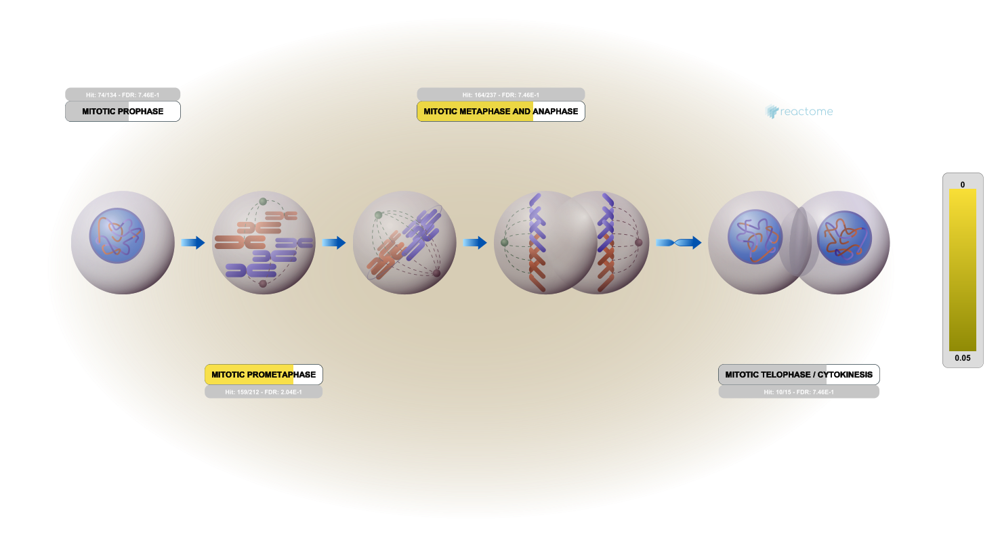

# RNA Seq Analysis

## Background

Our data for today comes froma HOX gene knock-out study

The authors report on differential analysis of lung fibroblasts in response to loss of the developmental transcription factor HOXA1

## Data Import

We have 2 key input files: counts and metadata

```{r}
library(DESeq2)
```


```{r}
metaFile <- "GSE37704_metadata.csv"
countFile <- "GSE37704_featurecounts.csv"

# Import metadata and take a peek
colData = read.csv(metaFile, row.names=1)
# head(colData)
```

```{r}
countData = read.csv(countFile, row.names=1)
# head(countData)
```

We need to remove the odd first "length" column from `countData to have a 1:1 correspondence with `calData` rows

```{r}
countData <- as.matrix(countData[, -1])
# head(countData)
```

```{r}
rownames(colData) == colnames(countData)
```

## Remove zero count genes
Some genes (rows) have no count data (i.e. zero values). We should remove these before any further analysis.

```{r}
to.keep <- rowSums(countData > 0)
```


## Setup for DeSeq

```{r}
dds <- DESeqDataSetFromMatrix(countData = countData,
                              colData = colData,
                              design = ~condition)
```


### Run DESeq

```{r}
dds <- DESeq(dds)
```


### Get results

```{r}
res <- results(dds)
```


# Results

```{r}
# head(res)
```


# Volcano plot

```{r}
library(ggplot2)

ggplot(res) +
  aes(log2FoldChange,
      -log(padj)) + 
  geom_point()
```

Let's add some color to this plot along with cutoff lines for fold-change and P-value

```{r}
mycols <- rep("gray", nrow(res))
mycols[ abs(res$log2FoldChange) > 2] <- "blue"
mycols[ res$padj > 0.01 ] 
```

```{r}
ggplot(res) +
  aes(log2FoldChange,
      -log(padj)) + 
  geom_point(col=mycols) +
  geom_vline(xintercept = c(-2,2)) +
  geom_hline(yintercept = -log(0.01))
```


## Add Annotation

```{r}
library("AnnotationDbi")
library("org.Hs.eg.db")

columns(org.Hs.eg.db)
```

### MapIds

```{r}
res$symbol = mapIds(org.Hs.eg.db,
                    keys=row.names(res), 
                    keytype="ENSEMBL",
                    column="SYMBOL",
                    multiVals="first")

res$entrez = mapIds(org.Hs.eg.db,
                    keys=row.names(res),
                    keytype="ENSEMBL",
                    column="ENTREZID",
                    multiVals="first")

res$name =   mapIds(org.Hs.eg.db,
                    keys=row.names(res),
                    keytype="ENSEMBL",
                    column="GENENAME",
                    multiVals="first")

head(res, 10)
```

### Save annotated results

```{r}
# wtie.csv(res, file="results_annotated.csv")
```


## Pathway Analysis

```{r, message=FALSE}
library(gage)
library(gageData)
library(pathview)
```

```{r}
data(kegg.sets.hs)
data(sigmet.idx.hs)

# Focus on signaling and metabolic pathways only
kegg.sets.hs = kegg.sets.hs[sigmet.idx.hs]

# Examine the first 3 pathways
head(kegg.sets.hs, 3)
```

```{r}
foldchanges <- res$log2FoldChange
names(foldchanges) <- res$entrez
head(foldchanges)
```

```{r}
keggres = gage(foldchanges, gsets=kegg.sets.hs)
```


```{r}
# Look at the first few down (less) pathways
head(keggres$less)
```

```{r}
pathview(gene.data=foldchanges, pathway.id="hsa04110")
```


### Go Analysis

Focus on the Biological Process "BP" section of GO

```{r}
data(go.sets.hs)
data(go.subs.hs)

# Focus on Biological Process subset of GO
gobpsets = go.sets.hs[go.subs.hs$BP]
```

```{r}
gobpres = gage(foldchanges, gsets=gobpsets)

lapply(gobpres, head)
```

### Reactome Analysis

Reactome is database consisting of biological molecules and their relation to pathways and processes. 

Let's now conduct over-representation enrichment analysis and pathway-topology analysis with Reactome using the previous list of significant genes generated from our differential expression results above.


```{r}
sig_genes <- res[res$padj <= 0.05 & !is.na(res$padj), "symbol"]
print(paste("Total number of significant genes:", length(sig_genes)))
```

The website wants a list of genes to work with. We can write one out with the `write.table()` function:

```{r}
write.table(sig_genes, file="significant_genes.txt", row.names=FALSE, col.names=FALSE, quote=FALSE)
```

Add a figure from Reactome:



### GO Enrichment Analysis


