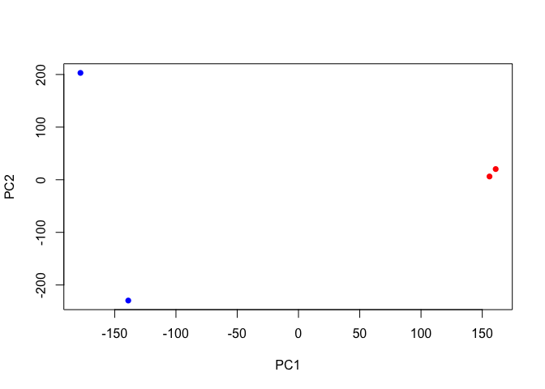
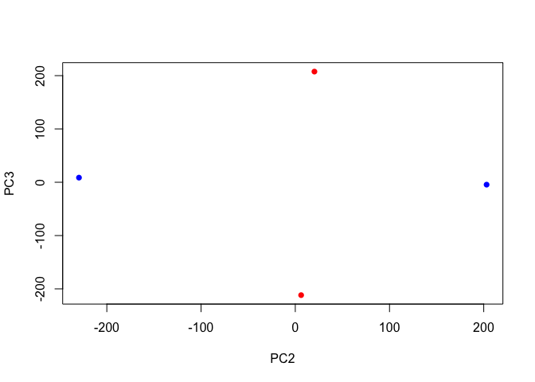
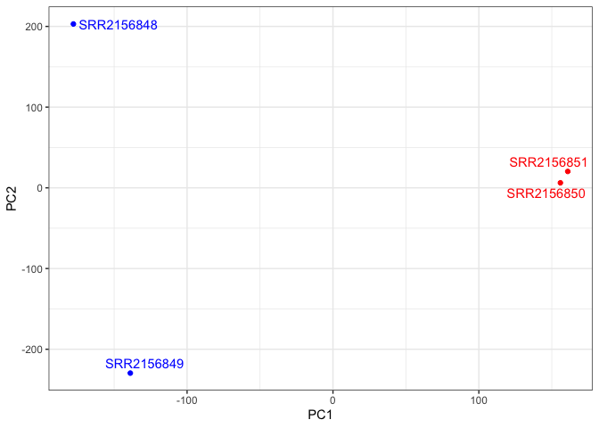

# Class 17: Analyzing Sequencing Data
Yane Lee PID A17670350

## Downstream Analysis

With each sample having its own directory containing the Kallisto
output, we can import the transcript count estimates into R using:

``` r
if (!requireNamespace("BiocManager", quietly = TRUE))
    install.packages("BiocManager")

BiocManager::install("rhdf5")
```

    Bioconductor version 3.22 (BiocManager 1.30.27), R 4.5.2 (2025-10-31)

    Warning: package(s) not installed when version(s) same as or greater than current; use
      `force = TRUE` to re-install: 'rhdf5'

``` r
library(tximport)

folders <- dir(pattern="SRR21568*")
samples <- sub("_quant","",folders)
files <- file.path(folders, "abundance.h5")
names(files) <- samples

txi.kallisto <- tximport(files, type="kallisto", txOut=TRUE)
```

    1 2 3 4 

``` r
head(txi.kallisto$counts)
```

                    SRR2156848 SRR2156849 SRR2156850 SRR2156851
    ENST00000539570          0          0    0.00000          0
    ENST00000576455          0          0    2.62037          0
    ENST00000510508          0          0    0.00000          0
    ENST00000474471          0          1    1.00000          0
    ENST00000381700          0          0    0.00000          0
    ENST00000445946          0          0    0.00000          0

We now have our estimated transcript counts for each sample in R. We can
see how many transcripts we have for each sample:

``` r
colSums(txi.kallisto$counts)
```

    SRR2156848 SRR2156849 SRR2156850 SRR2156851 
       2563611    2600800    2372309    2111474 

And how many transcripts are detected in at least one sample:

``` r
sum(rowSums(txi.kallisto$counts)>0)
```

    [1] 94561

We want to filter out the annotated transcripts with no reads

``` r
to.keep <- rowSums(txi.kallisto$counts) > 0
kset.nonzero <- txi.kallisto$counts[to.keep,]
```

``` r
keep2 <- apply(kset.nonzero,1,sd)>0
x <- kset.nonzero[keep2,]
```

## Principal Component Analysis

We can now apply any exploratory analysis technique to this counts
matrix. As an example, we will perform a PCA of the transcriptomic
profiles of these samples.

``` r
pca <- prcomp(t(x), scale=TRUE)
```

``` r
summary(pca)
```

    Importance of components:
                                PC1      PC2      PC3   PC4
    Standard deviation     183.6379 177.3605 171.3020 1e+00
    Proportion of Variance   0.3568   0.3328   0.3104 1e-05
    Cumulative Proportion    0.3568   0.6895   1.0000 1e+00

Now we can use the first two principal components as a co-ordinate
system for visualizing the summarized transcriptomic profiles of each
sample:

``` r
plot(pca$x[,1], pca$x[,2],
     col=c("blue","blue","red","red"),
     xlab="PC1", ylab="PC2", pch=16)
```



> Q. Q. Use ggplot to make a similar figure of PC1 vs PC2 and a separate
> figure PC1 vs PC3 and PC2 vs PC3.

``` r
plot(pca$x[,1], pca$x[,3],
     col=c("blue","blue","red","red"),
     xlab="PC1", ylab="PC3", pch=16)
```


``` r
plot(pca$x[,2], pca$x[,3],
     col=c("blue","blue","red","red"),
     xlab="PC2", ylab="PC3", pch=16)
```



Plot with labels for the two control samples (SRR2156848 and SRR2156849)
and the two enhancer-targeting CRISPR-Cas9 samples (SRR2156850 and
SRR2156851).

``` r
library(ggplot2)
library(ggrepel)

mycols <- c("blue","blue","red","red")

ggplot(pca$x) +
  aes(PC1, PC2, label=rownames(pca$x)) +
  geom_point( col=mycols ) +
  geom_text_repel( col=mycols ) +
  theme_bw()
```



## Differential-expression analysis

We can use DESeq2 to complete the differential-expression analysis that
we are already familiar with:

``` r
library(DESeq2)
```

    Loading required package: S4Vectors

    Loading required package: stats4

    Loading required package: BiocGenerics

    Loading required package: generics


    Attaching package: 'generics'

    The following objects are masked from 'package:base':

        as.difftime, as.factor, as.ordered, intersect, is.element, setdiff,
        setequal, union


    Attaching package: 'BiocGenerics'

    The following objects are masked from 'package:stats':

        IQR, mad, sd, var, xtabs

    The following objects are masked from 'package:base':

        anyDuplicated, aperm, append, as.data.frame, basename, cbind,
        colnames, dirname, do.call, duplicated, eval, evalq, Filter, Find,
        get, grep, grepl, is.unsorted, lapply, Map, mapply, match, mget,
        order, paste, pmax, pmax.int, pmin, pmin.int, Position, rank,
        rbind, Reduce, rownames, sapply, saveRDS, table, tapply, unique,
        unsplit, which.max, which.min


    Attaching package: 'S4Vectors'

    The following object is masked from 'package:utils':

        findMatches

    The following objects are masked from 'package:base':

        expand.grid, I, unname

    Loading required package: IRanges

    Loading required package: GenomicRanges

    Loading required package: Seqinfo

    Loading required package: SummarizedExperiment

    Loading required package: MatrixGenerics

    Loading required package: matrixStats


    Attaching package: 'MatrixGenerics'

    The following objects are masked from 'package:matrixStats':

        colAlls, colAnyNAs, colAnys, colAvgsPerRowSet, colCollapse,
        colCounts, colCummaxs, colCummins, colCumprods, colCumsums,
        colDiffs, colIQRDiffs, colIQRs, colLogSumExps, colMadDiffs,
        colMads, colMaxs, colMeans2, colMedians, colMins, colOrderStats,
        colProds, colQuantiles, colRanges, colRanks, colSdDiffs, colSds,
        colSums2, colTabulates, colVarDiffs, colVars, colWeightedMads,
        colWeightedMeans, colWeightedMedians, colWeightedSds,
        colWeightedVars, rowAlls, rowAnyNAs, rowAnys, rowAvgsPerColSet,
        rowCollapse, rowCounts, rowCummaxs, rowCummins, rowCumprods,
        rowCumsums, rowDiffs, rowIQRDiffs, rowIQRs, rowLogSumExps,
        rowMadDiffs, rowMads, rowMaxs, rowMeans2, rowMedians, rowMins,
        rowOrderStats, rowProds, rowQuantiles, rowRanges, rowRanks,
        rowSdDiffs, rowSds, rowSums2, rowTabulates, rowVarDiffs, rowVars,
        rowWeightedMads, rowWeightedMeans, rowWeightedMedians,
        rowWeightedSds, rowWeightedVars

    Loading required package: Biobase

    Welcome to Bioconductor

        Vignettes contain introductory material; view with
        'browseVignettes()'. To cite Bioconductor, see
        'citation("Biobase")', and for packages 'citation("pkgname")'.


    Attaching package: 'Biobase'

    The following object is masked from 'package:MatrixGenerics':

        rowMedians

    The following objects are masked from 'package:matrixStats':

        anyMissing, rowMedians

``` r
sampleTable <- data.frame(condition = factor(rep(c("control", "treatment"), each = 2)))
rownames(sampleTable) <- colnames(txi.kallisto$counts)
```

``` r
dds <- DESeqDataSetFromTximport(txi.kallisto,
                                sampleTable, 
                                ~condition)
```

    using counts and average transcript lengths from tximport

``` r
dds <- DESeq(dds)
```

    estimating size factors

    using 'avgTxLength' from assays(dds), correcting for library size

    estimating dispersions

    gene-wise dispersion estimates

    mean-dispersion relationship

    -- note: fitType='parametric', but the dispersion trend was not well captured by the
       function: y = a/x + b, and a local regression fit was automatically substituted.
       specify fitType='local' or 'mean' to avoid this message next time.

    final dispersion estimates

    fitting model and testing

``` r
res <- results(dds)
head(res)
```

    log2 fold change (MLE): condition treatment vs control 
    Wald test p-value: condition treatment vs control 
    DataFrame with 6 rows and 6 columns
                     baseMean log2FoldChange     lfcSE      stat    pvalue
                    <numeric>      <numeric> <numeric> <numeric> <numeric>
    ENST00000539570  0.000000             NA        NA        NA        NA
    ENST00000576455  0.761453       3.155061   4.86052 0.6491203  0.516261
    ENST00000510508  0.000000             NA        NA        NA        NA
    ENST00000474471  0.484938       0.181923   4.24871 0.0428185  0.965846
    ENST00000381700  0.000000             NA        NA        NA        NA
    ENST00000445946  0.000000             NA        NA        NA        NA
                         padj
                    <numeric>
    ENST00000539570        NA
    ENST00000576455        NA
    ENST00000510508        NA
    ENST00000474471        NA
    ENST00000381700        NA
    ENST00000445946        NA
